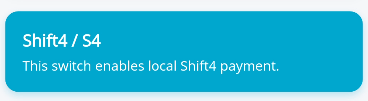
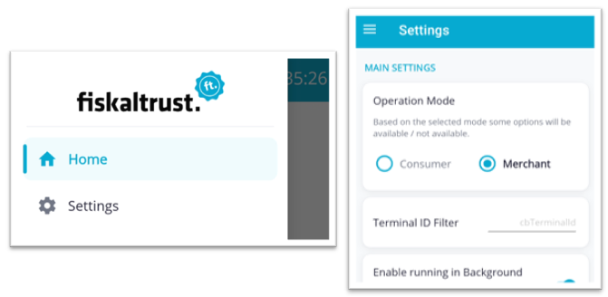

# InStore App 1.3.0

<!--truncate-->

## New payment vendor now supported: Shift4

The new payment vendor [Shift4](https://www.shift4.com) was added and supports all current features (payment, refund, cancel) including the new payment vendor provided tip.

**Now supported payment vendors:**

- [Viva](https://viva.com/)
- [Hobex](https://www.hobex.at/) (POSit and ECR)
- [Worldline](https://worldline.com/) / [PayOne](https://www.payone.com/) (Tab on Mobile and SmartPOS)
- [Softpay.io](https://softpay.io/)
- [Global Payments](https://www.globalpayments.at/) (GP tom and GP Pay)
- [Shift4](https://www.shift4.com)

---

## Payment vendor provided tip support across payment providers

Tips entered directly on the payment terminal are now reported back to the POS in a consistent way with all current supported payment vendors.

NOTE: To really use this fetaure, TIP support must be activated in most of the payment vendor configurations. If not enabled the standard payment flow without TIP will be used in the payment vendor applications and by us.

_Affected issues:_ [#534](https://github.com/fiskaltrust/fiskaltrust-instore-app/issues/534), [#626](https://github.com/fiskaltrust/fiskaltrust-instore-app/issues/626), [#632](https://github.com/fiskaltrust/fiskaltrust-instore-app/issues/632), [#630](https://github.com/fiskaltrust/fiskaltrust-instore-app/issues/630), [#384](https://github.com/fiskaltrust/fiskaltrust-instore-app/issues/384)

---

## Refund and cancel support expanded across payment providers

Refund and cancel transactions - including payment vendor provided tip - are now supported on Viva, Hobex (POSit and ECR), Worldline / PayOne (Tab on Mobile and SmartPOS), Softpay.io, Global Payments (GP tom and GP Pay), Shift4.

See [documentation](https://docs.fiskaltrust.cloud/apis/pos-system-api#tag/pay/paths/~1pay/post) for the newly added /pay actions `refund` and `cancel`

_Affected issues:_ [#578](https://github.com/fiskaltrust/fiskaltrust-instore-app/issues/578), [#620](https://github.com/fiskaltrust/fiskaltrust-instore-app/issues/620), [#635](https://github.com/fiskaltrust/fiskaltrust-instore-app/issues/635), [#633](https://github.com/fiskaltrust/fiskaltrust-instore-app/issues/633), [#609](https://github.com/fiskaltrust/fiskaltrust-instore-app/issues/609), [#585](https://github.com/fiskaltrust/fiskaltrust-instore-app/issues/585)

---

## UI and performance overhaul

Broad UI, usability and performance improvements across the app for a smoother day-to-day experience with main focus on the settings screen and startup loading. The performance improvement is especially visible on devices with older hardware and weaker CPU performance.

_Affected issue:_ [#651](https://github.com/fiskaltrust/fiskaltrust-instore-app/issues/651)

---

## Other Changes

### Features
- [Payment] Hobex POSit and Softpay.io - add support for GetTransaction to allow retrieval of transaction result in case of connectivity issues with the payment vendor [#619](https://github.com/fiskaltrust/fiskaltrust-instore-app/issues/619)
- [Payment] Shift4 / S4 - printing support on Commerce Engine (running on PAX A800) [#367](https://github.com/fiskaltrust/fiskaltrust-instore-app/issues/367)
- [Printer] Add Scanner Support for viva Ciontek device (giveaway flow) [#613](https://github.com/fiskaltrust/fiskaltrust-instore-app/issues/613)
- [Payment] Shift4 / S4 - certification test [#366](https://github.com/fiskaltrust/fiskaltrust-instore-app/issues/366)

### Improvements
- [Settings] UX - Review and Refactor Print Delay Settings for Practical Use [#262](https://github.com/fiskaltrust/fiskaltrust-instore-app/issues/262)
- [Settings] printer config for network printer - try to provide better input keyboard for IP address so that no manual switch to numeric keyboard is necessary [#546](https://github.com/fiskaltrust/fiskaltrust-instore-app/issues/546)
- [Settings] Improve wording: replace Send per Mail/Send per SMS [#683](https://github.com/fiskaltrust/fiskaltrust-instore-app/issues/683)
- [Start Screen] Add some type of loading icon when the app is getting started [#650](https://github.com/fiskaltrust/fiskaltrust-instore-app/issues/650)
- [Pairing] Add a loading icon/progress bar when connecting to the cashbox after entering the pairing code [#549](https://github.com/fiskaltrust/fiskaltrust-instore-app/issues/549)
- [Docs] Update available-settings page to latest version [#623](https://github.com/fiskaltrust/fiskaltrust-instore-app/issues/623)
- [Docs] extend the manual installation guide to also give a link for the preview version for easier access to pre-release testable versions of the InStore App [#521](https://github.com/fiskaltrust/fiskaltrust-instore-app/issues/521)
- [DevKit] payment - tip handling is not clearly explained anywhere [#596](https://github.com/fiskaltrust/fiskaltrust-instore-app/issues/596)

### Bug fixes
- [Payment] Stuck in "4. Processing Payment" when a critical exception happens in the background payment state machine --> should somehow catch the error + continue after usual error info [#605](https://github.com/fiskaltrust/fiskaltrust-instore-app/issues/605)
- [Payment] Improve Viva receipt (remove 0 tip amount + add card name) [#243](https://github.com/fiskaltrust/fiskaltrust-instore-app/issues/243)
- [Payment] Worldline/PayOne - SmartPOS device support is broken and has to be reworked [#657](https://github.com/fiskaltrust/fiskaltrust-instore-app/issues/657)
- [Give Away] Add a popup with confirmation button to reensure that the receipt should get printed on the give away qr code [#649](https://github.com/fiskaltrust/fiskaltrust-instore-app/issues/649)
- [Email] Some valid email addresses fail to send despite being valid -> only check DNS MX records for the target domain [#586](https://github.com/fiskaltrust/fiskaltrust-instore-app/issues/586)
- [Pairing] Remove Long Press device pairing popup, since it has bugs and no one knows about it [#554](https://github.com/fiskaltrust/fiskaltrust-instore-app/issues/554)
- [Printer] Pax 3700 permission error for USB endpoint should only be shown in developer mode but not in normal mode so that users are not confused [#560](https://github.com/fiskaltrust/fiskaltrust-instore-app/issues/560)
- [Payment] GP tom is using sandbox package instead of prod package when using a prod build of the InStore App [#685](https://github.com/fiskaltrust/fiskaltrust-instore-app/issues/685)
