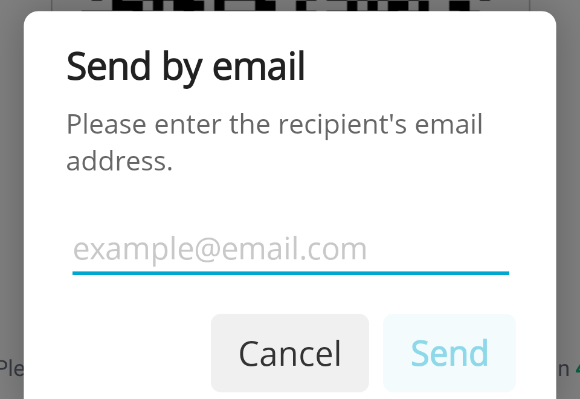
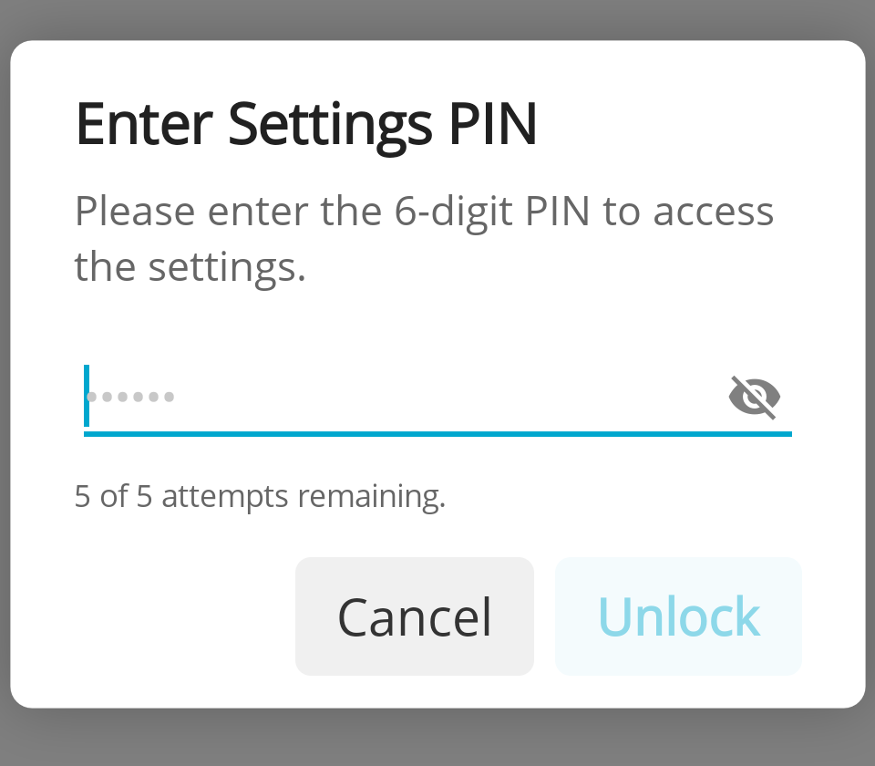

# InStore App 1.3.1

<!--truncate-->

## UI/UX design refresh

Continuation of the UI overhaul started in 1.3.0. The app's look and feel has been aligned with the new fiskaltrust design system, including a redesigned email and SMS input popups on the digital receipt screen. A new "Thank you" screen now closes the receipt flow, replacing the previous "Receipt was accepted..." notification which could appear on the wrong device in multi-terminal setups.

_Affected issue(s):_ [#581](https://github.com/fiskaltrust/fiskaltrust-instore-app/issues/581), [#677](https://github.com/fiskaltrust/fiskaltrust-instore-app/issues/677), [#678](https://github.com/fiskaltrust/fiskaltrust-instore-app/issues/678), [#713](https://github.com/fiskaltrust/fiskaltrust-instore-app/issues/713)

---

## Settings access PIN

The settings page can now be protected with a 6-digit PIN to prevent unwanted configuration changes by waiters or other unauthorized users. Only after entering the correct PIN can the settings be accessed. To stop brute-force attempts, only 5 tries per hour are allowed.

_Affected issue(s):_ [#699](https://github.com/fiskaltrust/fiskaltrust-instore-app/issues/699)

---

## HomeScreen WebView configuration

The HomeScreen WebView option can now be enabled directly in the local settings, and the displayed URL can be configured per device. On devices using the WebView, the blue header bar is hidden so the WebView runs in true fullscreen — settings and receipt history remain accessible via a swipe from the left edge.

_Affected issue(s):_ [#706](https://github.com/fiskaltrust/fiskaltrust-instore-app/issues/706), [#594](https://github.com/fiskaltrust/fiskaltrust-instore-app/issues/594)

---

## Other Changes

### Improvements
- [Settings] Improve wording: replace Send per Mail/Send per SMS [#683](https://github.com/fiskaltrust/fiskaltrust-instore-app/issues/683)
- [Docs] Add Pax Global link [#704](https://github.com/fiskaltrust/fiskaltrust-instore-app/issues/704)

### Bug fixes
- [Payment] Progress screen is not usable on landscape screens (especially when they are small like on the Sunmi Smart Pad) + background color wrong [#719](https://github.com/fiskaltrust/fiskaltrust-instore-app/issues/719)
- [Payment] Worldline / PayOne SmartPOS - WPI Version Incompatibilities - TOM provides receipt as expected - SmartPOS uses new WPI_VERSION v2.2 format even if we request v2.1 [#696](https://github.com/fiskaltrust/fiskaltrust-instore-app/issues/696)
- [Settings] When configuring a printer the Paper Width setting 48mm is not shown selected but can also not be clicked [#695](https://github.com/fiskaltrust/fiskaltrust-instore-app/issues/695)
- [Settings] Selecting a not available / turned off bluetooth printer - feels stuck - no info that we are trying to do a test printout [#679](https://github.com/fiskaltrust/fiskaltrust-instore-app/issues/679)
- [Receipt Printing] very bad print quality on Shift4 PAX Device [#610](https://github.com/fiskaltrust/fiskaltrust-instore-app/issues/610)
- payment - gptom on Android16 cannot be called - blocked [#351](https://github.com/fiskaltrust/fiskaltrust-instore-app/issues/351)
