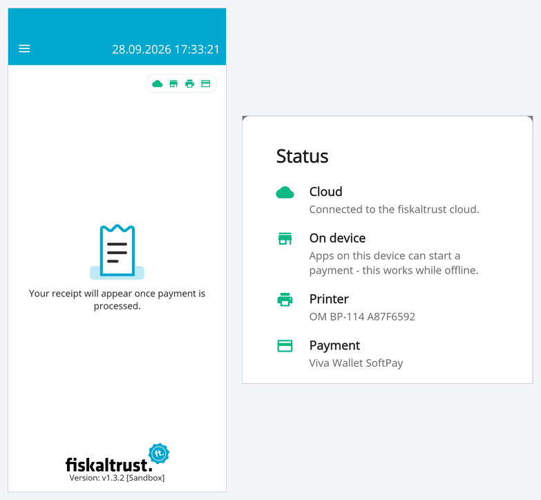

# InStore App 1.3.2

<!--truncate-->

## Nexi payment support (SoftPOS)

_Available since:_ v1.3.2-rc3

Nexi is now supported as a payment provider. The integration is based on the Nexi **MyPayments** SoftPOS app — a software-based card reader — so no separate payment terminal is required: the Android device running the InStore App acts as the card reader.

Supported actions are **payment**, **refund** and **cancel**, all triggered directly from the InStore App.

_Affected issue(s):_ [#728](https://github.com/fiskaltrust/fiskaltrust-instore-app/issues/728)

---

## SumUp payment support

_Available since:_ v1.3.2-rc3

SumUp is now supported as a payment provider. Payments are processed through the **SumUp app** (PaymentSwitch), which means a SumUp Solo or Solo Light reader can be used without any additional integration effort.

When a **merchant API key** is configured in the settings, the InStore App additionally uses the SumUp cloud API for:

- **refund**
- **cancel**
- **improved payment receipts** with the full transaction details

Without an API key, only `payment` is available. See the [feature matrix](https://docs.fiskaltrust.eu/docs/poscreators/experience-middleware/payment#payment-service-provider-psp-feature-matrix) in our Documentation for the exact scope.

_Affected issue(s):_ [#739](https://github.com/fiskaltrust/fiskaltrust-instore-app/issues/739)

---

## Status information on the main screen

_Available since:_ v1.3.2

The main screen (**Home**) now shows four status icons in the top right corner: **Cloud**, **On device**, **Printer** and **Payment**.
A green icon means everything is ready, so you can see at a glance whether the InStore App is connected to the fiskaltrust cloud, whether apps on the same device can start payments locally (which also works offline), and whether a printer and a payment provider are configured.
Tapping the icons opens a **Status** popup with the details, such as the configured printer and payment provider.

This replaces the red "not connected" screen that could briefly appear when a payment was started via local communication while the device was offline.

_Affected issue(s):_ [#775](https://github.com/fiskaltrust/fiskaltrust-instore-app/issues/775)

---

## Details

### v1.3.2

All changes from v1.3.2-rc3 and additionally the following changes:

#### Features
- [UI] New status icons on the home screen for cloud connection, local communication on the device, printer and payment, with a Status popup showing the details [#775](https://github.com/fiskaltrust/fiskaltrust-instore-app/issues/775)
- [Payment] Payment transactions can now be triggered locally by the POS System API in the fiskaltrust Android launcher on the same device, without being routed through the cloud. Use an Android launcher version that supports this local communication path. [#759](https://github.com/fiskaltrust/fiskaltrust-instore-app/issues/759)
- [Payment] "No payment" can now be selected as payment provider, so that all payment requests are ignored — e.g. when the InStore App is only used for receipts and printing (similar to the "No printing" printer option) [#773](https://github.com/fiskaltrust/fiskaltrust-instore-app/issues/773)

#### Improvements
- [Receipt Printing] Much better print quality on image-based printers (e.g. Worldline / PayOne SmartPOS, Shift4 and Neptune-based PAX devices), so that text is clearly readable and QR codes can be scanned reliably [#698](https://github.com/fiskaltrust/fiskaltrust-instore-app/issues/698)
- [Receipt] The paper is now fed far enough after each printout on all supported devices, so the receipt can be torn off cleanly without damaging the QR code at its end [#749](https://github.com/fiskaltrust/fiskaltrust-instore-app/issues/749)

#### Bug fixes
- [Payment] Viva - cancelling a transaction with the Viva app v5.40 got stuck at "Processing Payment" and the successful result was never reported back. Note: This was a breaking change from Viva v5.30 to v5.40 and the bugfix now supports working with both. [#777](https://github.com/fiskaltrust/fiskaltrust-instore-app/issues/777)
- [Payment] When the same payment request was received several times via the cloud (e.g. because of connectivity issues), the payment could be started again although its result was already available — now the existing result is reported back [#756](https://github.com/fiskaltrust/fiskaltrust-instore-app/issues/756)

### v1.3.2-rc3

#### Features
- [Payment] Nexi is now supported as a payment provider via the Nexi MyPayments SoftPOS app (payment, refund and cancel) [#728](https://github.com/fiskaltrust/fiskaltrust-instore-app/issues/728)
- [Payment] SumUp is now supported as a payment provider via the SumUp app and a connected SumUp Solo or Solo Light reader; refund, cancel and detailed payment receipts are available when a merchant API key is configured [#739](https://github.com/fiskaltrust/fiskaltrust-instore-app/issues/739)
- [Payment] The InStore App passed the official GP tom certification and is listed as a [certified partner solution](https://www.gptom.com/en/fiskaltrust-instoreapp/); the GP tom App2App integration is approved for production use [#112](https://github.com/fiskaltrust/fiskaltrust-instore-app/issues/112)

#### Bug fixes
- [Receipt] When printing a receipt on Shift4 failed (e.g. because of a connection error), it was still reported as successful [#758](https://github.com/fiskaltrust/fiskaltrust-instore-app/issues/758)
