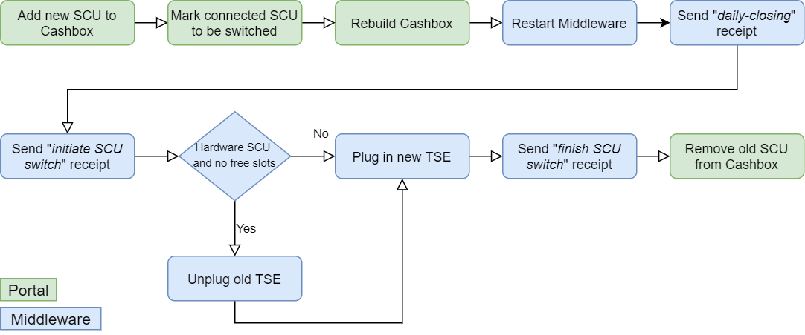

# fiskaltrust.Middleware 1.3.19 (Germany)
_May 4, 2021_

With this Middleware version, we added the possibility to switch the connected SCU for already started Queues. This change allows users of the Middleware to change the used TSE without having to create a new Queue. Additionally, we've included several important bug fixes in this update. 

Version 1.3 of the Middleware is meant for the German market only, customers in Austria and France should continue to use version 1.2. We will unify these experiences in an upcoming version.

## Feature: Switch connected TSE without creating a new Queue
In the last weeks, we've already received lots of feedback and questions from partners who needed to switch TSEs due to numerous reasons. Until now, this was only possible indirectly by also creating a new Queue and retiring the old one. However, this leads to additional effort on all sides, and will be even more inconvenient when cloud TSEs that are currently in certification will need to be replaced by their certified follow-up version.

We've therefore implemented a way to switch SCUs and therefore TSEs of existing Queues (SCUs are "bound" to a specific TSE and therefore cannot be re-used with other TSEs).

In short, the switch process consists of these steps:
1. The SCU switch is prepared in the portal, i.e. the target SCU is added to the Cashbox and marked as _switch target_.
2. The Middleware is restarted to pull the latest changes after the config was rebuilt.
3. A daily-closing receipt is sent
4. The switch is initiated with an "initiate SCU switch" receipt. After this, no SCU is connected to the Queue anymore.
5. (_Optional_): If a hardware TSE is used and e.g. only one SD card slot is available, the TSE is changed.
6. The switch is finalized with a "finish SCU switch" receipt. This receipt connects the Queue to the new SCU.

Notifications for the tax authorities are created during this process and - as usually - automatically sent to our cloud services. If products with the required feature are active for the used outlet, these notifications will be automatically processed in the future (as soon as the financial authorities define the interface).

This process is documented in more detail in our [rollout documentation](https://link.fiskaltrust.cloud/market-de/scu-switch). PosCreators should implement the new two new receipt cases if they want their products to support this new feature, which are described at the end of [this section](https://docs.fiskaltrust.cloud/docs/poscreators/middleware-doc/germany/reference-tables/ftreceiptcase#type-of-receipt-ftreceiptcase).

## Updated SCU: A-Trust
As A-Trust has stabilized their API and their architectural design, we have updated our A-Trust SCU to reflect these latest changes. This means that A-Trust TSEs can now again be used by the Middleware. We recommend to create a new A-Trust SCU, as the configuration parameters have changed heavily.

**Please note**: A-Trust is currently working on their TSE cockpit. Meanwhile, please use the username and password that are described in the [A-Trust partner center](https://www.a-trust-tse.de/TsePartner/KassenSichV/Default.aspx).

## Changed behavior: Fail-transaction-receipt executable in failed mode
With this version, it's now possible to execute the fail-transaction-receipt when the Queue is operated in failed mode (i.e. when the communication with the TSE is interrupted). We've changed this behavior to support scenarios that require to close open transactions before proceeding with a zero-receipt, e.g. when the amount of started transactions on the TSE has reached the maximum.

After sending the fail-transaction-receipt, the Queue remains in failed mode. A zero receipt is still required to re-enable the SCU communication.

## Changed behavior: Retrying on empty responses is now optional on CryptoVision
In a previous version, we've altered our CryptoVision SCU to retry reading data from the TSE in case the response body is empty. However, we've noticed that this behavior doesn't resolve the underlying issue and leads to higher receipt processing times without improving the overall situation. We've hence disabled this per default.

## Bug fix: Wrong TSE payload when transformed PayItems are used
Due to an issue when computing the payload that is sent to the TSE, wrong values were generated in some specific cases when PayItems were used that are transformed to DSFinV-K business cases by the Middleware (e.g. vouchers). In these cases, the _payments_ part was not computed correctly, which lead to partially duplicated entries, as the data was also (correctly) written to the _turnover_ part of the payload.

The DSFinV-K export was not affected by this issue, as it's computed directly from the processed receipt requests and their responses. However, the TSE payloads may not match the DSFinV-K data in those cases.

This issue has now been resolved.

## Stability improvement: More precise time updates in some SCUs
We've improved the precision of the _time update_ mechanism that is required by some TSEs (_CryptoVision_, _Swissbit_, _Epson_ and _Diebold Nixdorf_). Previously, the set time may have differed slightly from the system time due to the internal procedure; this should now be resolved.

## Bug fix: Reading high number of started transactions fails on Diebold Nixdorf SCU
Due to a timeout that occurred when reading very high amounts of started transactions from the _Diebold Nixdorf_ SCU, the _GetTseInfo_ command - and thus the startup of the Middleware - was blocked in some specific cases, rendering the Middleware unable to process operations on the TSE. 

This issue mostly occurred when installing the Middleware as a service with limited permissions to system files. The issue and it's underlying cause have been resolved.

## Bug fix: DSFinV-K threw exception when PayItem.Quantity was set to 0
An issue was fixed that prevented the generation of DSFinV-K exports when the _Quantity_ of send _PayItem_ was set to 0. Although this issue was occurring very rarely, it has now been resolved.

## Bug fix: DSFinV-K cash payment table included wrong data
We altered the behavior of our DSFinV-K export to exclude non-cash payments in the `cash_per_currency.csv` file.

## Bug fix: Fixed wrong time format in DSFinV-K transaction table
We've updated our DSFinV-K export to correctly format the TSE's _start_ and _finish transaction_ timestamps in the `transactions_tse.csv`. Previously, these values were lacking the required milliseconds.

Please note that as of now, all TSEs use unix timestamps, which only contain seconds (and no milliseconds). The last part of these values therefore is always '.000'.

## Bug fix: Mono service could not be installed on some Linux versions
Due to an issue in our Launcher, it was not possible to install the fiskaltrust.Middleware as a Mono service on some Debian-based Linux versions. This issue has been resolved.

**Please note**: This change requires users to update the Launcher, i.e. to re-download the package that contains the `fiskaltrust.exe` from the Portal after rebuilding the Cashbox.

## Affected packages
Packages not listed here were not updated, as we decided to not increase the version of unchanged packages. All packages with versions greater or equal to 1.3.1 are compatible with each other (it is e.g. possible to use _fiskaltrust.Middleware.SCU.Swissbit.1.3.1_ with the new queue packages).

- _fiskaltrust.Middleware.Queue.EF v1.3.19-rc1 *_
- _fiskaltrust.Middleware.Queue.MySQL v1.3.19-rc1 *_
- _fiskaltrust.Middleware.Queue.SQLite v1.3.19-rc1 *_
- _fiskaltrust.Middleware.SCU.DE.CryptoVision v1.3.19_
- _fiskaltrust.Middleware.SCU.DE.DieboldNixdorf v1.3.19_
- _fiskaltrust.Middleware.SCU.DE.Epson v1.3.19_
- _fiskaltrust.Middleware.SCU.DE.Swissbit v1.3.19_
- _fiskaltrust.Launcher v1.3.19 **_

\* An RC version was released to be able to deliver the bug fixes quickly. After verifying the correct behavior together with our partners, the versions will be re-labeled to non-RC.

** Unlike regular package updates, this change requires a re-download of the Launcher from the Portal. The fiskaltrust.Launcher is currently not able to update itself.

## Next steps in the Middleware
We will continue to improve the stability of our Middleware in the next sprints. As always, we're happy to hear feedback and suggestions via [info@fiskaltrust.at](mailto:info@fiskaltrust.at) or directly via issues in our GitHub repositories.
