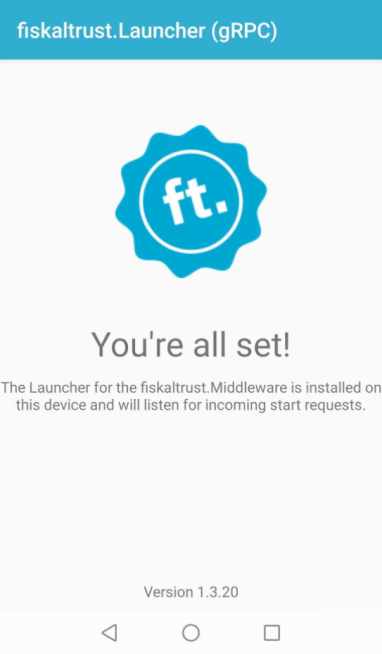
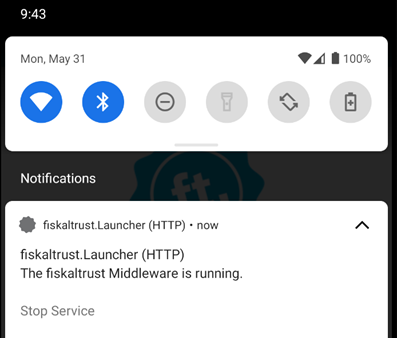

# fiskaltrust.Middleware 1.3.20 (Germany)
_May 31, 2021_

In this Middleware version, we've removed the _one-client-limitation_ of our Swissbit Cloud SCU in cases where it has been bought as a part of our fiskaltrust.CarefreeBundle . This enables our partners to get the "fully unlimited" Carefree experience with this TSE-as-a-service, as only our fair use regulations are in place now. Additionally, we've updated third party dependencies, fixed some issues in our SCUs, and added requested features and stability improvements to the Middleware for Android.

Version 1.3 of the Middleware is meant for the German market only, customers in Austria and France should continue to use version 1.2. We will unify these experiences in an upcoming version.

## Feature: Outlet-based Swissbit Cloud SCUs
Ifthe Swissbit cloudbased TSE  is bought as part of our fiskaltrust.CarefreeBundle , it's now possible to connect multiple Queues to a single SCU (i.e. to a single TSE). This effectively removes the previous limitation to a single client, supporting a broader variety of rollout scenarios and setups, and therefore enabling the full feature-set of our _fiskaltrust.Carefree_ package. 

This change also applies when using the SCU with a TSE that was _not_ bought via fiskaltrust - altough in that case, additional costs may be billed from Swissbit for each registered client (which is not the case when using the TSE-as-a-service).

**Please note that the one-client-limitation is still in place when buyingthe Swissbit cloudbased TSE  as a single product via our shop.** Only TSEs-as-a-service, which are included into our fiskaltrust.CarefreeBundle s, can be operated on an outlet-based pricing model.

You can find more details about this change in our [blog](https://fiskaltrust.de/news/).

## Feature: Display Android Middleware version in main activity
The Middleware for Android now displays the currently installed version directly in the Main activity (i.e. the view that is displayed when the App is started via its icon).

## Feature: Added "Stop" button to Android notification
We've added the option to include a _"Stop service"_ button into the Middleware's Android notification. This could be helpful in cases where the Middleware is switched to a non-responsive state, e.g. due to rare power saving behaviors of some devices. 

## Updated third party dependencies: Swissbit Cloud, Deutsche Fiskal, Swissbit Hardware & A-Trust
We've updated some third party dependencies to the respective latest version, namely:
- Fiskal Cloud Connector (used by the _Deutsche Fiskal_ and the _Swissbit Cloud_ SCU): Version 3.1.0
- Swissbit SDK (used by the _Swissbit_ SCU for hardware TSEs): Version 5.7.5
- A.Sign TSE service (used by the _A-Trust_ SCU): Version 1.2.1.2

These updates enable our users to benefit from bug fixes and improvements the TSE vendors implemented in the new versions. The regular Middleware behavior was not affected by those.

**Please note**: A-Trust is currently working on their TSE cockpit. Meanwhile, please use the username and password that are described in the [A-Trust partner center](https://www.a-trust-tse.de/TsePartner/KassenSichV/Default.aspx).

## Changed behavior: Included TSE process data into DSFinV-K export
While the field `TSE_VORGANGSDATEN` in the `transactions_tse.csv` table is marked as _optional_ in the DSFinV-K specification, it is used to verify the signatures created by the TSE by some third-party tools. Hence, when not including this data, these checks could fail. We've therefore added the data to the table to ensure that our exports can be properly verified.

These changes are backward-compatible; new exports of existing data will include the changed field.

## Bug fix: Reolved failing SCU initialization with certain Diebold Nixdorf firmware versions
We've fixed an issue with specific versions of the Diebold Nixdorf TSE's firmware that led to an error when trying to initialize the TSE, stating that the `GetSlotInfo` message returned incomplete data.

## Affected packages
Packages not listed here were not updated, as we decided to not increase the version of unchanged packages. All packages with versions greater or equal to 1.3.1 are compatible with each other (it is e.g. possible to use _fiskaltrust.Middleware.SCU.Swissbit.1.3.1_ with the new queue packages).

- _fiskaltrust.Middleware.Queue.EF v1.3.20 *_
- _fiskaltrust.Middleware.Queue.MySQL v1.3.20 *_
- _fiskaltrust.Middleware.Queue.SQLite v1.3.20 *_
- _fiskaltrust.Middleware.SCU.DE.SwissbitCloud v1.3.20_
- _fiskaltrust.Middleware.SCU.DE.DeutscheFiskal v1.3.20_
- _fiskaltrust.Middleware.SCU.DE.DieboldNixdorf v1.3.20_
- _fiskaltrust.Middleware.SCU.DE.Swissbit v1.3.20-rc1_*
- _fiskaltrust.Middleware.SCU.DE.ATrust v1.3.20-rc1_

\* An RC version was released to verify that some debug logging improvements we made are complete. After ensuring the expected behavior with our partners, the versions will be re-labeled to non-RC.

** Unlike regular package updates, this change requires a re-download of the Launcher from the Portal. The fiskaltrust.Launcher is currently not able to update itself.

## Next steps in the Middleware
We will continue to improve the stability of our Middleware in the next sprints. As always, we're happy to hear feedback and suggestions via [info@fiskaltrust.at](mailto:info@fiskaltrust.at) or directly via issues in our GitHub repositories.
