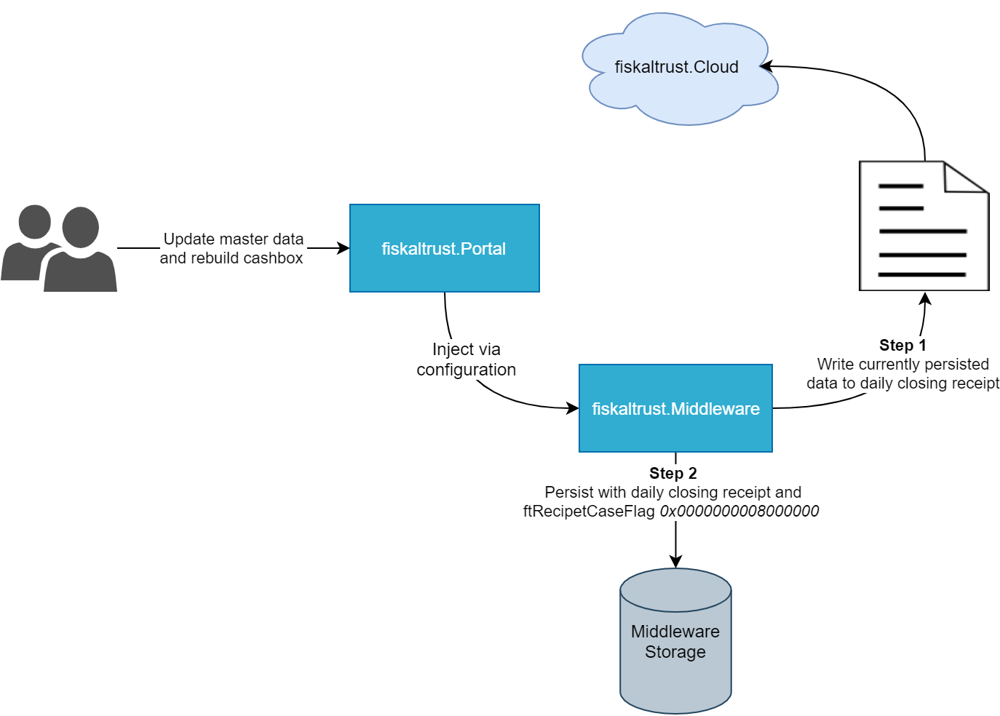

# fiskaltrust.Middleware 1.3.4 (Germany)
_August 3, 2020_

The Middleware 1.3.4 properly handles the DSFinV-K relevant master data and appends it to daily closing receipts, so that it can be easily used when querying an export.

Version 1.3 of the Middleware is meant for the German market only, customers in Austria and France should continue to use version 1.2. We will unify these experiences in an upcoming version.

## New feature: Master data handling
With the Middleware 1.3.4, master data (or _Stammdaten_ in German) is now injected into the Middleware and stored within the daily closing receipts. This information includes:
- **Account data** like company name and address and the VAT number
- **Outlet data** about the location where the Middleware is running
- **System data** about the user POS System
- **Agency data** about the third party companies that the user makes business with (_optional_)

**The typical workflow looks like this:**
1. POS Creators register their POS Systems in the fiskaltrust.Portal and provide templates to their dealers, who also link the POS Systems to their account.
2. POS Dealers invite POS Operators to the fiskaltrust.Platform and either set their company data themselves (or hand over this responsibility to the Operator), and create a cashbox.
3. The cashbox configuration is built/rebuilt via the Portal, and now already contains the required master data (which automatically is composed from the account).
4. When the Middleware starts for the first time, the Master data is automatically saved to the Middleware storage and furthermore written to all daily closing receipts. **A daily closing receipt hence always contains the master data that was valid until that specific point in time.**

**If master data needs to be changed afterwards, the following steps need to be executed:**
1. The required changes are made in the account of the POS Operator.
2. The cashbox configuration is rebuilt, and the Middleware is restarted once to pull the new configuration from the cloud.
3. This data does not become valid immediately, but is "ignored" until a daily closing receipt with the additional ftReceiptCaseFlag _0x0000000008000000_ is processed. In that case, the old master data is used until that point in time, and beginning with the next day the new data is in place.

Summarized, it's only possible to change the master data information on a daily closing receipt, which is a legal requirement.

The picture below illustrates this flow:

Additionally, we made sure to return all DSFinV-K relevant SignaturItems for all receipt types. This means that some items were added to _zero-_, _info-order-_ and _info-internal-receipts_ (these changes are non-breaking; only new items were added, existing ones were not modified).

We are working on publishing an official procedural documentation for the steps described above as well, which can be handed out to POS Operators to explain how this flow works and what needs to be done in case of an audit.

## Stability improvements
Aside from the changes made to support master data, we also introduced several stability improvements and fixed some bugs in this release:
- Customers reported a bug were only portions of the log file were written, and parts from SCU and Queue logs were excluded. This issue was now resolved, so the log file should now contain the exact same information as the console output.
- We also generally improved the logging in case of errors in one of our SCUs, so that it now should be easier to get helpful information in case something fails.

## Client package and demo updates
We updated our client packages to remove some inconsistencies between different communication protocols and Middleware versions. Hence, the clients now exhibit the exact same behavior for all communication protocols (gRPC, HTTP/REST and SOAP).

The client packages were also updated in the [C# demos](https://github.com/fiskaltrust/middleware-demo-dotnet) to demonstrate the improved behavior.

More details on how to use these packages can be found on the [project's GitHub page](https://github.com/fiskaltrust/middleware-interface-dotnet).

## How to update
Existing configurations with versions greater than 1.3.1 continue to work, **but we strongly recommend updating to this new version to make sure all legal requirements are fulfilled**.

As always, updates can be rolled out by selecting the new version in the fiskaltrust.Portal and re-building the configuration. The updated Middleware instances will then automatically pull the new packages at the next startup.

## Affected packages
Packages not listed here were not updated, as we decided to not increase the version of unchanged packages. All packages with versions greater or equal to 1.3.1 are compatible with each other (it is e.g. possible to use _fiskaltrust.Middleware.SCU.Swissbit.1.3.1_ with the new packages).

- _fiskaltrust.Middleware.Queue.EF v1.3.4_
- _fiskaltrust.Middleware.Queue.SQLite v1.3.4_
- _fiskaltrust.Middleware.Interface.Client.Soap v1.3.4_
- _fiskaltrust.Middleware.Interface.Client.Http v1.3.4_

## Next steps in the Middleware
We will continue to enhance the data experience in the Middleware to be make sure to fulfill all audit requirements before September 30. This includes DSFinV-K and TAR file exports, both locally and from the data stored in our cloud platform. As always, we would be very happy to hear feedback and suggestions via [feedback+middleware@fiskaltrust.cloud](mailto:feedback+middleware@fiskaltrust.cloud).
