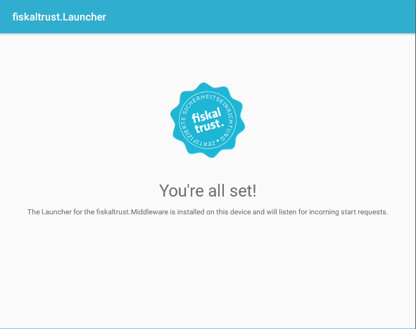
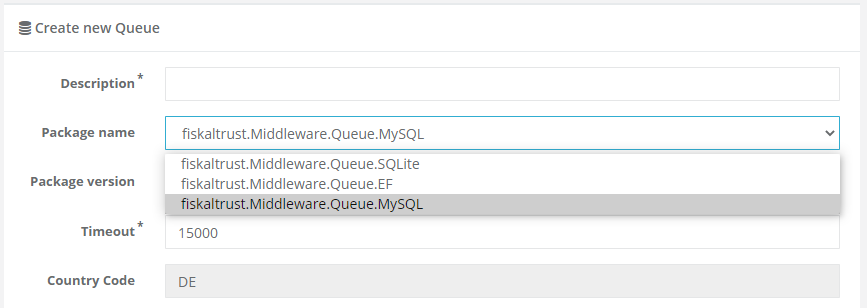

# fiskaltrust.Middleware 1.3.5 (Germany)
_August 18, 2020_

The Middleware 1.3.5 adds support for Android mobile devices, MySQL databases, and properly handles large amounts of parallel receipt requests.

Version 1.3 of the Middleware is meant for the German market only, customers in Austria and France should continue to use version 1.2. We will unify these experiences in an upcoming version.

## New feature: Android support
Our architectural changes in the Middleware 1.3 allowed us to add an all-new Launcher to the Middleware. In addition to Windows and Linux machines, we now also support mobile devices running Android 7.0+! As mobile POS Systems are becoming more and more relevant, we consider this an important step to support our users in reaching new markets segments, and are proud to provide them a very similar user experience over as many platforms as possible.

Starting from today, an RC version of the Android Launcher can be downloaded on the Cashbox page of the Portal. The APK file can then be installed and provides a foreground service that hosts Queue and SCU packages via gRPC. This service can be started and stopped via intents and provides the same IPOS interface as Desktop Middleware instances do, hence re-using business logic should be fairly easy, especially if an implementation in an Android-compatible language exists (e.g. in Java).

While our goal always is to provide a equal user experience throughout all platforms, some limitations currently exist in the Android Launcher:
- Due to platform restrictions, the Android Launcher cannot dynamically download packages (like the Windows/Linux Launchers do). Hence, the SCU and Queue packages are hardwired to the library which must be updated to get new versions. As the users we spoke with use different forms of device management, rolling out new APK versions should be doable in our opinion.
- We currently only support the SQLite queue (which is sufficient for the use cases we heard of until now), and two SCUs: fiskaly and Swissbit. The latter can be plugged into the device as an SD card. If a cashbox is used that includes other Queues or SCUs, an exception will be thrown.

### Samples
To give POS Creators an easy starting point, we implemented sample apps that use the Android Middleware in Xamarin and Java. They can be found in the [middleware-demo-android repository](https://github.com/fiskaltrust/middleware-demo-android), alongside a short quick start guide.

## New feature: MySQL support
In addition to supporting SQLite and Microsoft's SQL Server via the Entity Framework Queue, we added an additional Queue package to connect the Middleware to MySQL databases. By supporting this Open Source database, we want to give our users the opportunity to run failsafe, scalable systems without additional database license costs. 

Like our other storage providers, the MySQL queue can be seamlessly connected to existing MySQL databases, allowing users to re-use already existing IT infrastructure. 

## Stability improvement: Parallel requests
In our internal tests, we noticed that sending large amounts of parallel requests to the Middleware could lead to issues where receipts were not properly processed in the right order. We resolved this by making sure sequential processing is enforced at all times, according to the order the receipts arrive.

## How to update
Existing configurations with versions greater than 1.3.1 continue to work, **but we recommend updating, especially if the Middleware is used in a Multi-POS system scenario.**

As always, updates can be rolled out by selecting the new version in the fiskaltrust.Portal and re-building the configuration. The updated Middleware instances will then automatically pull the new packages at the next startup.

## Affected packages
Packages not listed here were not updated, as we decided to not increase the version of unchanged packages. All packages with versions greater or equal to 1.3.1 are compatible with each other (it is e.g. possible to use _fiskaltrust.Middleware.SCU.Swissbit.1.3.1_ with the new packages).

- _fiskaltrust.Middleware.Queue.EF v1.3.5_
- _fiskaltrust.Middleware.Queue.SQLite v1.3.5_
- _fiskaltrust.Middleware.Queue.MySQL v1.3.5-rc1_

## Next steps in the Middleware
We will continue to enhance the data experience in the Middleware to be make sure to fulfill all audit requirements before September 30. This includes DSFinV-K and TAR file exports, both locally and from the data stored in our cloud platform. As we added all-new products and packages with this update, we would be especially happy to hear feedback and suggestions via [feedback+middleware@fiskaltrust.cloud](mailto:feedback+middleware@fiskaltrust.cloud).
