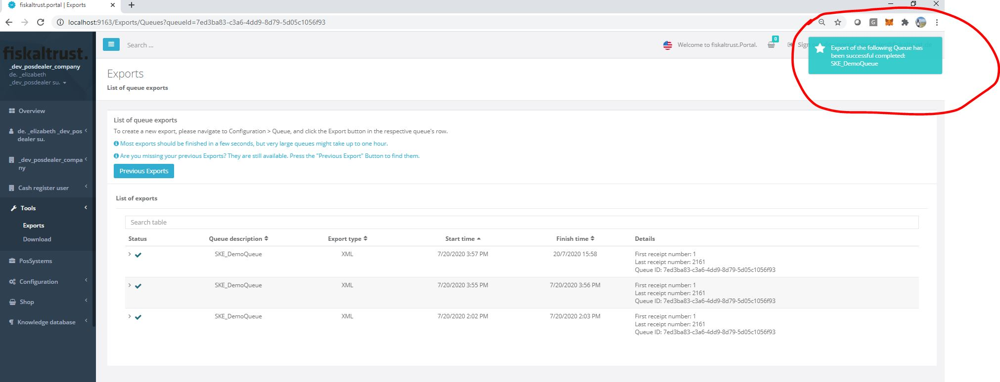
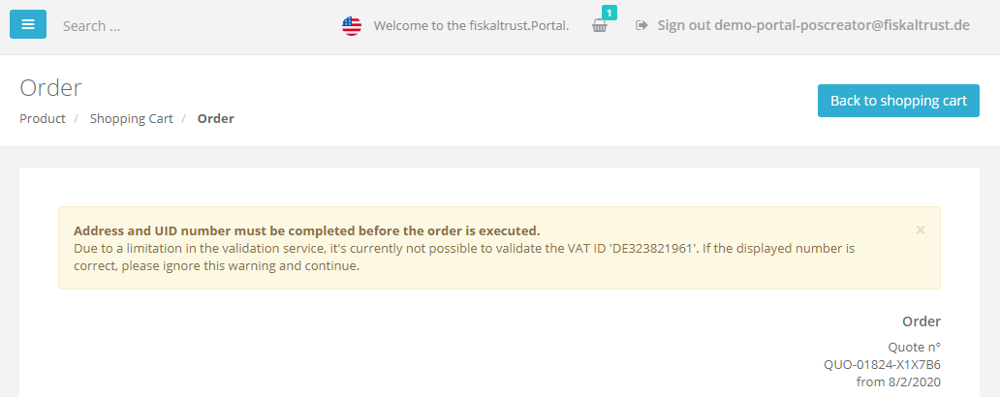
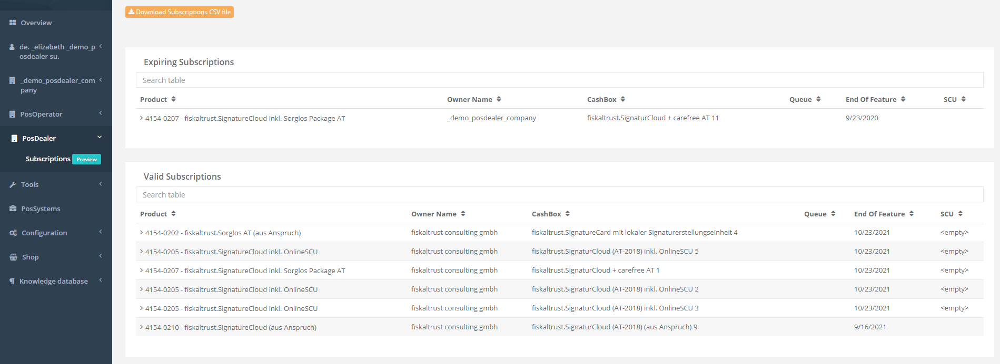
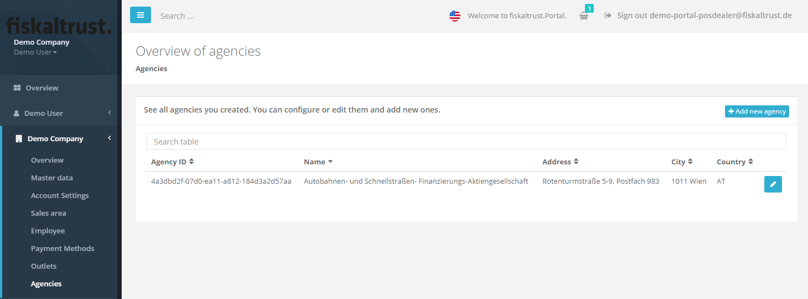

# Portal - Dev Sprint 79
**DSFinV-K master data handling & outlet bulk imports**

Aside from further polishing the fiskaltrust.Portal's outlet feature, most development effort of this sprint was put into properly injecting DSFinV-K-relevant master data (e.g. account information, outlet data, etc.) into the middleware configuration so it can be processes by the [Middleware 1.3.4](../middleware/middleware-1.3.4.md). This enables us to finish the DSFinV-K export prototype in the next sprints.

<!--truncate-->

## Features

### Data exports

#### Automatic updates on the export status page
To further improve the export experience, the status on the export page is now automatically updating for running exports. Thus, it's not required anymore to refresh the page when waiting for an export to finish. Aside from the changed status icon in the table, users will be notified with a toast notification, as shown in the picture below:

#### Compress export results
All output files of exports are now compressed to a zip file after each successful export. This should especially simplify processes when dealing with exports that create many files (like FR-DEX and DSFinV-K).

The only file that is not added to the archive is _journal.json_, which contains user-relevant events that happened during the export (e.g. details about a possibly broken receipt chain).

#### Improved XML export compatibility
In some cases, users were unable to open the output file of the XML export in Excel due to compatibility issues when using special characters like "<" in certain portions of the data. This issue was resolved.

### E-Commerce

#### Replace UID check error with warning
To fulfill legal requirements, the fiskaltrust.Portal displays an error message on the checkout page if master data values are detected to be invalid. Due to a limitation of the EU service that we use to validate company data, it's currently not possible to properly validate German VAT numbers. 

Hence, we now display a warning instead of an error message in the shop that gives the user the ability to manually check if the entered VAT number is correct before proceeding the checkout process.

**Please note that customers are still required to set their companies' VAT numbers in the master data section of the Portal.**

#### **Preview Feature** - PosDealer Subscription Management
One of the most requested PosDealer features is the possibility to manage the subscriptions of attached PosOperators. From the feedback we got, we identified two main areas:

- PosDealers should have the ability to view all subscriptions for their attached users and have an easy overview to see which subscriptions need action
- PosDealers should be able to extend these subscriptions easily

In this sprint we mainly covered the first area, to make sure that we show the relevant information. For this purpose we do differentiate between subscriptions that need action (expiring and expired subscriptions), and subscriptions that are good to go. 

At the moment we are only displaying the most necessary information. If you need additional information, like the last used moment, the possystemid, or the dealercount just click the `Download Subscriptions CSV File` button. 

In addition to additional fields, this file can be used for requesting extensions of subscriptions. The column `Extend J/N` can be used to mark subscriptions that should be extended. As soon as this is filled out the file can be handed over to our support team which will do the subscription extension for you. 

In the upcoming sprints and with the feedback we receive for this new feature we will further improve the functionalities, displaying of data and also integrate the flow to let users extend subscriptions with the usual checkout process in portal, which includes entitlements, moving entitlements and bulk checkout for multiple posoperators.

### Middleware Configuration

#### Agency management
The DSFinV-K specification requires the ability to handle agency businesses - a common example for this is selling toll stickers for the ASFINAG. In these cases, the company is selling something in the name of a third party company, which both has to be printed on the receipt and is written into the DSFinV-K export.

With the changes we made, it's now possible to handle these agencies within accounts. Added agencies will be assigned an ID that should be sent to the Middleware when performing agency business transactions (via ftChargeItemCaseData, [as described in the docs](https://docs.fiskaltrust.cloud/docs/poscreators/middleware-doc/germany/data-structures)).

The Portal will then automatically inject this data into the configuration, as described [here](../middleware/middleware-1.3.4.md). This process will furthermore be described in more detail in the upcoming _procedural documentation_ for the DSFinV-K export.

#### Outlet CSV import
To simplify the outlet management for large customers, we added a new feature that allows importing outlets from CSV files. It's also possible to download a sample CSV that contains the required data schema.

After uploading the file, an additional page is shown that shows the to-be-imported data. Possible validation errors and their detailed description are also displayed on that page (if they occur). These validations e.g. include checks for duplicate outlet numbers, invalid characters, or schema mismatches.

## Next steps
The next sprints will be mostly focused on further improving the shop experience by simplifying the current processes and streamlining the offered products. We are also working hard on improving the Middleware and preparing additional product runtimes for customers with cloud cash registers.

## Feedback
We would love to hear what you think about these features. To get in touch, please reach out to [feedback+portal@fiskaltrust.cloud](mailto:feedback+portal@fiskaltrust.cloud).
