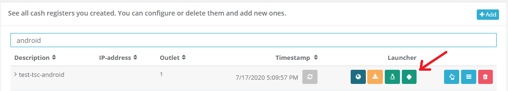

# Portal - Dev Sprint80
**DSFinV-K preview & Android Launcher download**

In this sprint, we focused on releasing a first preview version of the _DSFinV-K_ export to the sandbox. Although this **preview version** is not production-ready, it already creates most of the required content and only misses some final polishing that we will perform in the upcoming weeks. In addition to this, we also added the possibility to download the new [Android Launcher for our Middleware](../middleware/2020-08-18-1.3.5.md), and introduced some small, but very helpful Quality of Life-updates.

<!--truncate-->

## Features

### Data exports

#### DSFinV-K preview
As the possibility to generate a valid DSFinV-K export is legally required by the German KassenSichV, we put great development effort into preparing this near-finished version during the last sprint. **Please make sure to use at least version 1.3.4 of the Middleware to allow the export to properly handle the master data module.** Aside from this, POS Creators who follow our interface documentation should not be required to make any changes in their implementation, as the interface and tagging for the German market was designed to require all data quite a while ago.

Like other exports, this can be queried directly from the Queue overview in the Portal:

As already mentioned, this is a preview version, and thus only available on the [sandbox](https://portal-sandbox.fiskaltrust.de). We are aware of some current limitations and will resolve them in the upcoming sprints:
- Some special VAT rate cases are not yet supported.
- Depending on how vouchers are booked, they may not yet be properly written into the export.
- The KASSE_UST_ZUORDNUNG field is not yet filled.
- The export is currently only available via our Portal. It will be added to the local, free version of the Middleware as well.
- Outlet-based exports are not yet available*

_* This is not a legal requirement, but will be implemented for convenience reasons. Until then, exports can be queried per queue too._

### E-Commerce

#### Automatically allow users to move entitlements
Until now, Portal users had to manually enable the feature to move entitlements from one account to another (e.g. from POS Dealer to POS Operator). This was changed, and it's now possible for everybody to move entitlements without having to enable it in any way.

### Middleware Configuration

#### Android Launcher download
The architectural changes from Middleware 1.2 to 1.3 enabled us to add a new supported runtime environment to our Middleware: **Android**! With the new Android Launcher, users are able to install and use the German Middleware on Android as they are used to from the Desktop experience - we provide a separate Launcher app that can installed on Android, and POS System Apps can access the interface via gRPC. More details about these changes are available in the [Middleware 1.3.5 release notes](../middleware/2020-08-18-1.3.5.md).

To integrate the Android Launcher as good as possible in our previous user experience, we added a new download button in the CashBox view of the Portal:

Please note that the Download will only be enabled for cashboxes that contain the supported packages (SQLite, Swissbit and fiskaly) and communication protocol (gRPC) only.

_The Android Launcher is currently only available on the Sandbox. We will roll this out to production after some more tests with our customers and partners._

## Next steps
In the upcoming days and weeks, we want to put most effort into finalizing the Portal's shop, including production and shipping features. Aside from this, the development team is also working hard on improving the overall user experience in the Portal.

## Feedback
We would love to hear what you think about these features. To get in touch, please reach out to [feedback+portal@fiskaltrust.cloud](mailto:feedback+portal@fiskaltrust.cloud).
