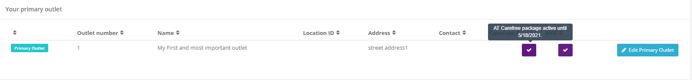
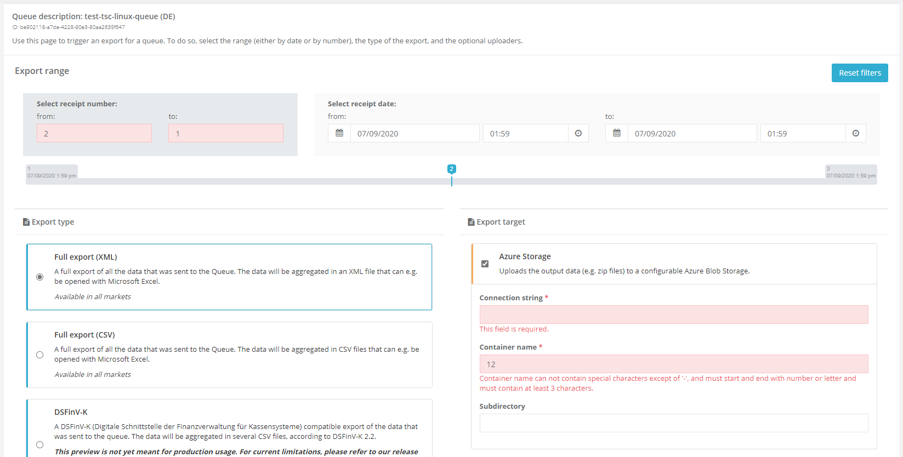
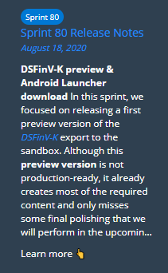

# Portal - Dev Sprint 81
**Shop and production improvements**

In this sprint, we focused on streamlining the German e-commerce experience. This includes full support for ordering, producing and shipping digital and hardware products, enabling missing features in the entitlement based sale processes, and various UX improvements in the Portal that should greatly simplify common e-commerce related tasks.

<!--truncate-->

## Features

### E-Commerce
 
#### Finishing up missing functionalities in the shop (DE)
In this sprint, we put great effort into the our e-commerce systems to finish up missing parts in the shop, our digital production logic (which e.g. creates queues and SCUs when buying products), and our shipping provider. 

- Therefore, it's now possible to perform all required actions to buy, create, and assign products to outlets. 
- Shipping products to different outlets by selecting them in the shop before putting the product into the basket is now also possible.
- Moving entitlements from one account to another is now fully supported as well (without the need for any workarounds).

If you are a POS dealer and need help or an introduction session about how to work with these new features, please reach out to our [support](mailto:support@fiskaltrust.de) anytime.

#### Buy carefree package and AKO from outlet page (DE)
Similar to features in our Austrian and French portal, it's now possible to directly buy a carefree package or an AKO subscription from the outlet page of the Portal.
Clicking on the button in the respective row of the table will move the product into the shopping cart.

#### Print acting purchaser and outlet information on invoices (All markets)
To make the tracking of orders more transparent, we now print both the "acting purchaser" (e.g. the POS dealer who buys a product in the name of an operator) and the outlet for which the product was purchased. These additional details are added for each position of the invoice, if relevant.

#### Account-specific price lists (DE)
We now support account specific price lists in the German shop. This means that in case a customer signed a volume license, the prices that were agreed on are displayed during the checkout (and of course properly printed on the invoice). **Right now, the 'regular' prices are still displayed in the product overview of the shop.** We will change this to display the account-specific prices too soon.

#### Select head office as default outlet in shop (DE)
Until now, it was required to manually select an outlet each time when buying an outlet-specific product in the shop. This was highly error-prone, as many people forgot it - which lead to orders that we were not able to properly process.

As most products in Germany are outlet-based (Carefree, AKO, etc..), we now pre-select the company's main address. Additionally, the size of the dropdown was slightly increased to emphasize this setting.

### Data exports

#### Export usability improvements (All markets)
To avoid the creation of invalid exports, we now validate all fields in the new export page that was introduced a few sprints ago. This includes validations for the receipt range and for the fields of export targets.

### Middleware Configuration

#### New template variables for outlets and CashboxIdentification (All markets)
We added two new template variables to simplify template creation and execution in the German market:
- `queue{0-9}_id_base64withoutspecialchars`: These fields are automatically computed by encoding the queue ID with Base64 and removing special characters. **We mainly introduced this variable to provide unique values for the _CashboxIdentification_ in Germany (i.e. the "Kassenseriennummer"), and recommend using it for this field in templates to fulfill legal requirements.**
- `outlet_number`: This is passed by the Portal when a template product is bought via the shop, and also used internally to assign the products to the correct outlet.

#### Active POS Archive is now displayed directly in the Queue overview (DE)
Similar to the view in our Austrian Portal, the German queue list now directly displays if the POS Archive product is enabled for each queue. 

#### Non-starting offline Launcher (AT, FR)
We fixed an issue some customers experienced when downloading the offline Launcher from the French or Austrian portals. In this case, the launcher reported a missing package and was unable to start.

### User Management

#### Usability improvements to prevent non-supported actions (All markets)
We distilled some common issues from customer feedback and noticed that it was possible to perform some actions in the Portal that could lead to later issues. Hence, we introduced some minor UI changes to both simplify user flows and prevent these non-supported actions:
- In some cases, issues during registrations were not displayed to the user and the registration process continued with errors, which lead to confusion and issues later. All errors are now properly displayed during the process.
- Another issue could occur if a user deactivated the POS dealer role while the auto-invitation role was still active. We fixed this by enforcing that the latter must be disabled first.
- Removing the primary employee of an account in the portal could lead to different issues and in the worst-case lock users out of their accounts. We hence disabled this option for now - please contact our support in case you need to remove/change the primary contact.

### Various

#### Display the latest release notes directly in the Portal (All markets)
To more actively notify our users about recent changes in the Portal, we now display the summary of the latest release notes directly on the [start page](https://portal.fiskaltrust.de/Home/Dashboard) of the Portal. 

## Next steps
We will continue improving our e-commerce functionalities in the Portal in the upcoming sprints, both for the German and the French market. Additionally, we will continue to work on German features like the DSFinV-K export (both the cloud and the offline-version). Finally, we continuously work on improving the usability of our products, especially the Portal.

## Feedback
We would love to hear what you think about these features. To get in touch, please reach out to [feedback+portal@fiskaltrust.cloud](mailto:feedback+portal@fiskaltrust.cloud).
