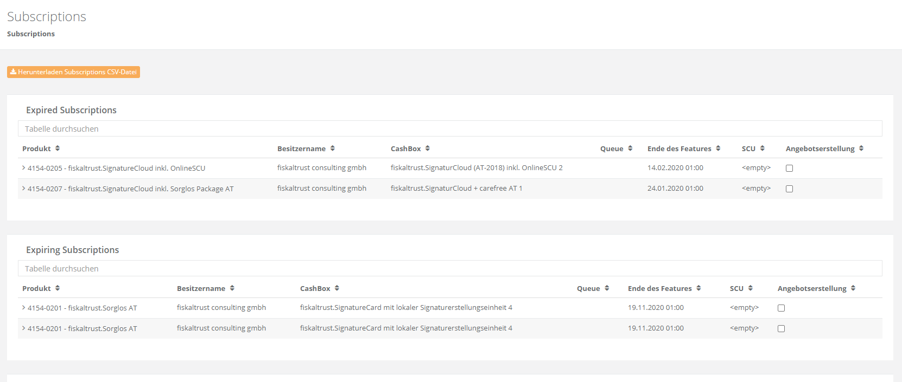
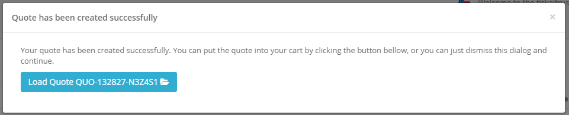

# Portal - Dev Sprint 85
**TAR file export, simplified subscription management & TSE certificate details**

In this sprint, we worked in making the aggregated TAR export available in the Portal, which - together with the DSFinV-K export - enables our customers to get all audit-relevant data without requiring direct access to the POS System. Additionally, we greatly improved the subscription management, and are now displaying the expiration dates of TSEs.

<!--truncate-->

## Features

### Data exports

#### PosArchive export for TAR files (DE)
In addition to the already existing DSFinV-K export, we added the possibility to download aggregated TSE tar files directly from the PosArchive storage. This means that a user-definable range of the TAR files that our Middleware automatically stores during each daily closing receipt (and later uploads to our cloud storage) is packed and served as a zip file.

_Please note that this feature requires Middleware version >= 1.3.9._

### E-Commerce

#### Self-Service subscription extension (AT)
After receiving a lot of feedback on the currently very difficult and error prone extension process we wanted to make sure that you are able to easily extend subscriptions for you and your customers.

For this reason we added a new functionality to the PosDealer-Subscriptions page which shows three categories of subscriptions for all your connected posoperators. The first category is the already expired one. It contains subscriptions that are already invalid and should either be canceled or extended to make sure that features like PosArchive are still available. The second category contains the expiring subscriptions. These subscriptions are in danger of expiring and should be extended as soon as possible.

You are now able to check the subscriptions that you want to extend and then scroll to the bottom and click on the "Create Quote" button. This will create a quote for you that you can then put into the shopping cart and perform a checkout. 

We hope that this feature makes it easier to extend subscriptions and we are happy to receive feedback on how we can further improve it.

### Middleware Configuration

#### Display additional information for SCU certificates (DE))
We regularly got requests from users who wanted to easily download their TSE's certificates, or quickly see if the certificate has expired - with the latter being mostly relevant for developer TSEs, which expire after 6 months.

We hence added a _Download_ button to the German SCU page. When clicking this button, all certificates of an SCU can be downloaded in a zip file. If the certificates are available and can be parsed, we now also display the expiration date of the TSE. If a certificate is expired, a warning will be displayed.

### User Management

#### Reenable changing the Username (All markets)
Previously, we have been facing a bug that made it impossible to correctly change the username. With this release this should be fixed and changing the username should be working again.

## Next steps
In the next sprints, we will focus on further improving the user experience in our Portal, mostly focused on an enhanced rollout experience. This includes updates to the templating system, the invitation process, and other related workflows.

## Feedback
We would love to hear what you think about these improvements and fixes. To get in touch, please reach out to [feedback+portal@fiskaltrust.cloud](mailto:feedback+portal@fiskaltrust.cloud).