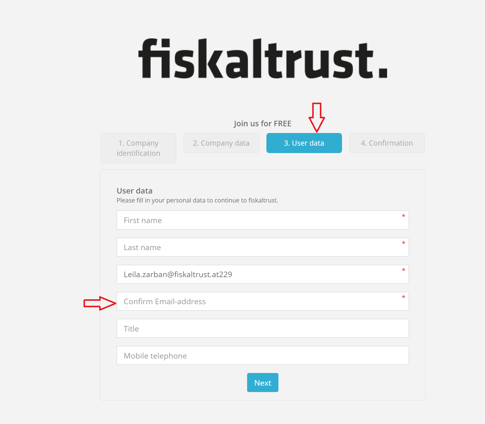

# Portal - Dev Sprint 98
**Introduce tool for generating AO148 applications**

In this sprint, we have been focusing on creating a tool that should give users the ability to easily create AO 148 applications.

<!--truncate-->

## Features

### Middleware Configuration

- [Improving Page Performance](#improving-page-performance)

### User Management
- [Added email verification field to registration dialog](#added-email-verification-field-to-registration-dialog)

### Tools
- [Introduce tool for generating AO148 applications (DE)](#introduce-tool-for-generating-ao148-applications-de)
 
## Middleware Configuration

### Improving Page Performance
 
We invested some time in improving the way our tables are displayed. Visually nothing major should have changed but we managed to reduce updates on the tables and reduced necessary memory. A wider range of monitor resolutions should now also be supported.
Affected by this change are the tables under the following views: Queue DE page,  Queue DE SCU connection page and the Outlets page.
 
## User Management
 
### Added email verification field to registration dialog
Very often, customers were accidentally entering a misspelled email address, and were thus unable to login. By adding a confirmation email, the user has to submit it for a second time, so an error will be issued if the two entries don’t match.
 

 
## Tools
 
### Introduce tool for generating AO148 applications (DE)
Since many of the PosOperators haven’t had the chance to roll out everything the way the new regulations require, the authorities have given them the opportunity to create the  so-called ”AO 148 Antrag” that can be created to extend the period. We wanted to give customers the possibility to create those applications on their own, and also enable them to send it to the authorities very easily.
For this purpose, a generator was implemented to create the application for AO 148 extension. A PDF file is generated with most fields automatically filled with already existing data. Then the user is able to download and send this PDF file to the authorities any way they prefer. Users that have purchased the carefree bundle can send it automatically via fax.
 
## Next steps
 
In the next weeks we will focus on improving the usability of the portal.
## Feedback
 
We would love to hear what you think about these improvements and fixes. To get in touch, please reach out to [feedback+portal@fiskaltrust.cloud](mailto:feedback+portal@fiskaltrust.cloud). 
