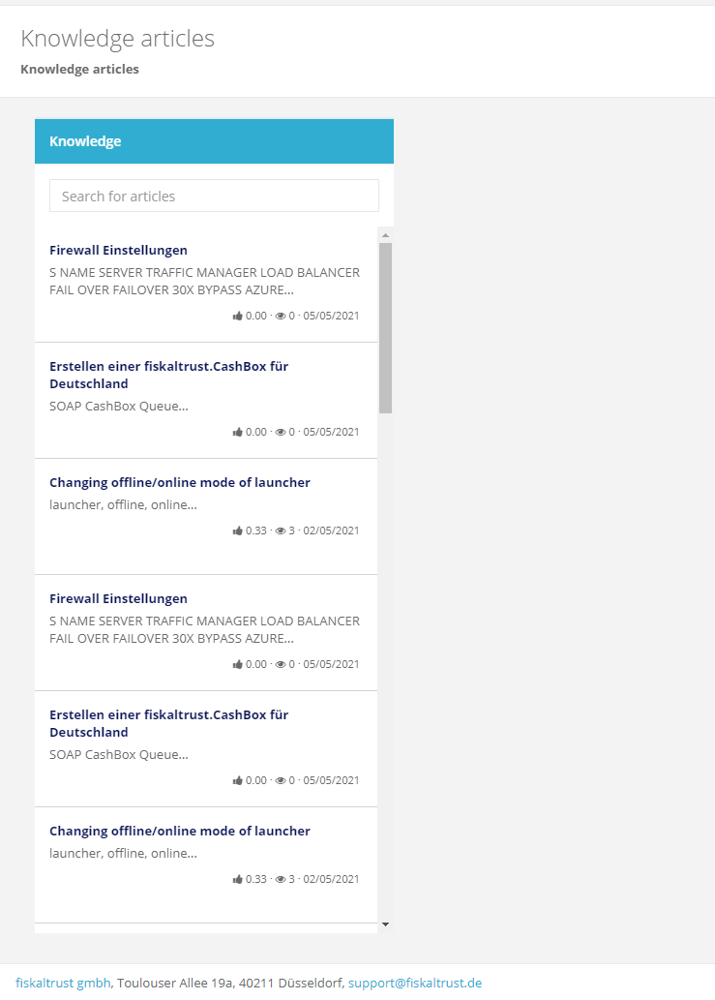
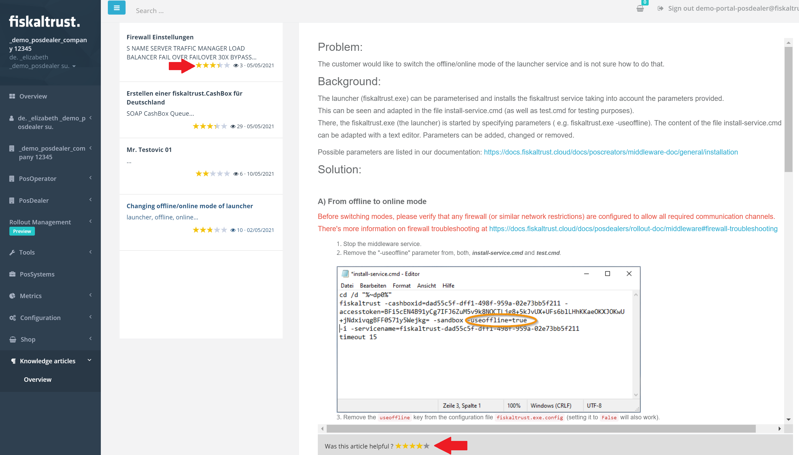
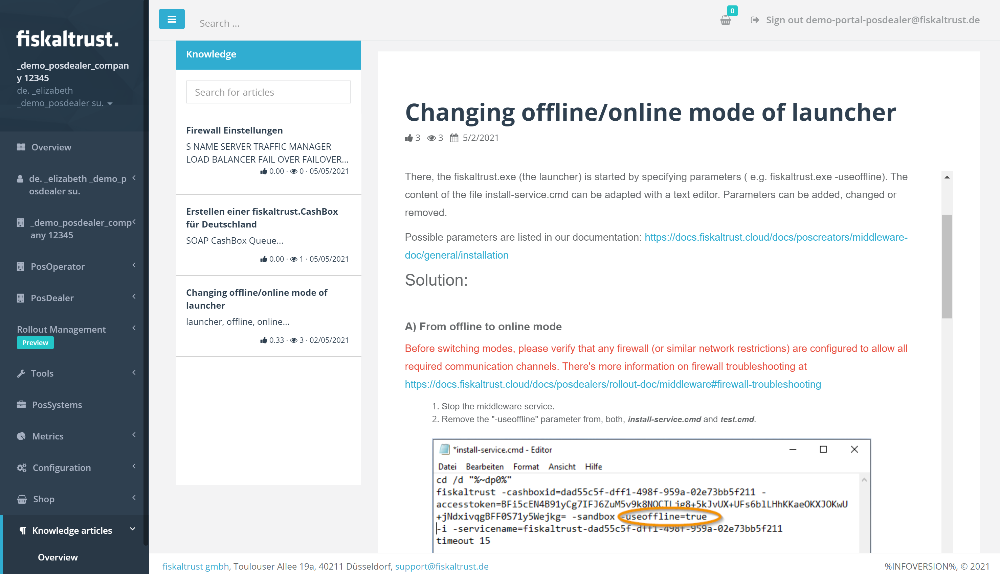

# Portal - Dev Sprint 100
**ft-Knowledge base in public preview**

In this Sprint we focused on integrating a Knowledge Base into Portal. This will contain knowledge articles for any number of issues our customers encounter when using our products and services, with the purpose of troubleshooting those issues and of addressing topics that cannot be solved with the help of the product documentation.

<!--truncate-->

## Features

### Support
- [Portal - Dev Sprint ](#)
  - [Features](#features)
    - [Support](#support)
  - [Support](#support-1)
    - [ft-Knowledge base in public preview](#ft-knowledge-base-in-public-preview)
  - [Next steps](#next-steps)
  - [Feedback](#feedback)

## Support 

### ft-Knowledge base in public preview

Very often, we could see that our product documentation was not enough to cover all topics that customers encounter when using our services and products. Product documentation covers indeed the product functionality in an end-to-end way, but it doesn’t focus on troubleshooting and is not created around customer inquiries. 

So in order to address the lack of information that can help with troubleshooting, we are therefore creating a knowledge base, which will contain articles whose topics come from common customer questions and inquiries, all structured in the form of a problem and offering its respective solution. 

Now, portal users can access all published articles under the KBArticle page (KB = Knowledge-based) in Portal. The structured content of these articles, alongside pictures and useful visualizations can help users identify the steps needed to tackle issues they are facing. When Users want to see all publicly available KBArticles, they can use the Navigation to open a list of them. When Users want to search for a specific word in the KBArticles, they can do so by using the search that is provided as part of the list.

Users have the possibility of rating the articles, as well as leaving their feedback on their contents, if they wish to do so. 

Furthermore, upon selecting to view a specific article, information such as Title, Overall Rating,Views, Last Modified Dates are pinned on top of the page and the user can scroll through the content.

Aside from that, users can bookmark the articles they like, and they can go back to the last open article if they click on Go-Back in their browser.

## Next steps
In the next weeks we will focus on improving the usability of the middleware configuration features of the portal.

## Feedback
We would love to hear what you think about these improvements and fixes. To get in touch, please reach out to [feedback+portal@fiskaltrust.cloud](mailto:feedback+portal@fiskaltrust.cloud).
