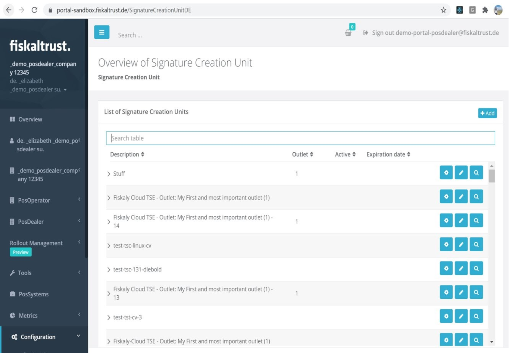
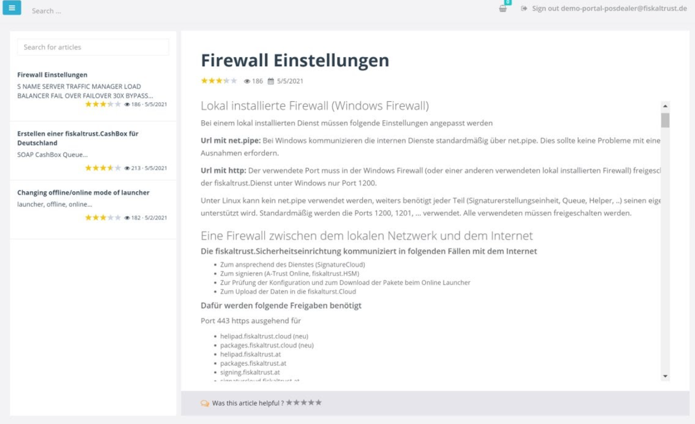
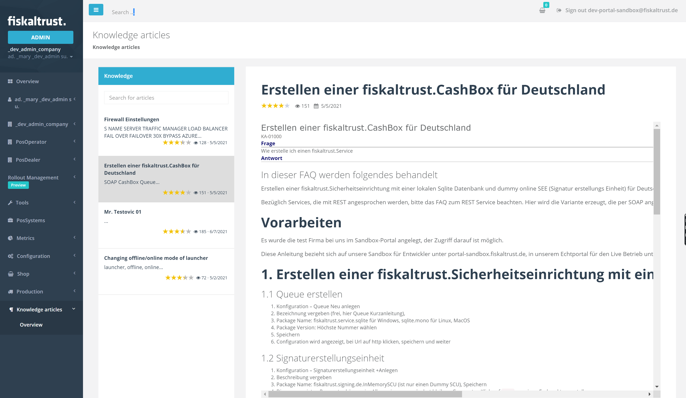

# Portal - Dev Sprint 102
In this sprint, we have introduced several usability improvements for knowledge base articles and configuration management.

<!--truncate-->

## Features

### Middleware Configuration
- [Visual improvements to Middleware component dialogues](#visual-improvements-to-middleware-component-dialogues)

### Support

- [KBArticles improvements](#kbarticles-improvements)

## Middleware Configuration

### Visual improvements to Middleware component dialogues

Some minor improvements of the SignaturCreationUnit DE TableView(DE)  in Portal have been implemented. We invested some time in improving the way our tables are displayed. All previous functionalities are kept, but the consistency of all operations, as well as the performance of the page in different resolutions, has also been improved.

## Support

### KBArticles improvements

Using the feedback that we received about the user experience of the Knowledge-Based Articles platform in Portal, we applied several improvements:

- Internal articles are not shown in Portal anymore, to make it easier for users to navigate through material that is truly relevant to them.
- Only articles in the language of the user are shown, and not all possible available content.
- The Feedback and rate section of each article have been highlighted, so the readers can easily detect where they can leave their feedback/rating of the article.
  
  
  

- By removing some headers and footers, shrinking the size of the images and enlarging the usable space of the article, the reading experience is more pleasant and allows for more focus.
- Selected Articles are now highlighted in gray, which makes it easier for the users to see if they have already selected the article in their selection list.

  

## Next steps
In the next weeks we will focus on improving the performance of the portal.

## Feedback
We would love to hear what you think about these improvements and fixes. To get in touch, please reach out to [feedback+portal@fiskaltrust.cloud](mailto:feedback+portal@fiskaltrust.cloud).

