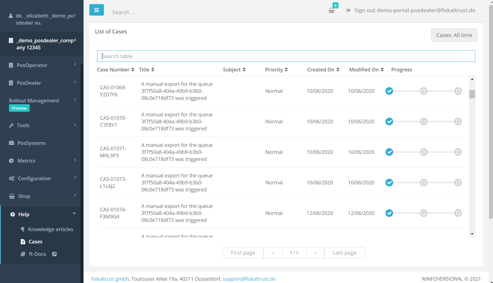

# Portal - Dev Sprint 103
In this sprint, we have been working hardly to give customers the chance to follow along with the onboarded cases in portal.

<!--truncate-->

## Features

### Middleware Configuration

- [Improved Queue SCU Page DE](#improved-queue-scu-page-de)

### Support

- [Visualization of onboarded customer cases in portal](#visualization-of-onboarded-customer-cases-in-portal)

## Middleware Configuration

### Improved Queue SCU Page DE

Some minor improvements of the QueueSCUDEConnectionList TableView (DE)  in Portal have been implemented. We invested some time in improving the way our tables are displayed. Visually nothing major has changed, aside from the styling of the Radio button, the addition of the title on the browser tab, and the addition of a Sorting option on the Outlet column. All previous functionalities are kept, but the consistency of all operations, as well as the performance of the page in different resolutions, has also been improved.

## Support

### Visualization of onboarded customer cases in portal

A new Cases View of the cases of the current user has been implemented. When a customer calls or sends an email request, a case is created internally and a case-onboarding message is sent to the customer, summarizing the case. Email is sent out and the cases statuts is incremented, and after that, the case is visible in Portal. This new Cases page has all the same functionalities  (filtering, sorting, pagination etc) as our other tables.  All active cases of the user after login, as well as the progress of each case can now be displayed. 

## Next steps
In the next weeks we will focus on improving the Knowledge base experience in portal.

## Feedback
We would love to hear what you think about these improvements and fixes. To get in touch, please reach out to [feedback+portal@fiskaltrust.cloud](mailto:feedback+portal@fiskaltrust.cloud).
