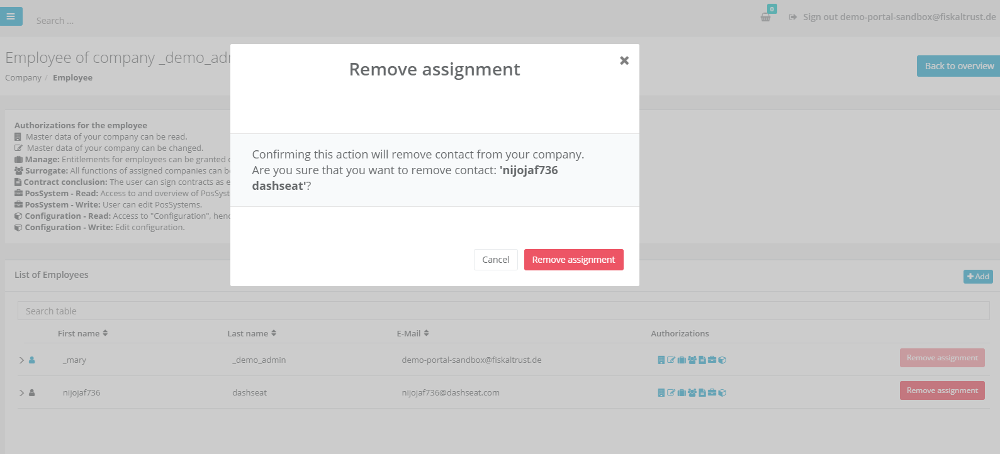

# Portal - Dev Sprint 105
The goal of this Sprint was mainly the improvement of the user experience for the Subscriptions, Invoices and Quotes Pages in Portal. 

<!--truncate-->

## Features

### Middleware Configuration

- [Portal - Dev Sprint ](#)
  - [Features](#features)
    - [Middleware Configuration](#middleware-configuration)
  - [Middleware Configuration](#middleware-configuration-1)
    - [Add confirmation dialogue when removing employees in the Employees Page in Portal](#add-confirmation-dialogue-when-removing-employees-in-the-employees-page-in-portal)
    - [Reworked Quotes Pages](#reworked-quotes-pages)
    - [Reworked Invoices Pages](#reworked-invoices-pages)
    - [Reworked CashBox Edit Page](#reworked-cashbox-edit-page)
    - [Display Subscription Period](#display-subscription-period)
  - [Feedback](#feedback)

## Middleware Configuration

### Add confirmation dialogue when removing employees in the Employees Page in Portal

Now, users in the Employees Page in Portal are warned with a confirmation dialogue when removing an employee that they are about to do so, and the message displayed warns them about the effects that will arise if they will proceed. 
The user can either confirm or cancel the dialogue, in order to proceed or go back to the previous state.

### Reworked Quotes Pages

The Quotes Page in the Shop in Portal has been reworked and now the user experience has been improved. The performance of the page has increased and a bigger amount of data can now be handled more efficiently. A better view is offered in different resolutions for the Quotes Page, and the API has improved significantly.

### Reworked Invoices Pages

The Quotes Page in the Shop in Portal has been reworked and now the user experience has been improved. The performance of the page has increased significantly, and a bigger amount of data can now be handled more efficiently. The general functionalities are identical to the past, but a search bar and pagination functionality have now been added.

### Reworked CashBox Edit Page

The CashBox Edit Page in Portal has been reworked and now the user experience has been improved. The performance of the page has increased significantly, and a bigger amount of data can now be handled more efficiently. The general functionalities are identical to the past, and now the refactored dropdown Box is able to deal with more general scenarios. Aside from this, updating the selected outlet on the Cashbox Edit page, now also updates the outlet filter. 

### Display Subscription Period

PosDealers -aside from being able to extend and cancel subscriptions- are now able to know exactly when those subscriptions started or ended, when navigating through the Subscriptions Table Page. This is an important improvement, as in the past PosDealers had no idea about the runtime of subscriptions. Now, while loading subscription data the Start and Expire Date of products are calculated and are being displayed in separate columns in the Subscriptions Page Table.

## Feedback
We would love to hear what you think about these improvements and fixes. To get in touch, please reach out to [feedback+portal@fiskaltrust.cloud](mailto:feedback+portal@fiskaltrust.cloud).
