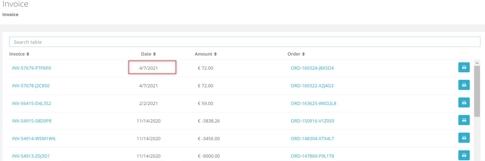
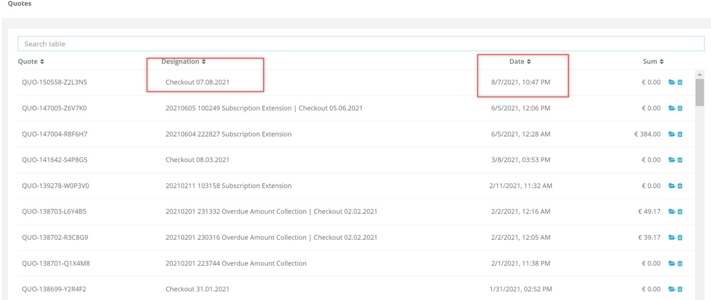
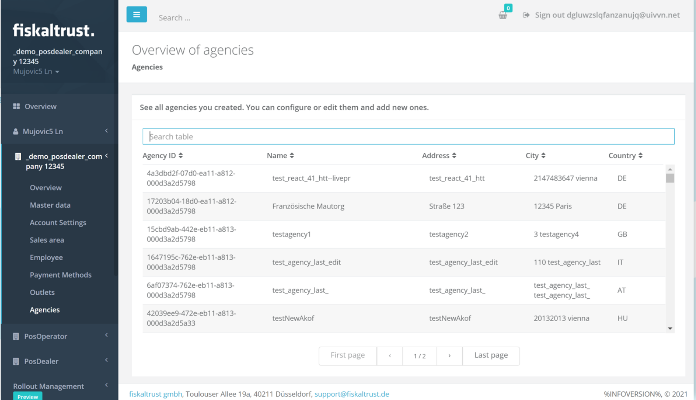
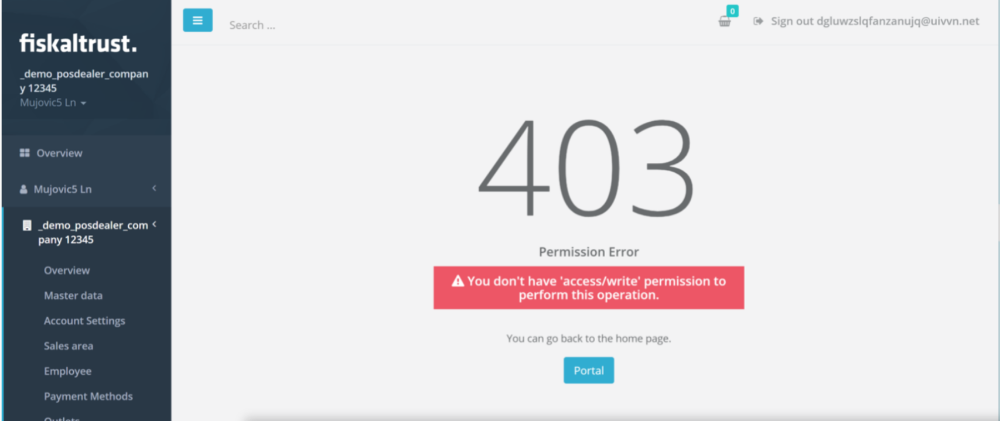
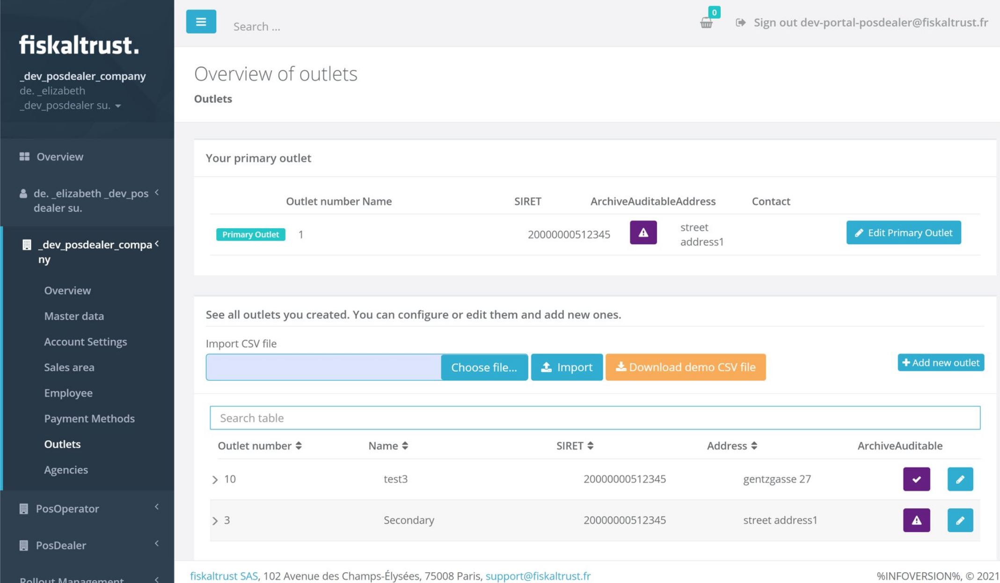
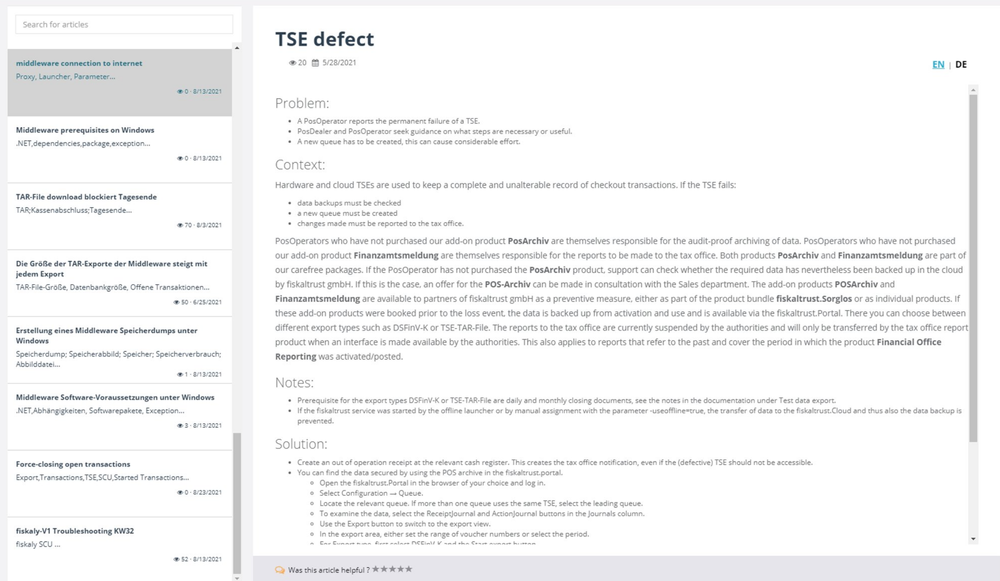
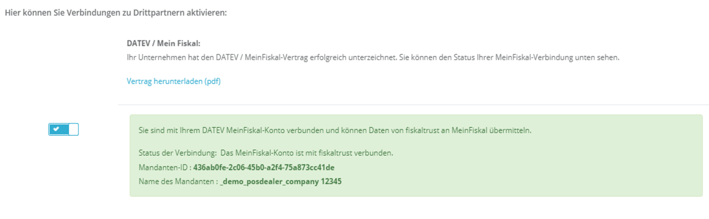

# Portal - Dev Sprint 107
In this sprint we have introduced some overall usability improvements as well as security enhancements.

<!--truncate-->

## Features

### Middleware Configuration

- [Reworked Quote and Invoices Pages](#reworked-quote-and-invoices-pages)
- [Securing Agency Page](#securing-agency-page)
- [Archive Auditable for Outlets FR](#archive-auditable-for-outlets-fr)

### Knowledge-based Articles

- [Knowledge articles page improvements](#knowledge-articles-page-improvements)

### Various Improvements

- [DATEV MeinFiskal Improvements](#datev-meinfiskal-improvements)
- [Contracting emails improvements](#contracting-emails-improvements)

## Middleware Configuration

### Reworked Quote and Invoices Pages

Quotes Page has been reworked and improved. The layout has been modified in a way that the information is better aligned. The latest quotes, invoices and orders are displayed in a clearer way and are sorted descending by date (default sorting), improving the user experience for all Portal users. 

### Securing Agency Page

The Agency page has been reworked and is now properly secured. The user that is trying to load or update agencies, must have respectively the necessary access/read and access/write rights. In case those rights have not been granted, the create/edit button is now hidden. 

An error is shown to the user if they do not have sufficient permissions/claims:

### Archive Auditable for Outlets FR
 
Up until now, it has been very hard to know if an outlet in FR has an active archive auditable. To make it easier for users to know whether an outlet will be covered by the features that are part of the archive auditable, this has been visualized better in the UI of the page. An ArchiveAuditable product has been added in the OutletProducts FR, so now when users navigate to the Outlets Page FR, they are able to see if a specific outlet has an active Archive Auditable. Aside from that, the new ArchiveAuditable product is purchasable and extendable, if the account has enough entitlement.

## Knowledge-based Articles

### Knowledge articles page improvements

So far, the selected Account language was defining the language of the KBArticles, to which the user has access. For example, if an article is available in german, but the account is set to english, it won't show up to the user.
In order to make it easier to share information and to make sure users have access to all possible articles, this has now been changed. All articles are listed, even if they don’t match the account or contact language. It is possible to search for Title, Keywords, Subject & Description in all languages in the search box. Inside the Article, a new language selection has been added, allowing the user to switch among available languages. The selection defaults to the account language.

 
## Various Improvements

### DATEV MeinFiskal improvements

In the past, there have been a few different available labels for DATEV MeinFiskal. For the sake of consistency, all existing labels have been changed. So now, when users are using any DATEV MeinFiskal-related feature, they will see consistent naming with the label of “DATEV MeinFiskal”.

### Contracting emails improvements
 
So far, contracting emails were being sent to the contact that was enabling the role. This has now been reworked, and contacting emails are sent to both email addresses: to the account and the contact that is enabling a role.

## Next steps
In the next weeks we will focus on improving the PosOperators View and the validation flow.

## Feedback
We would love to hear what you think about these improvements and fixes. To get in touch, please reach out to [feedback+portal@fiskaltrust.cloud](mailto:feedback+portal@fiskaltrust.cloud).

