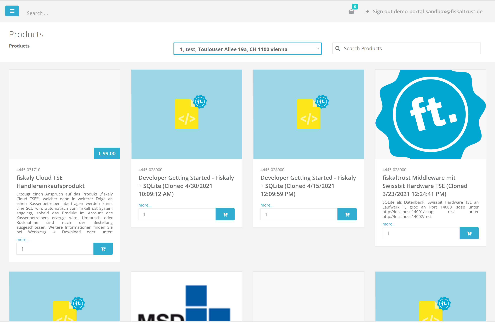
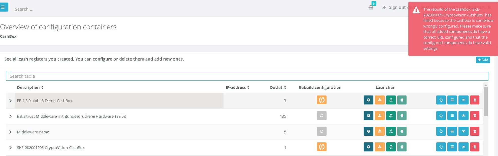
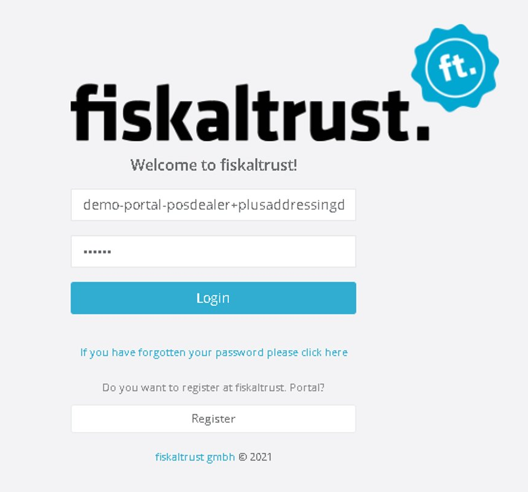

# Portal - Dev Sprint 111
The focus of this sprint was improving the overall user experience of the Shop/Products page and the german scu selection.

<!--truncate-->

## Features

### Middleware Configuration

- [Portal - Dev Sprint 111](#portal---dev-sprint-111)
  - [Features](#features)
    - [Middleware Configuration](#middleware-configuration)
    - [Support](#support)
  - [Middleware Configuration](#middleware-configuration-1)
    - [Highlight target SCU when SCU switch has been configured in Portal](#highlight-target-scu-when-scu-switch-has-been-configured-in-portal)
    - [Reworked Products Page](#reworked-products-page)
    - [Improved error messages on CashBox Rebuild Failures](#improved-error-messages-on-cashbox-rebuild-failures)
    - [Improved CashBox Metrics Page](#improved-cashbox-metrics-page)
  - [Support](#support-1)
    - [Plus Addressing in Portal](#plus-addressing-in-portal)
  - [Next steps](#next-steps)
  - [Feedback](#feedback)

### Support

- [Plus Addressing in Portal](#Plus-Addressing-in-Portal)

## Middleware Configuration

### Highlight target SCU when SCU switch has been configured in Portal

SCUs that are about to be switched are now highlighted in the portal by an icon. Also, a text referencing the SCU is added to the QueueSCU page. So now, users can get a visual confirmation that the configuration they applied was correct. These changes currently only affect the german portal.

### Reworked Products Page

The Products Page has been reworked. All markets are affected by this and now -aside from all previous functionalities- the user can enjoy an improved experience while navigating. Furthermore, now OutletID and SearchText are persisted in session storage.

### Improved error messages on CashBox Rebuild Failures

So far, whenever a user was attempting to perform a CashBox Rebuild which failed, was not getting any indication of the failure. The error messages that the user receives when a rebuild goes wrong are now implemented. They contain clear indications that the rebuild failed, as well as much information as possible on how to deal with it, depending on why the rebuild failed.

### Improved CashBox Metrics Page

The CashBox metrics page has been improved. Now the Exception details view is formatted in a much better way, and thus more readable. Aside from that, the previously unresolved issues of the “Copy” button have been addressed and now the Copy function works the way it should.

## Support

### Plus Addressing in Portal

Until now, Portal did not allow emails to contain a "+" sign. The plus sign is generally used as a hack to create multiple accounts using only one email. To allow for easier portal testing, it is helpful to have multiple accounts tied to one email address. Now, this is supported and for each mail address a person can have multiple users by adding a + and a random  text, and the emails will still make it to the mailbox.
For example, all of the following mail addresses (including plus addressing) will use the same mailbox (demo-portal-posdealer@fiskaltrust.de):

- demo-portal-posdealer+datevdemo@fiskaltrust.de
- demo-portal-posdealer+datevdemo2@fiskaltrust.de
- demo-portal-posdealer+datevdemodealer@fiskaltrust.de

## Next steps

In the next weeks, we will focus on improving Bulk Import Features and on improving generally the user experience. 

## Feedback
We would love to hear what you think about these improvements and fixes. To get in touch, please reach out to [feedback+portal@fiskaltrust.cloud](mailto:feedback+portal@fiskaltrust.cloud).
