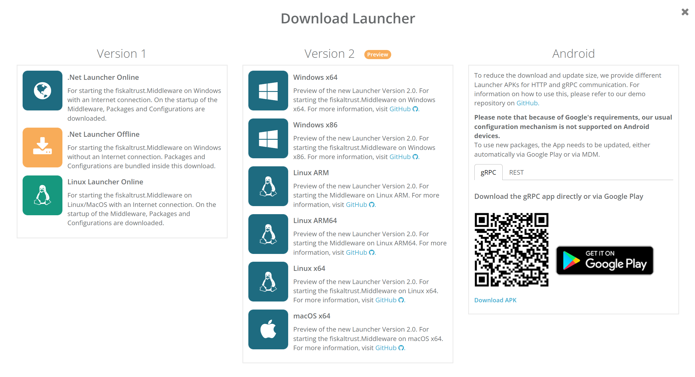

# Download Preview Launcher 2.0

A new major version of our Middleware Launcher 2.0 is currently in preview for the german market. To enable a smooth testing experience, we now provide the download option of the Launcher via the portal. Inside the Configuration section of the CashBoxes, we replaced the old download buttons with the new Dialog. The new download Dialog provides the 1.3 version, the Android Launcher and the 2.0 Preview versions for each Platform that we support at the moment. 

For more information on the new Launcher version, please visit our [github](https://github.com/fiskaltrust/middleware-launcher) page.

