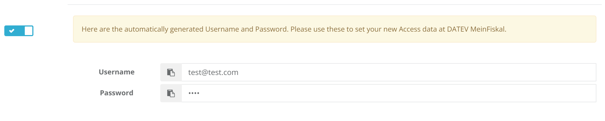
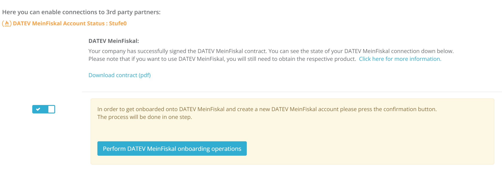

# Simplified DATEV MeinFiskal process

We have simplified process of onboarding to DATEV MeinFiskal. With new implementation when user signs DATEV MeinFiskal contract Onboarding will be performed in the background. After process is finished, user will be provided with randomly generated username and password. This data can be used to log in to 
[DATEV MeinFiskal portal](https://meinfiskal.de/kassenarchiv/login). Username and password should be manually changed by the user by using MeinFiskal portal. 

If onboarding process fails, user will be able to trigger it again by pressing onboard button.

