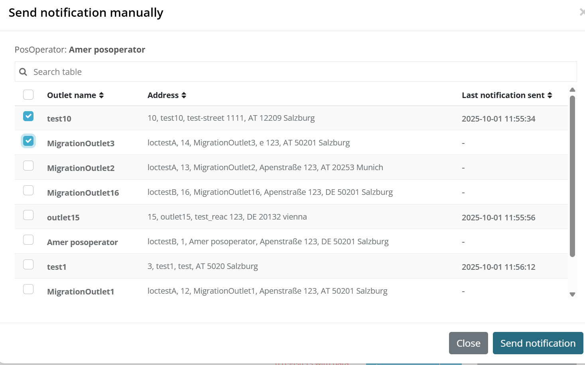

# Platform 2025-27

This release includes performance improvements and user experience enhancements delivered from July to September. Key highlights include performance optimizations for customers with large numbers of cashboxes, German notification management improvements with automated date handling and enhanced guidance, PosSystem pages performance improvements, and added outlet number visibility across all table views to streamline workflows.

## Cashbox Loading Performance Improvements
Available since July 14, 2025

**Affected markets:** ALL  

**Improved:** Significantly enhanced performance for customers with large numbers of cashboxes (1000+) in their accounts. The portal was previously very slow and barely usable for these customers, but performance improvements now allow even customers with 50,000+ cashboxes to load data in reasonable time.

**Why it matters:** Ensures the platform remains responsive and usable for enterprise customers with extensive cashbox deployments, improving their daily workflow efficiency and user experience.

**Next steps:** We will continue to improve performance by focusing on optimizing load times for Signature Creation Units (SCU/TSE) data.

## German Notification Management Enhancements
Available since July 1, 2025

**Affected markets:** 🇩🇪

**Improved:** Enhanced German notification management with several key improvements:
- **ERIC PDF Download**: Added ability to download PDF documents of sent notifications directly from ERIC system

- **Purchase and Commisioning Date Auto-Fallback**: Implemented fallback mechanism where PurchaseDate and CommissionDate automatically default to Queue StartMoment when not specified, while still allowing users to manually set custom dates when needed

- **Enhanced Date Guidance**: Improved helper text and UI clarity to better explain how dates are used and displayed throughout the system

- **TSE Commission Date Handling**: Better management of TSE commission dates with clearer communication to authorities regarding reused TSEs
- **Tax ID Input Assistance**: Added visual guidance with examples and explanatory text to help users correctly locate and format their Tax ID (Steuernummer) from official documents

- **Data Issue Display**: Enhanced visibility of different types of data issues including missing company data, subscriptions, and POS system information to help users identify and fix problems

- **Manual Notification Trigger**: Added ability for users to trigger notifications manually once data is prepared, bypassing the scheduled nightly process

- **Operator Communication**: Implemented feature to re-send emails that prompt operators to prepare and confirm their required notification data

- **Knowledge Base Integration**: Added KBA articles providing information about the management process and common error resolution instructions

**Why it matters:** Provides a solution for German notification management by reducing data entry errors, offering clearer guidance and troubleshooting support, enabling manual control over notification timing, and improving operator communication. These enhancements reduce support requests while ensuring faster compliance processing and better user experience.

## PosSystem Pages Performance Improvements
Available since July 30, 2025

**Affected markets:** ALL

**Improved:** Significantly enhanced PosSystem page performance by migrating to  React implementation, delivering much faster loading times and improved responsiveness. The migration also resolved UI/UX inconsistencies and enhanced navigation behavior.

**Why it matters:** Users experience faster page loads and smoother interactions when managing PosSystem configurations, reducing wait times and improving overall productivity in daily workflows.

## Outlet Number Visibility Enhancement
Available since August 12, 2025

**Affected markets:** ALL

**Improved:** Added outlet number display to table views across CashBox, Queue, SignatureCreationUnit, and Helper pages. The system now clearly shows valid outlet numbers and highlights invalid outlet as errors, eliminating the need to open detail dialogs to identify outlet information.

**Why it matters:** Users can quickly identify outlet configurations directly from table views, reducing navigation time and improving workflow efficiency.

**Visuals:**

