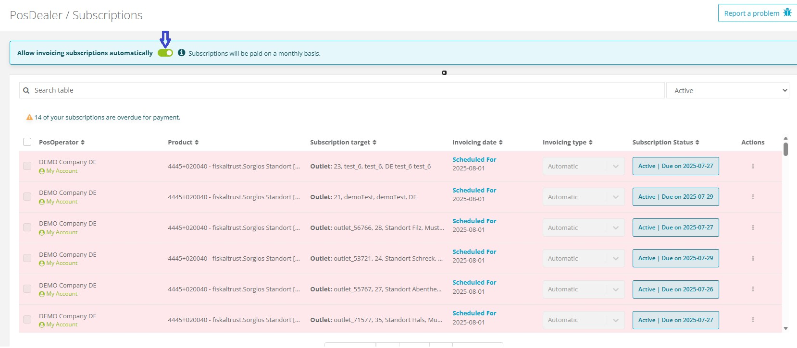
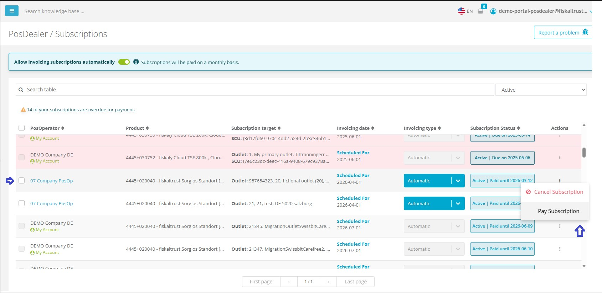

# Platform 2025-42

This release introduces Subscription Management Page Improvements.

Available since Portal November 2025

**Affected markets:** ALL

## Subscription Management

**Overview**

Subscription Page Overview
	As a PosDealer, you can get an overview of all your PosOperators' subscriptions in the PosDealer / Subscriptions tab of the fiskaltrust.Portal. You can filter the list to display overdue or upcoming subscriptions and renew payments for multiple subscriptions simultaneously. On this page, you can also manage subscriptions by opting for automatic renewals, performing manual renewals, or canceling a subscription.

**Improved:** The Subscription Management page has been enhanced to provide a clearer overview of subscriptions. Users can now easily manage subscriptions renewal and cancellations. The interface has been redesigned for better usability and accessibility.

  Users can now opt for automatic renewals for their subscriptions, ensuring uninterrupted service.

  

  Once user opt out for automatic renewals a contract shows up. After signing that contract feature will be active .

  

  Renewals can be performed in bulk, allowing users to select multiple subscriptions and renew them simultaneously.
  
  For bulk renewals and cancellations users will be able to select multiple subscriptions using checkboxes and perform actions using buttons at the bottom of the page.

  

   For individual subscriptions, action buttons are available in end of each subscription row. Once clicked, a confirmation dialog will appear to confirm the action.

   

   Same  operations apply for bulk and individual cancellations.

  If a subscription is canceled, users will receive a notification indicating the cancellation status and the remaining validity period of the subscription.

  If a subscription is close to its expiration date, users will receive a reminder notification to renew the subscription.

**Why it matters:** These improvements streamline subscription management, making it easier for users to handle their subscriptions efficiently.

**Access Links:**
- Sandbox: [https://portal-sandbox.fiskaltrust.de/PosDealer/Subscriptions](https://portal-sandbox.fiskaltrust.de/PosDealer/Subscriptions)
- Production: [https://portal.fiskaltrust.de/PosDealer/Subscriptions](https://portal.fiskaltrust.de/PosDealer/Subscriptions)

