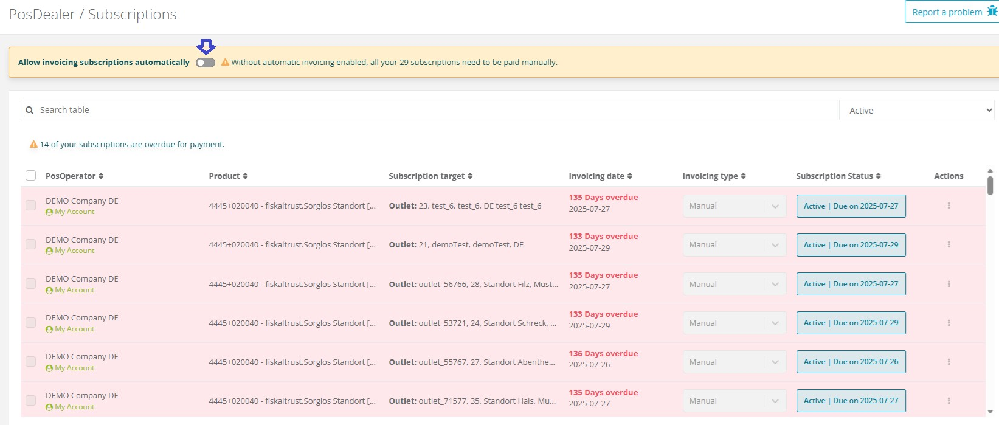
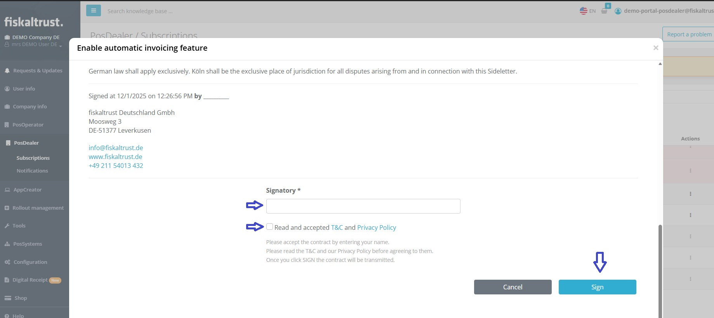
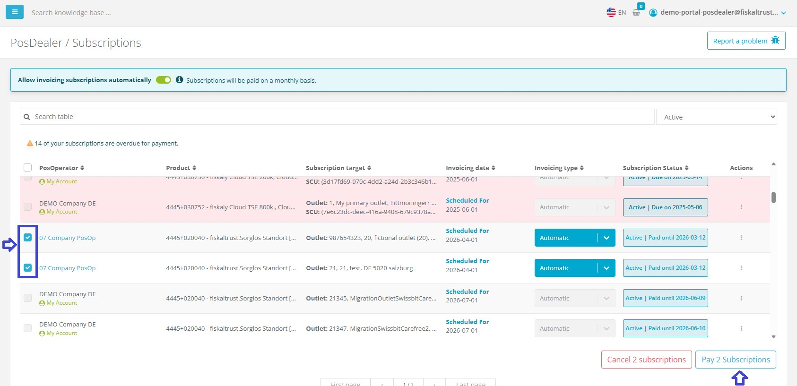
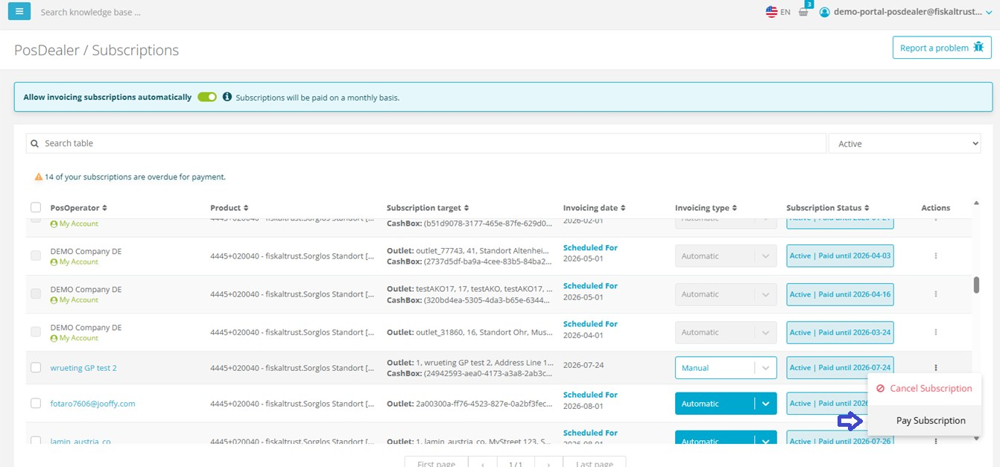
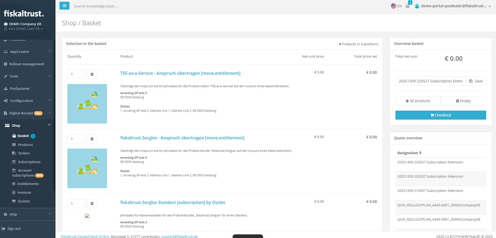
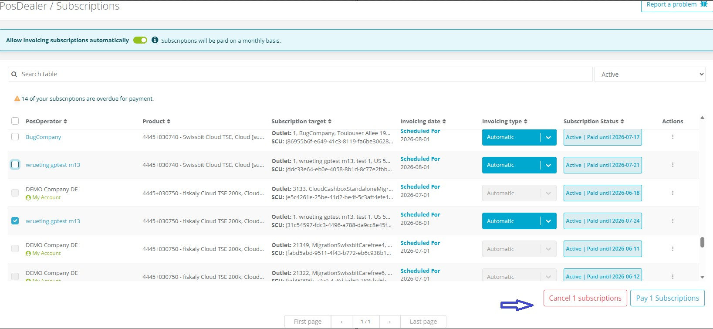
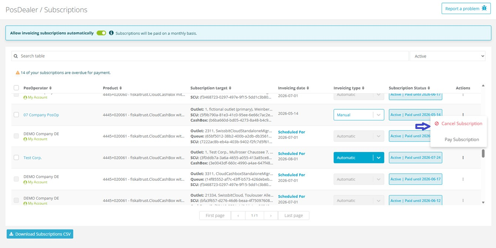
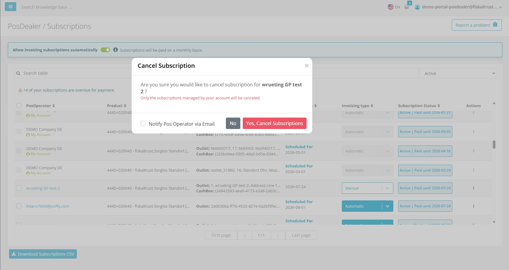

# Subscription Management

This release introduces Subscription Management Page Improvements.

Available Since April 2025

**Affected markets:** ALL

**Subscription Page Overview**

As a PosDealer, you can get an overview of all your PosOperators' subscriptions in the PosDealer / Subscriptions tab of the fiskaltrust.portal. You can filter the list to display overdue or upcoming subscriptions and renew payments for multiple subscriptions simultaneously. On this page, you can also manage subscriptions by opting for automatic renewals, performing manual renewals, or canceling a subscription.

**Improved:** The Subscription Management page has been enhanced to provide a clearer overview of subscriptions. Users can now easily manage subscriptions renewal and cancellations. The interface has been redesigned for better usability and accessibility.

  Users can now opt for automatic renewals for their subscriptions, ensuring uninterrupted service.

  

  Once user opt out for automatic renewals a contract shows up. After signing that contract feature will be active .

  

  Once the renewal is enabled ,Invoicing Type will be set to automatic and  all subscriptions that PosDealer has been managing will be automatically renewed upon expiration.

  If PosDealer decides to opt out from automatic renewals, a contract will be presented. After signing the contract, the automatic renewal feature will be deactivated.
  At that time ,the Invoicing Type will be set to manual, and all subscriptions managed by the PosDealer will require manual renewal upon expiration.

  PosDealer is able to set automatic renewal individually for each subscription as well.Once the individual renewal is enabled for a subscription that subscription will be renewed automaticaly upon expiration.

  
  
  Renewals can be performed in bulk, allowing users to select multiple subscriptions and renew them simultaneously.
  
  For bulk renewals and cancellations users will be able to select multiple subscriptions using checkboxes and perform actions using buttons at the bottom of the page.

  

  For individual subscriptions, action buttons are available in end of each subscription row. Once clicked, a confirmation dialog will appear to confirm the action. Using the action buttons you can pay for the individual subscription to extend it or choose to cancel it.

  

  If PosDealer want to manage subscription manually they can either select multiple subscriptions using checkboxes and click on "Pay Subscription" button at the bottom of the page or use the action buttons available at the end of each subscription row to pay individual subscription.

   

  There are 2 options while paying the subscription manually. 
  
  1) **Dealer Package** Option, If There is no entitlement for extending the subscription PosDealer can use DealerPackage option to add required entitlements to the shopping basket.
  
  2) **Entitlement** Option, If there is enough entitlement to extend the subscription PosDealer can use Entitlement option to extend then entitlements will be assigned to selected subscriptions at the shopping basket.

  After selecting the desired option and clicking on Pay button user will be informed via banner notification that the selected subscriptions have been added to the shopping basket.
  
   

  There will be also easy access link to shopping basket in that notification. Clicking it will redirect user to shopping basket page where user can complete the payment process.

   

  PosDealer can proceed to checkout from shopping basket page to complete the payment process.

  **Cancellation**

  Subscriptions can be canceled either individually or in bulk. PosDealer can select multiple subscriptions using checkboxes and click on the "Cancel Subscription" button at the bottom of the page to cancel them in bulk. 
 
 

  For individual subscriptions, action buttons are available at the end of each subscription row to cancel them.
  
    
   
   Once cancel subscription is clicked a confirmation dialog will appear to confirm the action.

    

  In that dialog user will be informed about the cancellation status and the remaining validity period of the subscription. Dealer can choose wheter to inform PosOperator via Email by using the **Notify PosOperator** checkbox in the dialog or not.
  
  By confirming the cancellation the selected subscriptions will be canceled and PosDealer will receive a notification indicating the cancellation status and the remaining validity period of the subscription.

  If notify PosOperator option was selected in the confirmation dialog PosOperator will receive an email notification about the cancellation.
   
  

**Why it matters:** These improvements streamline subscription management, making it easier for users to handle their subscriptions efficiently.

**Access Links:**
- Sandbox: [https://portal-sandbox.fiskaltrust.de/PosDealer/Subscriptions](https://portal-sandbox.fiskaltrust.de/PosDealer/Subscriptions)
- Production: [https://portal.fiskaltrust.de/PosDealer/Subscriptions](https://portal.fiskaltrust.de/PosDealer/Subscriptions)

