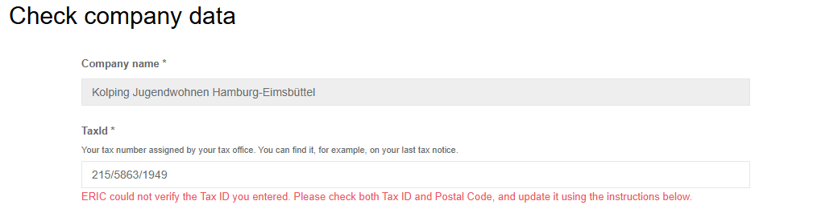
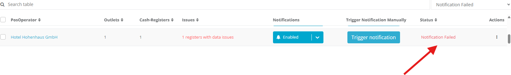
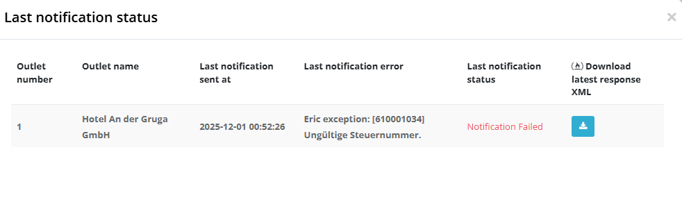
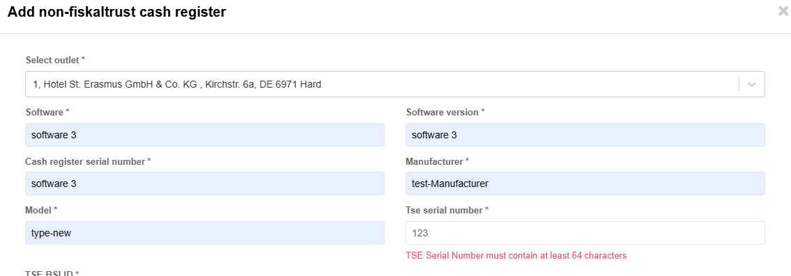
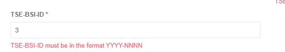
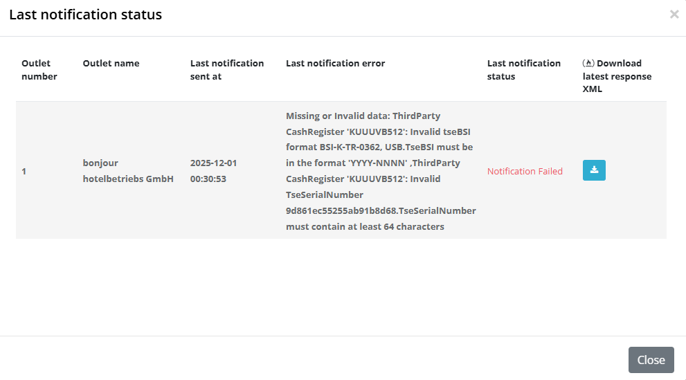
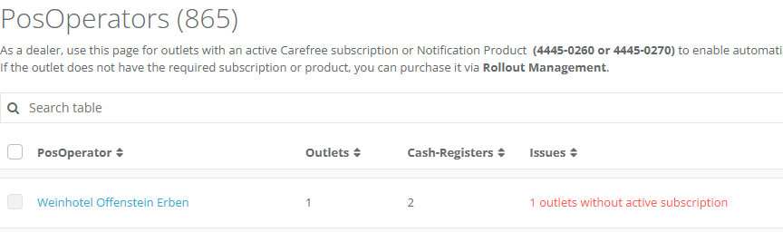
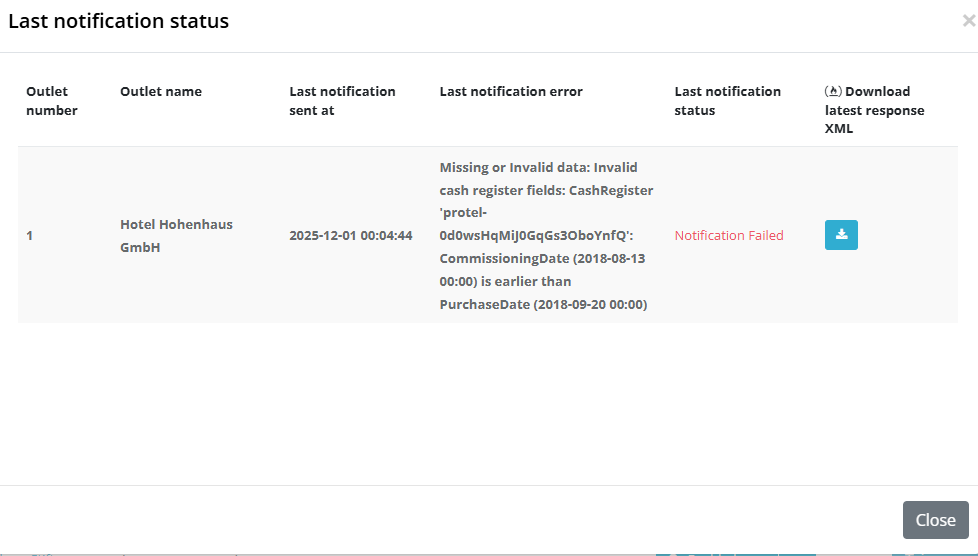
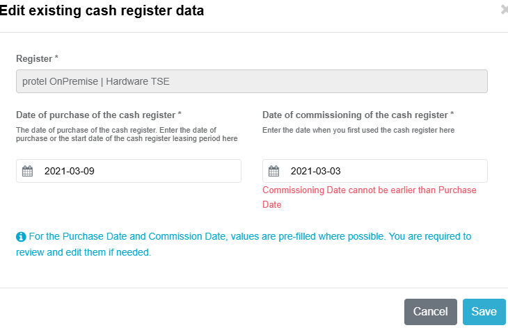
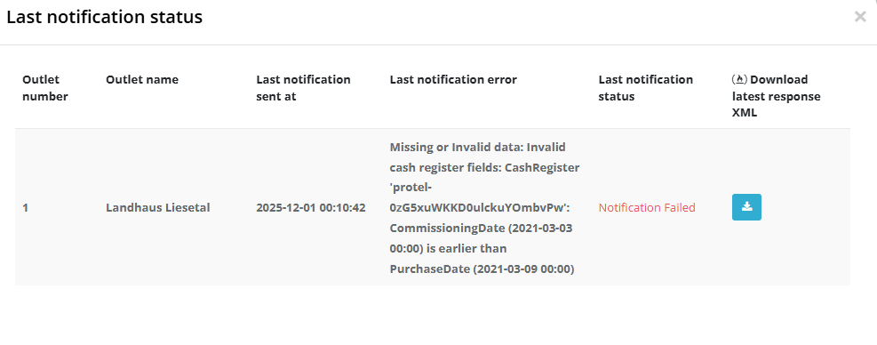

---
authors: platform
slug: portal/2025-43
tags: [Portal, Exports]
---

Available since Portal November 2025

**Affected markets:** DE

**Release Note – Notification Management Process**

**Overview**

In accordance with Section 146a (4) of the German Fiscal Code (AO), every electronic cash register or recording system must be reported to the responsible tax office within one month after being put into operation or taken out of operation.
To support this legal requirement, we have implemented a complete Notification Management Process, including:

<ul>
    <li>Notification Management Page</li>
    <li>POS Operator Data pages</li>
    <li>Notification Worker (Azure Function)</li>
</ul>

________________________________________
**New Features & Components**

1. Notification Management Page (Dealer Portal)
A new management interface is available for dealers, providing the ability to:
    <ul>
        <li>View and manage all operators under their dealership</li>
        <li>Enable or disable automatic or manual notifications for each operator</li>
        <li>Review all sent notifications along with their statuses (successful, failed, pending)</li>
        <li>Trigger notifications manually for specific operators if needed</li>
    </ul>

2. Operator Data Page

    A dedicated page where the operator can update all required data.
    The dealer sends the operator a link to this page.
    All necessary information for notifications is collected and validated here.

3. Notification Worker (Azure Function)
 
    A background worker runs every night at midnight, collecting the operator’s data and sending notifications to ERIC (third-party communication interface for German tax authorities).
________________________________________
Required Data for the Notification

Every notification must include:
<ul>
    <li>Operator information</li>
    <li>Outlet information</li>
    <li>Electronic recording system information</li>    
    <li>Type of certified TSE</li>
    <li>Number of electronic recording systems</li>
    <li>Serial number of the electronic recording system</li>
    <li>Purchase date</li>
    <li>Commissioning date</li>
    <li>TSE information (extracted from the TseInfo JSON)</li>
</ul>

________________________________________
Common Issues 
Below is a list of frequently occurring errors and how to resolve them.
1. Invalid Tax Number
    Possible Causes
    a) The tax number does not match the scheme for the Bundesland (state)
    b) The company must report to another state than where it physically operates
    c) A regional 10–11 digit tax number is used instead of the required 13-digit number

  
  
  
________________________________________
2. Missing or Invalid Data: Third-Party CashRegister (TSE Serial Number)

    Error: TSE serial number must be at least 64 characters and hexadecimal (0-9, a-f, A-F)

 
________________________________________
3. Invalid TSE BSI Certification Number
Required format: YYYY-NNNN

 
 
 

________________________________________
4. Missing Notification Product in the Outlet
Problem:
The outlet does not have an active notification product or carefree package.

 
 

________________________________________
5. ERIC Exception: Duplicate Serial Numbers
Error:
ERIC reports that the same recording system serial number is used multiple times.
Cause:
More than one queue shares the same Queue name.
Solution:
Operator → Configuration → Queues
Remove duplicates:
•	Send “Out of Operation” receipt, or
•	Hide queue if it does not exist physically
Then re-trigger the notification.

 
________________________________________
6. Missing TSE Information (TseInfoJson)
Cause:
No TSE data found in the last End-of-Day receipt → possible TSE connection problem.
Solution:
Check last End-of-Day receipt:
•	If TSE data exists → re-trigger notification
•	If not → fix the TSE connection problem or send a zero receipt to restore connection

 
________________________________________
7. Missing POS System Data (Model, Manufacturer)
Cause:
No valid POS System ID in the last End-of-Day receipt.

 
 
________________________________________
8. Invalid Date Order (PurchaseDate vs CommissioningDate)
Error:
Purchase date cannot be later than commissioning date.

 
 
 
________________________________________
9. ERIC Exception: Illegal Characters in Fields
Error:
Some characters in the legal company name or address are invalid.

________________________________________
Additional Notes

•	To check if a POS System is assigned:

Operator → Related Queue → Receipt Journal

Last daily closing must show a correct POS System ID that exists in DE Dynamic

•	A notification is only sent when:

✔ Notification state = true in Account Settings

✔ At least one outlet has an active notification subscription. And outlet should have at least one active queue or third party queue

✔ Operator has confirmed all required data

•	Postal code and tax number both should be valid while validating the tax number ( The tax number must match the correct state (Bundesland) based on the postal code)

•	We have implemented Notification_API and gradually extracting common logic from worker and portal into this API to centralize and simplify the validation and processing steps

•	Notification will be send for active queues . Hidden queues or queues that became inactive before July 1st, 2025 will not receive notifications

•	Github repository for Notification  Worker and Notification_API  can be found here:
         https://github.com/fiskaltrust/market-de-services

Useful links:
* Knowledge base article on Notification Management:( you can find solutions for common error messages here)
    https://portal.fiskaltrust.de/KBArticle#/KA-01146/Tax%20office%20notifications:%20Solutions%20for%20error%20messages
* Correct tax identification number formats:
    https://de.wikipedia.org/wiki/Steuernummer

* 13-digit tax identification number converter:
https://www.ueberbrueckungshilfe-unternehmen.de/DE/Infothek/Steuernummer-Umrechner/steuernummer-umrechner.html

