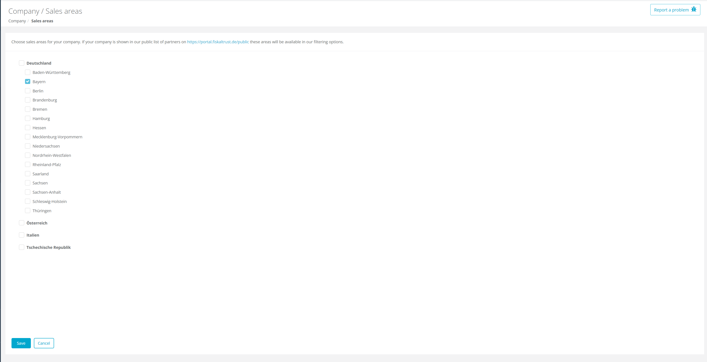
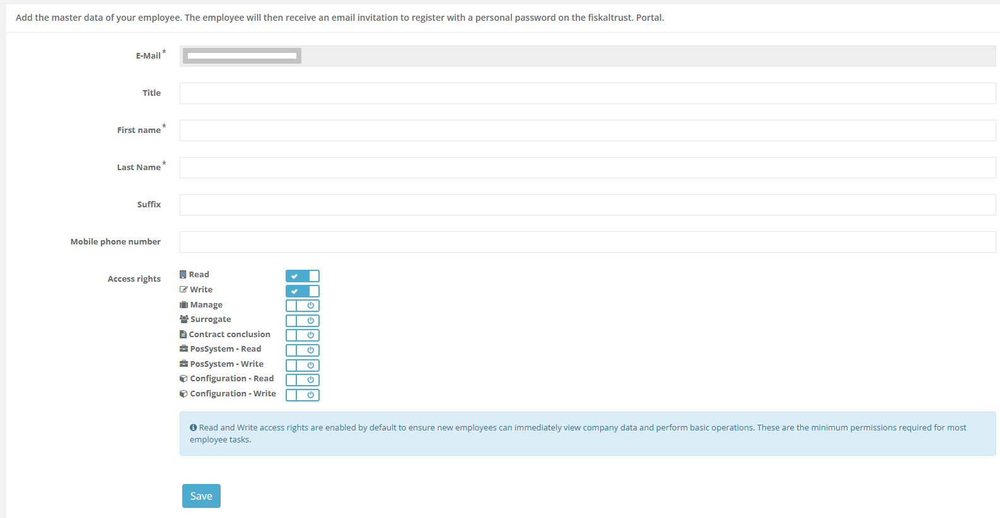
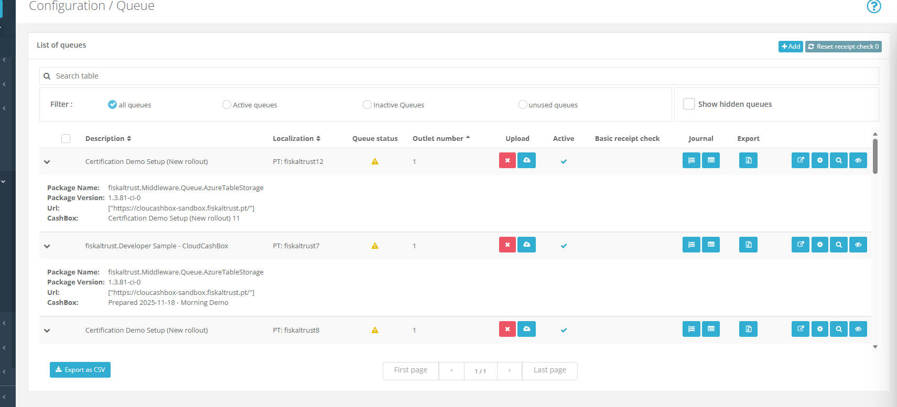

# Platform 2026-05

This release introduces template management improvements, user experience enhancements, and bug fixes for employee permissions and queue list functionality.

## Improved Template Creation Page
Available since January 29, 2026

**Affected markets:** ALL

**Improved:** The template creation page has been rebuilt with React. Creating and editing templates is now more intuitive with quicker response times.

**Key Features:**
- Improved form validation that catches errors before you submit
- Smoother, more responsive interface

**Why it matters:** Creating templates is now faster. You'll get instant feedback if something is wrong, and the there is still the same editor for editing json files.

## Sales Areas Management Migrated to React
Available since January 31, 2026

**Affected markets:** ALL

**Improved:** The Sales Areas pages now use the same React framework as the rest of the portal. Page rendering is significantly faster and the UI is unified.

**Key enhancements:**
- Used standardized components from design system
- Improved performance

 

**Why it matters:** Dealers and internal teams can edit Sales Areas in seconds, with less waiting.

## Employee Permission Default Settings Fixed
Available since January 29, 2026

**Affected markets:** ALL

**Fixed:** Creating new employees no longer results in permission errors. Read and Write access permissions are now automatically selected by default when you add a new team member.

 

**Why it matters:** Adding new employees to your team is now less error-prone. You don't have to worry about permission problems - the system automatically sets up the most common permissions, so your team members can start working right away.

## Better Login Page Behavior
Available since January 27, 2026

**Affected markets:** ALL

**Improved:** If you're already logged in and visit the login page, registration page, or home page, you'll now be automatically taken straight to your dashboard instead of seeing forms you don't need.

**Changes:**
- Login page: Takes you to your dashboard (or the page you were trying to reach)
- Registration page: Takes you to your dashboard
- Home page: Takes you to your dashboard when logged in

**Why it matters:** No more confusion or extra clicking. The portal is now recognizing when you're already logged in, saving you time and getting you to your work faster.

## Portugal Queue List Fixed
Available since January 27, 2026

**Affected markets:** 🇵🇹

**Fixed:** The queue list in Portugal now works correctly. Previously, clicking on one queue would expand all queues at once. Now when you click on a queue, only that specific queue expands, making it much easier to work with your queue list.

 

**Why it matters:** You can now easily view details for individual queues without all of them opening at the same time. This makes managing your queues much simpler and brings Portugal in line with how the queue list works in all other countries.
