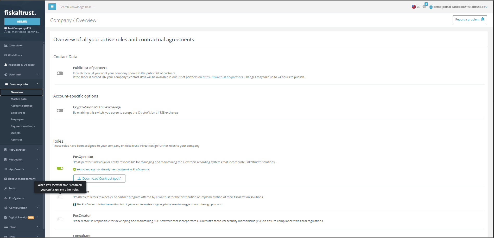

# Company Overview - Pos Operator Role Assignment Restriction

Company Overview page is the page that you can assign role to accounts. In previous version, you can assign many role to account which has been assigned as Pos Operator Role. In this version, you can only assign one role to account which has been assigned as Pos Operator Role. If you want to assign another role to account, you need to remove the Pos Operator Role from the account first.

In this new version if the user has an Pos Operator role assign then user will see the tooltip as below.

Role assignment for the ones that has only Pos Operator Role will be restricted. 
If the user has other roles assigned then user can assign other roles to the account.

## Release Information

Available in the fiskaltrust Portal since May 07, 2026.
