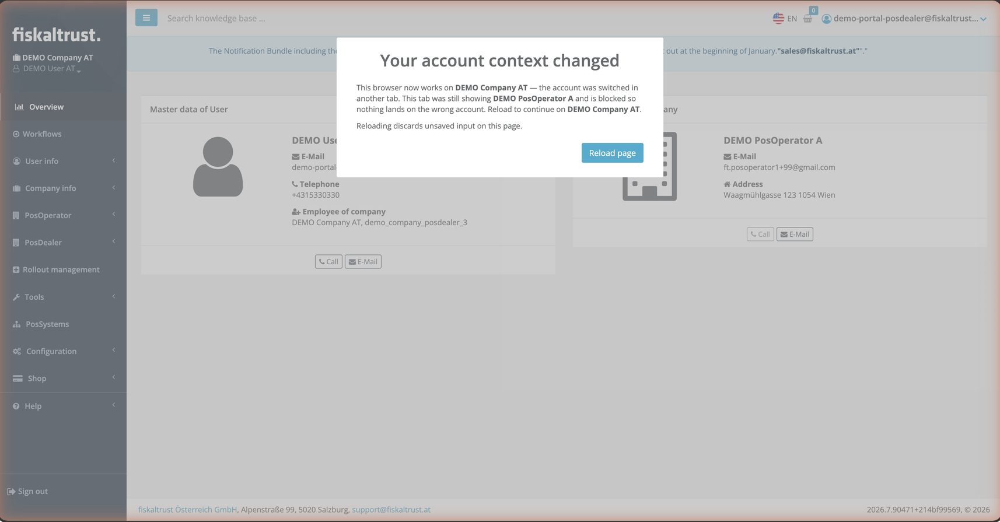

## Summary

The Service Portal now warns you immediately when the account you are working on is changed in another browser tab — for example after switching to a different account or signing in as a different user. Out-of-date tabs are blocked with a clear message, so nothing is accidentally done on the wrong account.

<!--truncate-->

## Why This Matters

The Service Portal can only be signed in as one user and one active account per browser. Many of you — especially PosDealers who manage several customer accounts — work in multiple tabs at the same time. Until now, switching the account in one tab silently affected every other open tab: those tabs kept **displaying** the previous account while everything you did in them was already **applied to the newly selected account**.

In the worst case, this meant configuration changes could land on the wrong customer account without any visible hint that something was off. This update removes that risk: the moment your account context changes anywhere in the browser, every other tab tells you — instantly and unmissably.

## What Changed

- When the active account changes in another tab, all other open portal tabs immediately show a **blocking warning dialog**. It names both accounts — the one the tab was showing and the one the browser is now working on — so you always know exactly what happened.
- The dialog cannot be dismissed by accident: to continue, you choose **Reload page**, which takes you to the dashboard of the now-active account.
- If a different user signed in on the same browser, the warning offers an additional **Sign out** option.
- If you switch back to the original account before reloading, the warning disappears by itself and you can simply keep working.
- Nothing changes for anyone working in a single tab — the warning only ever appears when a tab has genuinely fallen out of sync.

## Impact

This affects all markets and requires no action on your side. The warning is most valuable for PosDealers and consultants who work on several customer accounts in parallel tabs — accidental changes on the wrong account are now effectively prevented. The feature is being rolled out gradually; the warning currently appears on the portal's modernized pages, which cover the vast majority of daily workflows.
