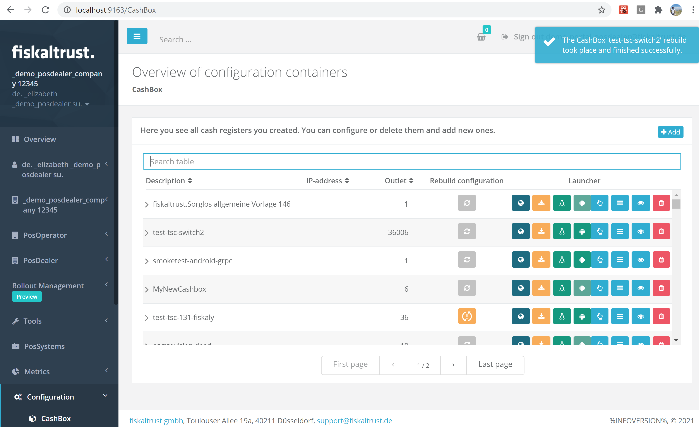

# fiskaltrust.Portal - Sprint 101
_May 31, 2021_

**Usability improvements**

In this sprint, we have introduced some usability improvements including improving the overall performance.

## Features

### Middleware Configuration
- [Visual improvements to Middleware component dialogues](#visual-improvements-to-middleware-component-dialogues)
- [Feedback on Cashbox rebuild](#feedback-on-cashbox-rebuild)

## Middleware Configuration

### Visual improvements to Middleware component dialogues

Some minor visual improvements of the TableViews in Portal have been implemented. We invested some time in improving the way our tables are displayed. Visually nothing major should have changed, aside from a smaller screen size -in which the user is navigating the TableViews page- does not affect anymore the way the tables are shown. The performance of the page in different resolutions has also been improved, and lastly, the precision of the search results when using the search function has been improved.

### Feedback on Cashbox rebuild

When rebuilding a Cashbox, Users can now get some more (visual) feedback on when the rebuild is finished.
A notification has been added to inform Users when CashBox rebuild is finished. 

## Next steps
In the next weeks we will focus on improving the Knowledge base experience in portal.

## Feedback
We would love to hear what you think about these improvements and fixes. To get in touch, please reach out to [feedback+portal@fiskaltrust.cloud](mailto:feedback+portal@fiskaltrust.cloud).

