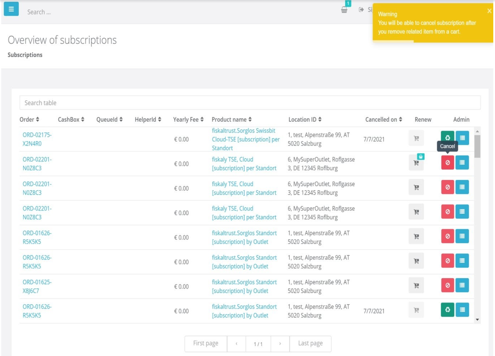
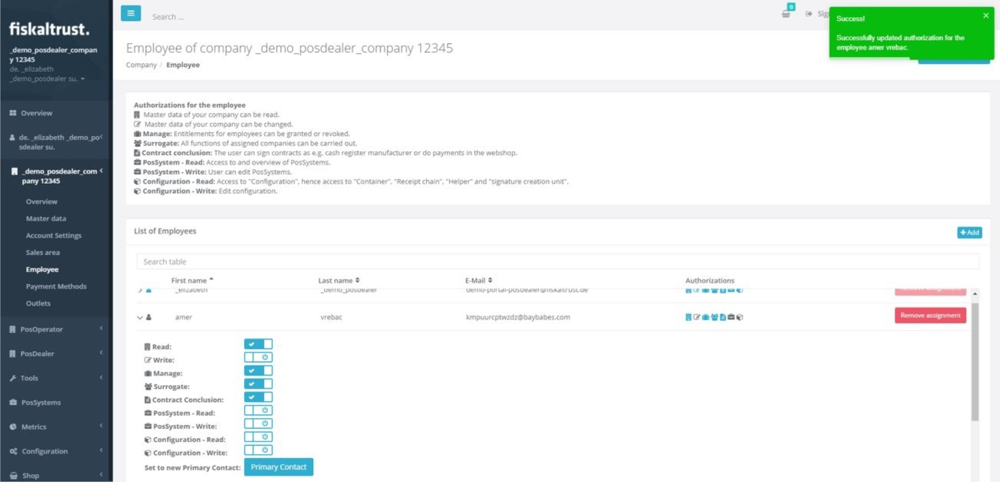
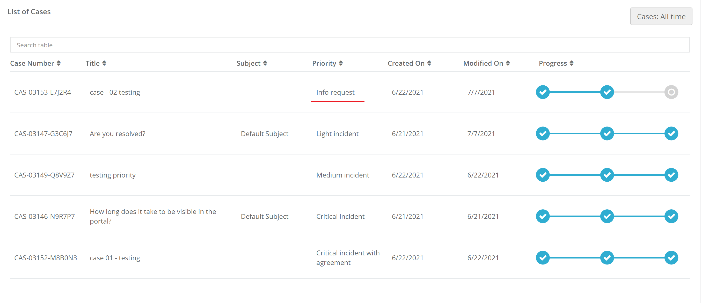

# fiskaltrust.Portal - Sprint 104
_July 12, 2021_

This Sprint’s main goals were improving the user experience of the Subscriptions Page, as well as the new Cases View page in Portal.

## Features

### Middleware Configuration

- [Reworked Subscriptions Page DE & FR](#Reworked-Subscriptions-Page-DE-&-FR)
- [Reworked Employees Page](#Reworked-Employees-Page)

### Support

- [Improvements of the new Cases View page in Portal](#Improvements-of-the-new-Cases-View-page-in-Portal)

## Middleware Configuration

### Reworked Subscriptions Page DE & FR

The Subscription Pages for DE and FR have been reworked and improved.
Users can now enjoy a better experience while navigating through those pages, as the performance times have been improved and the page can now handle bigger amounts of data better.
Features such as user warning when canceling subscription if a renewal product is in the shopping cart, as well as the disabling of the renewal button for cancelled subscriptions have been included.

### Reworked Employees Page

The Employees Page in Portal has been reworked and now the user experience has been improved. The performance of the page has increased and a bigger amount of data can now be handled more efficiently. Aside from that, toast notifications for all available actions have now been added. 

## Support

### Improvements of the new Cases View page in Portal

The recently implemented Cases View Page that visualizes the onboarded customers’ cases has been further improved. Valid Cases categories now include also the “Keine Störung” category, and the “Sort” functionality has been added into the Progress column.

## Next steps
In the next weeks we will focus on improving the performance of the portal.

## Feedback
We would love to hear what you think about these improvements and fixes. To get in touch, please reach out to [info@fiskaltrust.at](mailto:info@fiskaltrust.at).

