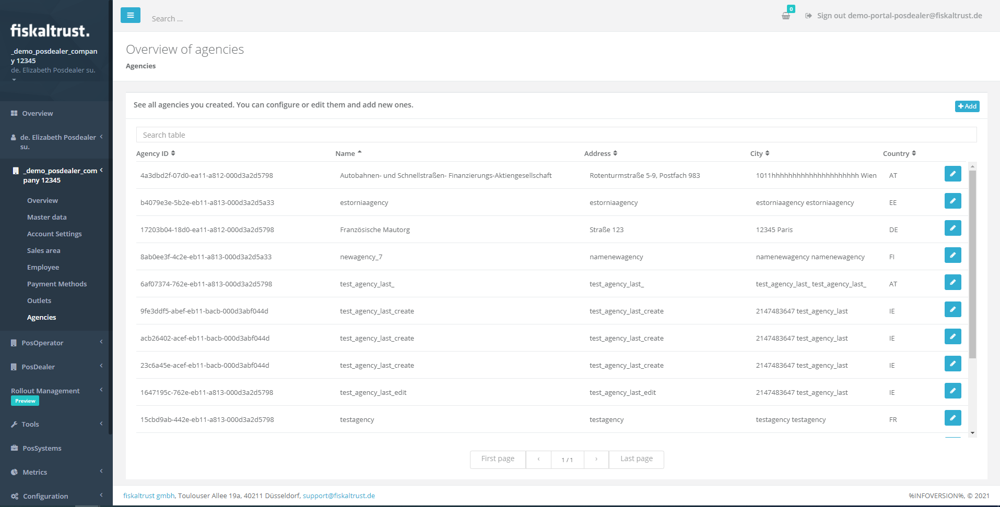
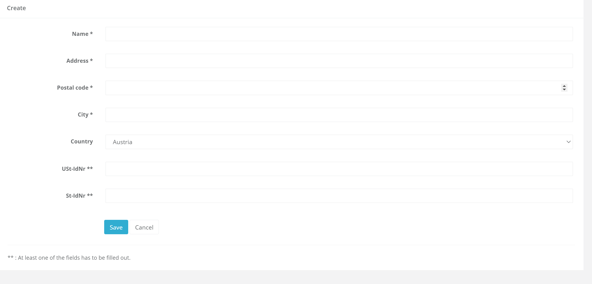
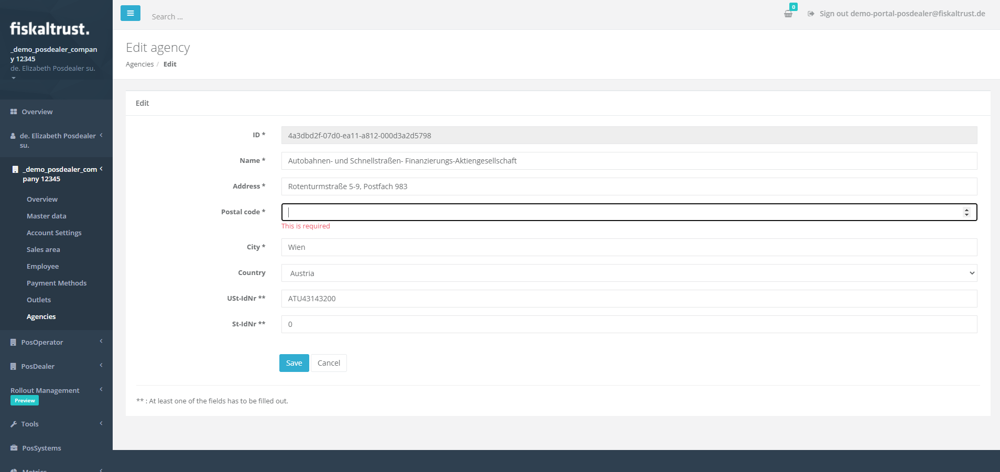
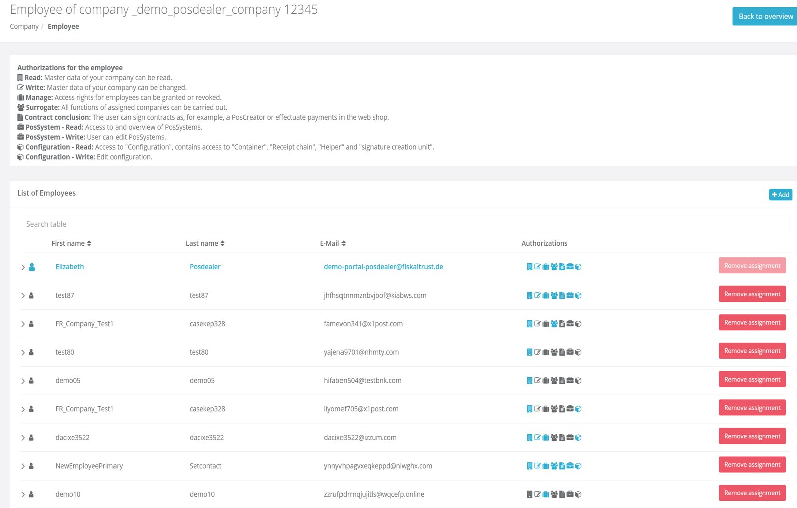

# fiskaltrust.Portal - Sprint 106
_August 9, 2021_

This sprint we have been working on improving the overall usability of employee and agencies management.

## Features

### Middleware Configuration

- [Reworked Agencies Page](#reworked-agencies-page)
- [Highlighting Primary Contact on Employees Page](#highlighting-primary-contact-on-employees-page)
- [Employees Page Improvements](#employees-page-improvements)

## Middleware Configuration

### Reworked Agencies Page

The Agencies  Page in Portal has been reworked and now the user experience has been greatly improved. All functionalities are kept but the user -aside from a significant improvement in the performance of the page- will also notice an improved experience when it comes to the following functionalities, as it can be shown in the pictures below:
- Searching
- Sorting
- Pagination
- Add
- Edit
- Validation
- Routing

### Highlighting Primary Contact on Employees Page

The order of displaying data in the Employees Page table has been changed, and now, when Users navigate to the new employee's page, the primary contact will show up in the first row, as the “first” employee. 

### Employees Page Improvements

Until now, when trying to perform an update of the permissions for an employee, the switch is not refreshed and an error message is shown even though it was performed successfully. Now, this has been corrected and when users are updating permissions, the information about this update is immediately visible.
Aside from this, another improvement has been implemented in this Sprint:
So far, the wrong error message was being displayed when inviting employees, whenever there were issues with the given data. Now, the correct error message is displayed, based on data validation results. So, whenever companies cannot be invited due to various data issues, the users are now properly informed on what exactly was the problem.

## Next steps
In the next weeks we will focus on improving the PosOperators View.

## Feedback
We would love to hear what you think about these improvements and fixes. To get in touch, please reach out to [feedback+portal@fiskaltrust.cloud](mailto:feedback+portal@fiskaltrust.cloud).

