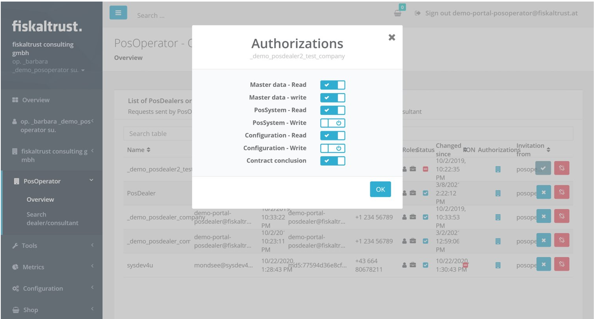
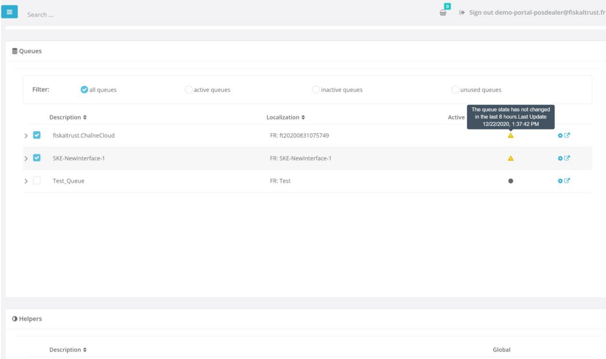
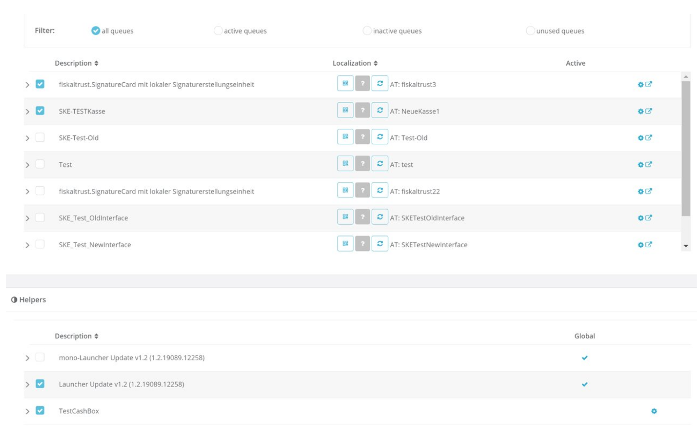

# fiskaltrust.Portal - Sprint 108
_September 9, 2021_

In this sprint we have been working on improving the usability and the user experience of the connections page, one of the most used pages in portal.

## Features

### Middleware Configuration

- [Reworked POS Dealer and POS Operators connections](#reworked-pos-dealer-and-pos-operators-connections)
- [Reworked CashBoxEdit Pages for AT and FR](#reworked-cashboxedit-pages-for-at-and-fr)

## Middleware Configuration

### Reworked POS Dealer and POS Operators connections

Now, aside from all the previous functionalities, POS Dealers, when they navigate to the POS Operators page, they now have access to a list of all connected POS Operators so they can perform their day to day operations easily. In the same way, POS Operators, when they navigate to the POS Dealers page, they now have access to a list of all connected POS Dealers. Those lists are now shown immediately, pagination is supported, and the users can enjoy an overall better experience navigating those pages.

### Reworked CashBoxEdit Pages for AT and FR

The CashBoxEdit Pages for France and Austria have been reworked and improved. Aside from the previous functionalities which are still available,and the overall improved performance of those pages, now users can use a new filter that is based on Outlets. Aside from that, the configuration link/button is not visible for global helpers, and only Helpers with a version higher than 1.3 are shown

## Next steps

In the next weeks, we will focus on improving error messages in Portal and improving the usability of the Help section. 

## Feedback
We would love to hear what you think about these improvements and fixes. To get in touch, please reach out to [feedback+portal@fiskaltrust.cloud](mailto:feedback+portal@fiskaltrust.cloud).
