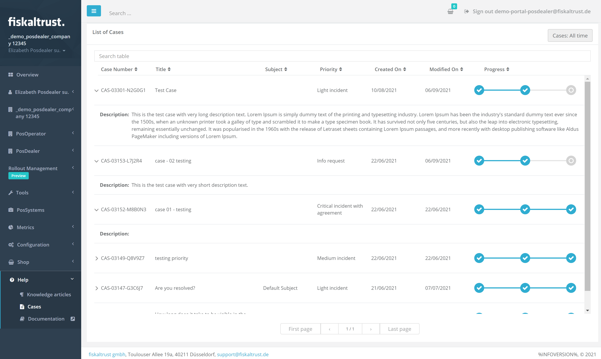
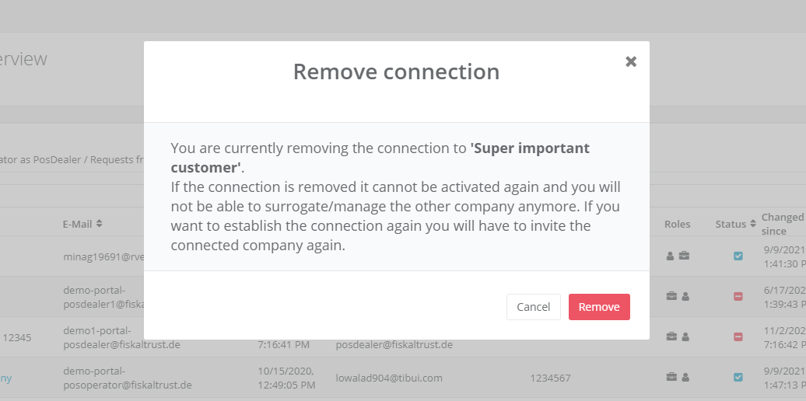
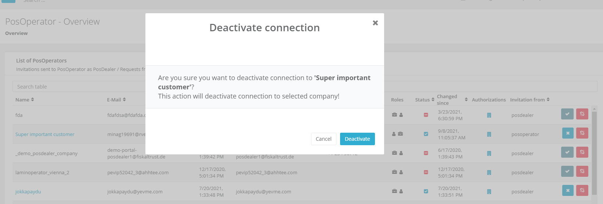
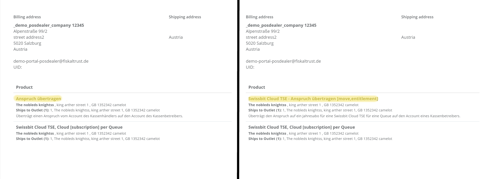
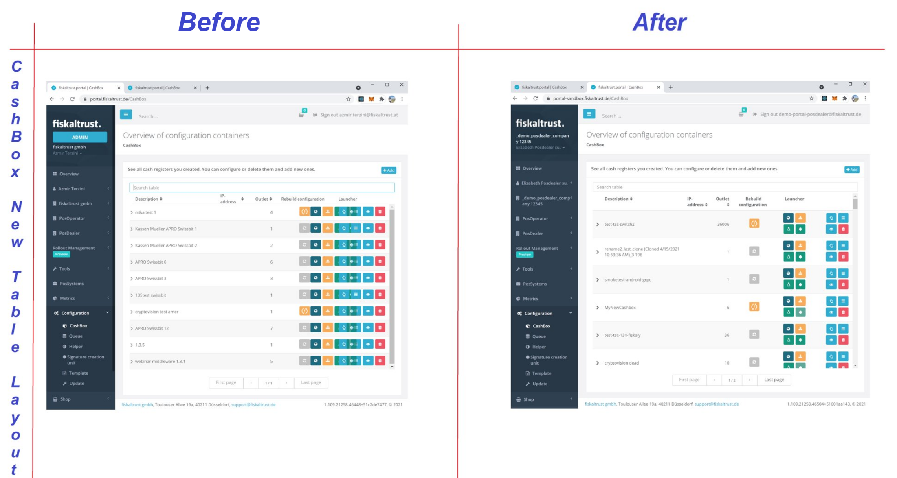
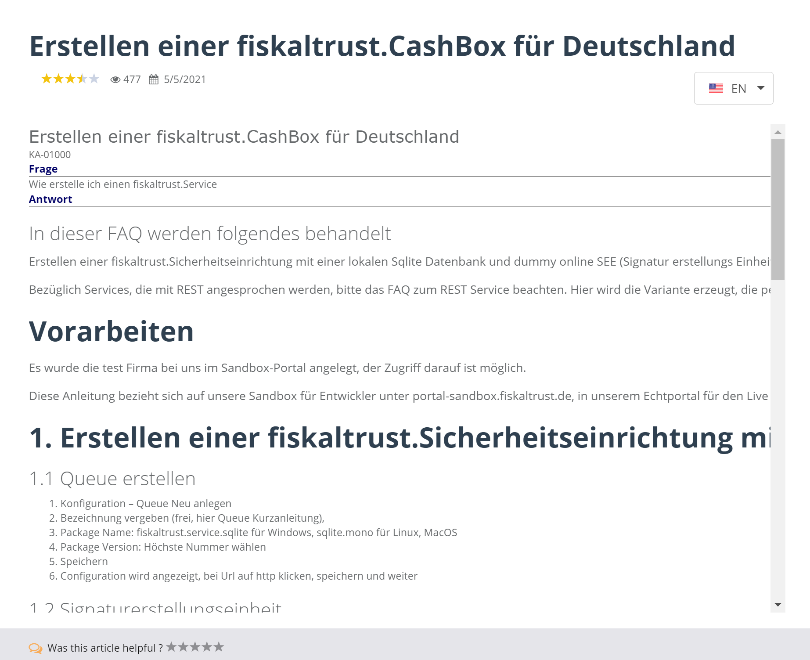

# fiskaltrust.Portal - Sprint 109
_September 20, 2021_

In the next sprints, the main focus was the scaled rollout for the french market and general user experience improvements.

## Features

### Middleware Configuration

- [Improvements in case description in Cases view](#improvements-in-case-description-in-cases-view)
- [Improvements in POS Operators Page](#improvements-in-pos-operators-page)
- [Fixed templated Product Names in Orders Page](#fixed-templated-product-names-in-orders-page)
- [Improved visualization of the contents in table views in Portal](#improved-visualization-of-the-contents-in-table-views-in-portal)

### Support
- [Knowledge based articles improvements](#knowledge-based-articles-improvements)
- [Enabled rollout plans for FR market](#enabled-rollout-plans-for-fr-market)

## Middleware Configuration

### Improvements in case description in Cases view

Now, the users have the possibility of seeing additional details for cases so they are better informed. A description has been added as a row detail for each case:

### Improvements in POS Operators Page

Now, users get a relevant confirmation dialogue before deactivating or removing a connection between them and another company. This will help prevent accidental removals or deactivation of connections, as the user now gets an appropriate warning about the effects of their actions (removing or deactivating a connection), and is asked to confirm or cancel said action.

### Fixed templated Product Names in Orders Page

In the past, it was impossible for the customer navigating in the Orders Page to know -aside from the generic product name- which exact product has been ordered. 
Now, this has been fixed and the detailed name and description of each ordered product are clearly depicted in the Orders Page in Portal. In the picture below the state before and after this fix are shown:

### Improved visualization of the contents in table views in Portal

In some pages, for example in the CashBox and SCU pages, some parts of the tables are overlapping or even hidden in the new table view for small screens.
Furthermore, the end of the table view disappears for low resolutions, and when the text length of a column is long, the height is not flexible and the text is overlapped with other rows. 
All these issues have now been tackled and improved. So all the tables in Portal appear correctly and the contents fit properly into all the tables, rows and columns.
An example shown below is the CashBox before and after these improvements.

## Support

### Knowledge based articles improvements

Various improvements have been implemented when it comes to selecting the language in the KBA platform.  Now, at each selected highlighted article, the user is seeing a dropdown list that displays all the available languages prioritized consistently first by the account and then the market language. 

### Enabled rollout plans for FR market 

The following rollout plans have been activated for the french market:

- Archive Auditable with Dealerpackage

   - Number: 4652-0002 
   - Title: fiskaltrust.ArchiveAuditable (Reseller Package)
   - Description: Buy an entitlement for a fiskaltrust.ArchiveAuditable. The entitlement is transferred to the outlet of choice and is created (redeemed) there.
   - Included Products:
     - 4652-021020 fiskaltrust.ArchiveAuditable (Forfait Revendeur)
     - 4652+020020 fiskaltrust.ArchiveAuditable [subscription] by Outlet

- Archive Auditable with Move Entitlements

   - Number: 4652-0011 
   - Title: fiskaltrust.ArchiveAuditable (Move Entitlements)
   - Description: Buy an entitlement for a fiskaltrust.ArchiveAuditable. The entitlement is transferred from the account to the outlet of choice there.
   - Included Products:
     - Move Entitlement for ArchiveAuditable
     - 4652+020020 fiskaltrust.ArchiveAuditable [subscription] by Outlet

## Next steps
In the next weeks, we will focus on improving error messages in Portal and improving the usability of the Help section. 

## Feedback
We would love to hear what you think about these improvements and fixes. To get in touch, please reach out to [info@fiskaltrust.at](mailto:info@fiskaltrust.at).

© 2021 GitHub, Inc.
Terms
Privacy
Security
Status
Docs
Contact GitHub
Pricing
API
Training
Blog
About
