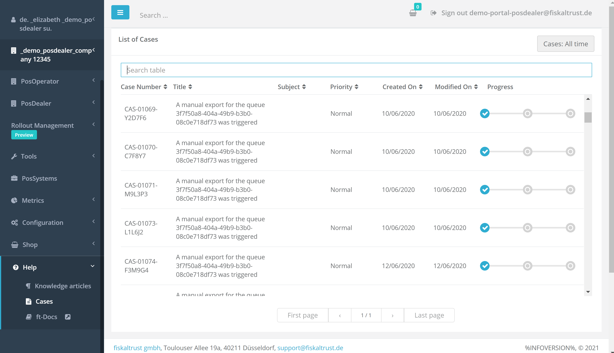

# fiskaltrust.Portal - Sprint 109
_September 20, 2021_

In the next sprints, the main focus was the scaled rollout for the french market and general user experience improvements.

## Features

### Middleware Configuration

- [Improvements in case description in Cases view](#improvements-in-case-description-in-cases-view)
- [Improvements in POS Operators Page](#improvements-in-pos-operators-page)
- [Fixed templated Product Names in Orders Page](#fixed-templated-product-names-in-orders-page)
- [Improved visualization of the contents in table views in Portal](#improved-visualization-of-the-contents-in-table-views-in-portal)

### Support
- [Knowledge based articles improvements](#knowledge-based-articles-improvements)
- [Enabled rollout plans for FR market](#enabled-rollout-plans-for-fr-market)

## Middleware Configuration

### Improvements in case description in Cases view

### Improvements in POS Operators Page

### Fixed templated Product Names in Orders Page

### Improved visualization of the contents in table views in Portal

## Support

### Knowledge based articles improvements

### Enabled rollout plans for FR market 

A new Cases View of the cases of the current user has been implemented. When a customer calls or sends an email request, a case is created internally and a case-onboarding message is sent to the customer, summarizing the case. Email is sent out and the cases statuts is incremented, and after that, the case is visible in Portal. This new Cases page has all the same functionalities  (filtering, sorting, pagination etc) as our other tables.  All active cases of the user after login, as well as the progress of each case can now be displayed. 

## Next steps
In the next weeks, we will focus on improving error messages in Portal and improving the usability of the Help section. 

## Feedback
We would love to hear what you think about these improvements and fixes. To get in touch, please reach out to [info@fiskaltrust.at](mailto:info@fiskaltrust.at).

© 2021 GitHub, Inc.
Terms
Privacy
Security
Status
Docs
Contact GitHub
Pricing
API
Training
Blog
About
