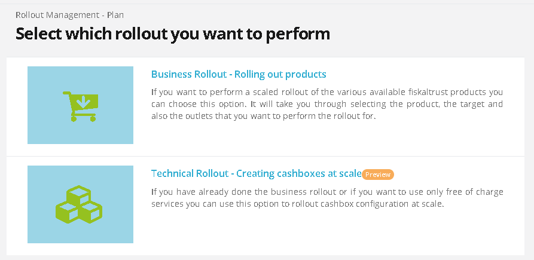

# fiskaltrust.Portal - Sprint 110
_October 4, 2021_

In the past weeks we have been hardly working on creating the Technical Rollout which should help our customers to rollout Middleware configurations similar as they are currently rolling out products with the Rollout Management.

## Features

### Middleware Configuration

- [Reworked ContactProfile Data Edit Page](#reworked-contactProfile-data-edit-page)
- [Replaced images that are displayed while logging in Portal](#replaced-images-that-are-displayed-while-logging-in-portal)

### Support

- [Technical Rollout in DE](#technical-rollout-in-de)
- [New Product Detail Card Component](#new-product-detail-card-component)
- [Rollout plan site is translatable](#rollout-plan-site-is-translatable)

## Middleware Configuration

### Reworked ContactProfile Data Edit Page

The ContactProfile Data edit page has been reworked and aside from offering the same functionalities as before, now client-side validation has been added and some visual improvements and performance improvements can be observed.

### Replaced images that are displayed while logging in Portal

In the past, when users were logging in, they were not sure whether they were logging into the correct market. Now, the images shown for each market are the actual logos of said market (AT, DE and FR).

## Support

### Technical Rollout in DE

After several iterations, finally we have the rollout in the DE market. The preview flag has been released and removed from the rollout management & plan. New navigation icons are available in the rollout management menu section, and the preview of technical rollout for templates has been launched. After selecting between a technical and a business rollout, the user now has the option to select one of the existing configuration templates, accounts and outlets. FInally, a quote is generated and everything is ready for checkout. Checking out the template will execute it, producing cashboxes, queues, SCUs and helpers, all done fully automated, giving finally the users the ability to roll out a single template to multiple outlets of the same customer in a safe, fast and easy way.

### New Product Detail Card Component

Now, when users are buying a product, they have the new product detail card component, which is offering them information on each specific product, such as price, product number and a short description, whenever they want to navigate to the details page.
Aside from that, they can specify the exact quantity of items to purchase and they can use a button to add items into the cart.

### Rollout plan site is translatable

Up until now, the RolloutPlans were not being translated. In order to make things easier for POS Dealers who do not speak German, now all data that we are showing, are presented originally in English and can be found in the tr

## Next steps
In the next weeks we will focus on connecting the Technical Rollout to the business Rollout

## Feedback
We would love to hear what you think about these improvements and fixes. To get in touch, please reach out to [feedback+portal@fiskaltrust.cloud](mailto:feedback+portal@fiskaltrust.cloud).
