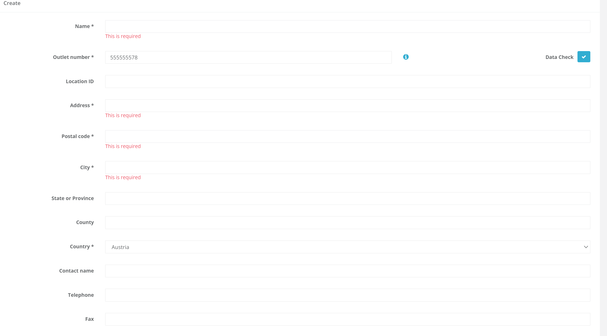

# fiskaltrust.Portal - Sprint 112
_November 1, 2021_

The focus of this sprint was improving the overall user experience of various pages including Outlets, and Usermanagement pages. We have mainly worked on adding stability and performance improvements.

### Master Data

- [Reworked outlet create and edit pages](#reworked-outlet-create-and-edit-pages)

### Usermanagement

- [Reworked change username pages](#reworked-outlet-create-and-edit-pages)

## Master Data

### Reworked outlet create and edit pages

Outlet create and edit page have been reworked and improved. The layout has been modified in a way that the information is better aligned. This is mainly a quality of life improvement including better performance.

## Usermanagement

### Reworked change username pages

Further improvements have been made to the change username experience. We have added some clearer error messages and also additional quality of life improvements.

## Next steps

In the next weeks, we will focus on improving Bulk Import Features and on improving generally the user experience. 

## Feedback
We would love to hear what you think about these improvements and fixes. To get in touch, please reach out to [feedback+portal@fiskaltrust.cloud](mailto:feedback+portal@fiskaltrust.cloud).
