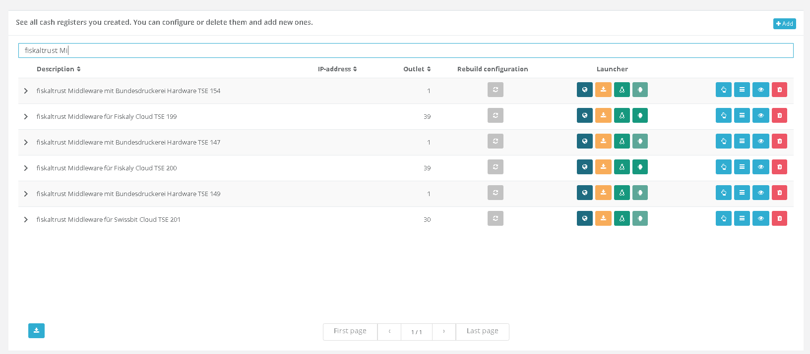
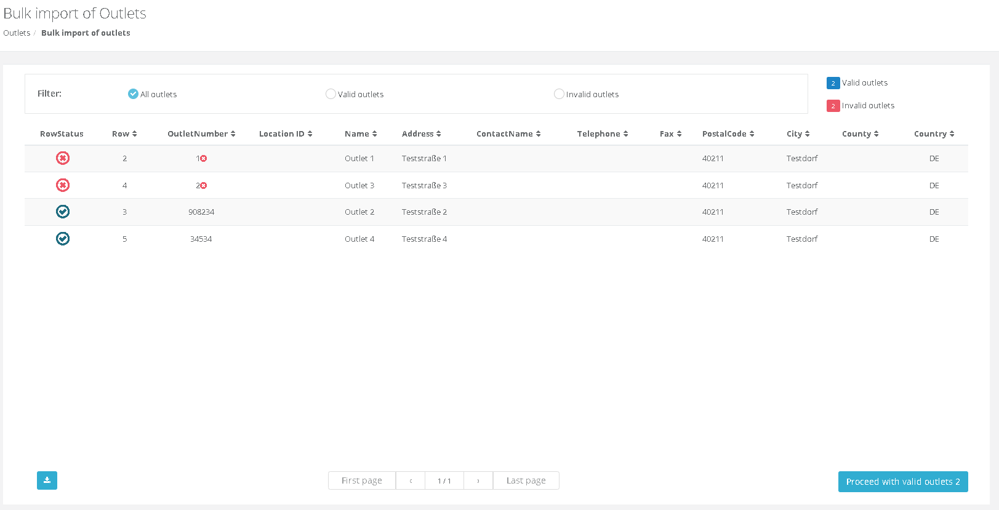

# fiskaltrust.Portal - Sprint 113
_November 15, 2021_

In this sprint we have focused on two feature areas. The first one is importing outlets. We wanted to make it easier for users to import outlets even though some of them are errornous. The second focus in this sprint was extending many pages to also have the ability to download data in CSV format.

### General

- [Export data as csv](#export-data-as-csv)

### Master data

- [Improve bulk import experience for outlets](#improve-bulk-import-experience-for-outlets)

## General

### Export data as csv 
After improving the overall experience when working with data in portal we are happy to announce yet another feature that we believe to be helpful to many of our users. In the past users often asked us about export capabilities for data that is stored in portal. We have added this functionality to most of the datatables and starting from now users can download a csv including the data that is displayed in the respective table and also additional fields that we are not displaying. Each table now has a button on the lower left that can be used to get a csv export.

## Master data

### Improve bulk import experience for outlets

We are very happy to announce that we are finally releasing the new version of the bulk import experience. This not only includes various performance improvements, but also new exicting features. While working on this feature our main focus was adding support for having a bullet proof import experience. In the past users had to rework the csv file and start over again in case of wrong entries. With the new experience we have now added a way to continue importing those entries that have been validated correctly and just ignoring the wrong rows. We have also tried to add some filters and visual indicators that should help users to find out if there are errors in the file. 

## Next steps

In the next weeks, we will focus on improving Bulk Import Features and on improving generally the user experience. 

## Feedback
We would love to hear what you think about these improvements and fixes. To get in touch, please reach out to [feedback+portal@fiskaltrust.cloud](mailto:feedback+portal@fiskaltrust.cloud).
