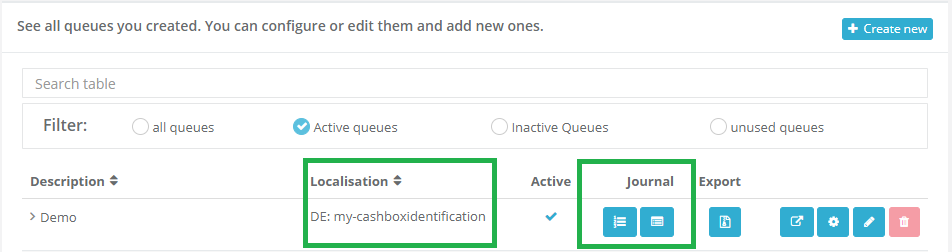
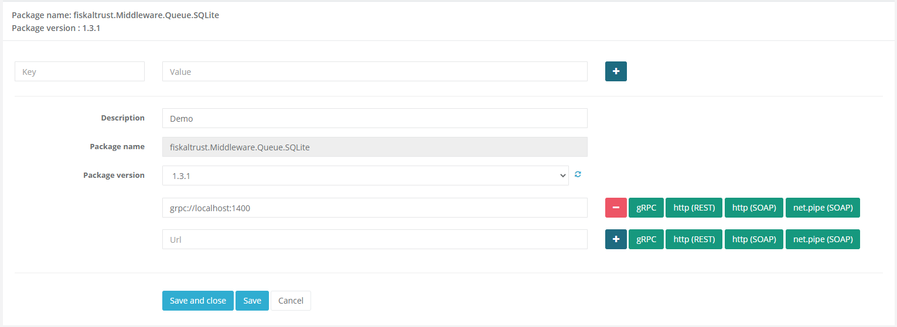

# fiskaltrust.Portal - Sprint 75
_June 8, 2020_

Beginning with this sprint, we will release bi-weekly updates on the changes made in the **fiskaltrust.Portal**. These release notes will contain a sum-up of all customer-relevant changes that were made, although these changes might be already rolled out at that time (depending on the severity and the user region).

If no customer-relevant changes to the portal were made in a sprint, we will omit publishing empty release notes. Since constant effort is put into improving our services, this usually means that only our non-customer-facing backend services were improved during these sprints.

## Features and general improvements
- We added a Powershell script to easily update launcher installations (which is exceptionally required once when updating to the Middleware 1.3.1). The script can be found in the **Downloads / Public Documents** section in the Portal.
- Access to the _Receipt_ and _Action Journals_ was enabled in the German and French production Portal. These lists can be accessed via the respective buttons in the Queue list.
- The Queue overview in the German and French production Portal now displays localization information (i.e. the _CashboxIdentification_). 
  
- When creating Swissbit TSEs, the _Device Path_ is now a required parameter.
- Buttons to add REST and gRPC URLs were added to Queue and SCU configuration pages. 

## Stability improvements and bugfixes
- We fixed several issues that could occur when requesting exports, including issues with the range selection/the slider. Additioanlly, the performance of the site was improved. 
- Text now do not exceed the frame anymore when displaying receipts from the Receipt Journal.
- Several issues that could lead to server errors under rare circumstances were fixed. This mostly occured while using the Surrogating feature, or accessing child subscriptions.
- An issue was fixed that prevented the proper sending of e-mails under very specific circumstances.

## Next steps
In the upcoming sprints, the development team will mostly focus on improving the customer onboarding experience in the Portal, e.g. by providing APIs for mass onboardings, and simplifying the contract signing process.

In addition to this, we will continue to improve the _Export_ features in the portal. 