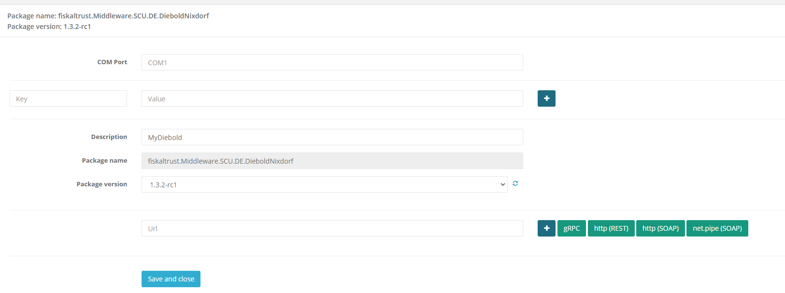
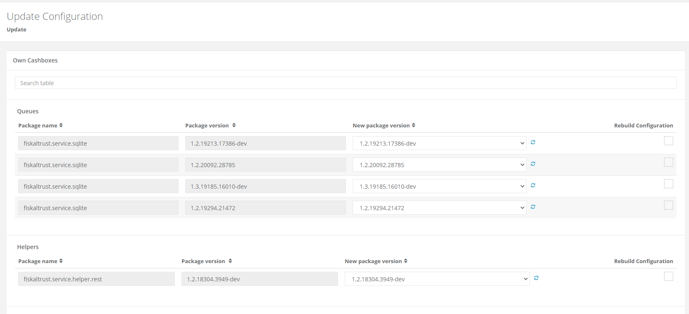
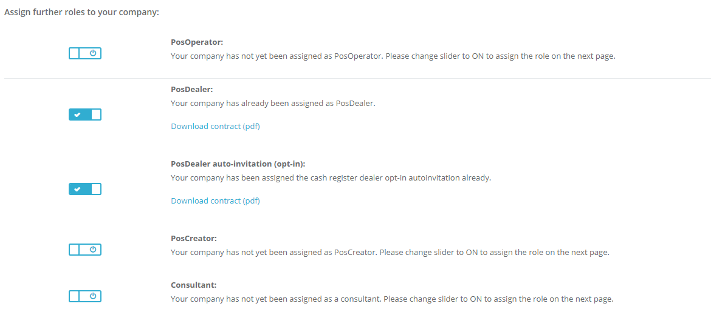
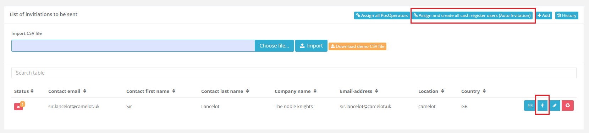

# New Data Export Experience - Sprint 76 Update
_June 22, 2020_

In the Sprint 76 Update of fiskaltrust.Portal, we are excited to announce that we have a completely new data export experience which not only should make selecting specific exports easier, but also should finish within several minutes instead of hours. 

In addition, we've added a automatic onboarding flow to the german sandbox environment. Now PosDealers are able to onboard PosOperators without further manual interaction.

Check out the [Features](#features) list below for more.

## Features

### Data Exports 

#### New Data Export Experience

#### CSV Export

#### FTP Upload simplified

#### FR Export Preview

### E-Commerce

### Improved Usability slider

### Additional information on parameters in journal.json

### DSFin-VK Prototype ????

#### Seperate template-products by market
In the past we have not seperated the template-based-products for different markets. This led to the fact that we have shown all of these products in the shop. We have made some changes to being able to separate these products between the markets and now only products that are really available for the given market are shown.

### Middleware Configuration

#### Configuring Diebold Nixdorf SCU
Similar to the other SCUs we do have a Diebold Nixdorf specific configuration page now that should make configuring the Diebold Nixdorf SCU easier for the users.
 
 
  

#### Bulkupdate functionality not working
When updating a Configuration in the Bulkupdate Interface a 500 error occurred. This issue was fixed and the functionality for updating middleware componenents and rebuilding the cashboxes automatically is back again.
 
 
  

### User Management

#### Sandbox Feature - Auto-Onboarding of PosOperators (DE only)
We have been getting many questions on how to make the onboarding experience easier for PosDealers. Since most of the PosDealers are managing many customers with the ft-Portal it is sometimes hard to get everybody on board. In the past we already had the invitation process which created the accounts for the PosOperator and sent an invitation to the PosOperator that needed to be accepted. This often led to a lot of work and sometimes it made the onboarding experience very bad. 

With the latest changes that we have rolled out to our Sandbox environment customers now can test the new, fully automated onboarding process. To enable this feature you have to activate the new `Cash register dealer opt-in autoinvitation` feature as seen in the screenshot bellow.
 
 
  

Because of the fact that this is a PosDealer-only feature you need to have the PosDealer role activated as well. The contract that is currently showing up is a placeholder contract and it will be replaced by an actual contract before going into production.

After that role has been activated you should see two new buttons in the PosOpeartors/Invitations view. 
 
 
  

Similar to the usual invitation feature you can either proceed for all pending invitations or just one by one. 

As soon as you have clicked one of the buttons the following steps are executed:

1. Creation of PosOperator Contact / User
1. Creation of PosOperator Account
1. Creation of Connection between PosOperator and PosDealer Accounts
1. Enable Full Permissions on PosOperator Account for PosDealer
1. Generate Random Password for PosOperator
1. Enable Connection between PosOperator and PosDealer Accounts
1. Create PosOperator contract and sign with the PosDealer´s Accountname
1. Save created PosOperator-Contract to the accountstorage of the PosOperator so that the PosOperator can access it via the portal
1. Save the opt-in-autoinvitation contract of the PosDealer to the accountstorage of the PosOperator (Prefix: posdealer-opt-in-autoinvitation_autoinvitation_{posDealerAccountId})
1. Enable PosOperator role for PosOperator
1. Send an Email to the PosOperator with the following documents:

- PosOperator Contract (signed by the PosDealer)
- PosDealer Opt-In Contract
- Additional files that can be added by the PosDealer during the invitation

After performing these steps the PosOperator Account is properly configured and can be used with the fiskaltrust Services. If the PosOperators want to login they will have to reset their password during the first login. To make this experience as easy as possible the email that the PosOperator gets contains a password reset link.

## Next steps
In the upcoming sprints, the development team will mostly focus on further improving the customer onboarding experience in the Portal.

In addition to this, we will continue to improve the _Export_ features in the portal and offer additional exports for DE.

## Feedback

We would love to hear what you think about these features. For getting in touch with us reach out to [info@fiskaltrust.at](mailto:info@fiskaltrust.at).