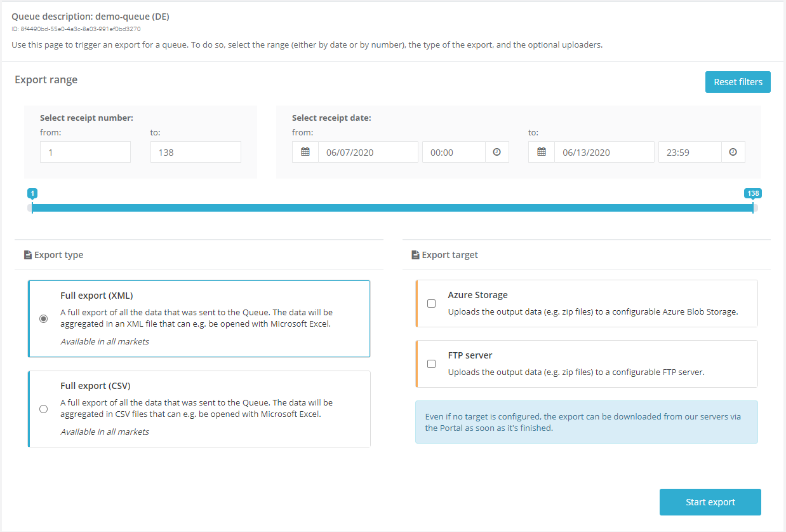
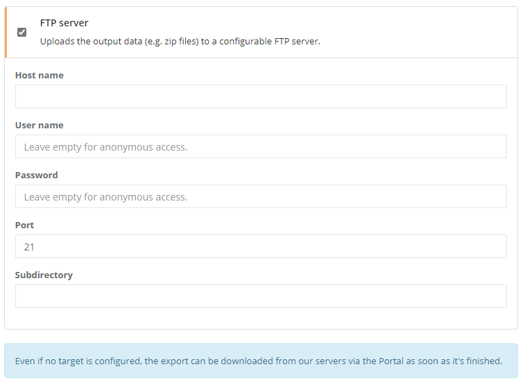

# fiskaltrust.Portal - Sprint 76
_June 22, 2020_

**Automatic POS operator onboarding & overhauled export experience**

In the Sprint 76 update of the fiskaltrust.Portal, we are excited to announce that we have a completely new data export experience which not only should make selecting specific exports easier, but is also able to finish exports within a few minutes instead of several hours, even for very large queues.

In addition, we've added an automatic onboarding flow to the German sandbox environment. PosDealers are now able to onboard PosOperators without further manual actions on their side.

These major changes are - among others - described in more detail in the following sections.

## Features and stability improvements

### Data exports 

#### New data export experience
The export experience in the Portal - i.e. the functionality to write stored Middleware data like receipt requests and responses into different file types - was completely overhauled in this sprint. The previous implementation dated back to earlier days and overall far smaller queues, and did not fit the requirements of large customers anymore. In addition to this, we regularly received feedback that the user interface was not intuitive enough.

The key features of the new functionality are:
- Drastically improved performance, shrinking down the time for an export from hours to only minutes, even for very large queues. For example, an XML export of a queue with 800,000 receipts now takes only 15 minutes on average. Exporting smaller queues will usually be finished in 2-3 minutes.
- Increased reliability of the overall process. Especially for large queues, the old export tended to fail sometimes, requiring users to queue several exports until one succeeds. This was resolved, as we  observed very high success rates in our ongoing tests.
- An overall simpler architecture makes it far easier for the development to implement new export types (e.g. the French export, and the upcoming DSFinV-K export).
- A simpler user interface that focuses on the main requirements when requesting an export. Now, users can easily select the export and (if required) optional export targets.

_For now, this feature is only available in the German and French portal. It will be activated for the Austrian market soon._

#### Simplified upload target configuration
The previous drag-and-drop functionality for export targets was replaced by a simpler checkbox-based approach. While this slightly limits the customizability (previously, it was possible to specify multiple targets of the same type), our user tests show that the user experience is far easier to understand and use.

**Even if no target is specified, the data will still be stored on our servers and can be downloaded via the Portal anytime.**

When a target is selected, users can configure the required options:

#### CSV export
In addition to the _full XML export_, a CSV export was added that exports the full data schema of the Middleware into CSV files. Among others, this includes all receipt requests and responses that were processed, journals, and all internal data that is stored in the Middleware database.

#### FR export (Preview)
A preview version of the French export (_FR-DEX_) was added to the [French sandbox](https://portal-sandbox.fiskaltrust.fr). In accordance with the InfoCert certification requirements, it can be used to export Queue data into CSV files, split by the type of the receipt chain.

_For now, this feature is only available in the sandbox._

### Improved usability of receipt range slider
Previously, using the receipt range slider to configure exports often lead to issues when used with large queues. The performance of this component was greatly improved, and it should thus be far more stable now, even for very large export configurations.

### Additional information on parameters in journal.json
In addition to displaying it in the portal, we now include the receipt range of exports into the `journal.json`. This should make it easier to track exports after they were downloaded.

### E-Commerce

#### Separate template products by market
In the past, we did not separate between template-based products for different markets. This led to the fact that we displayed all of these products in the shop (e.g. Austrian products were displayed in the German shop). 

We have made some changes to be able to separate these products between the markets, and now only display products that are really available for the given market are.

### Middleware Configuration

#### Configuring Diebold Nixdorf SCU
Similar to the other SCUs, we added a Diebold Nixdorf-specific configuration page now that should make configuring this SCU easier for users by requiring the mandatory COM Port setting.

  

#### Bulk update functionality not working
When updating Middleware configurations via the _bulk update_ interface, an error occurred. This issue was fixed and the functionality for updating middleware components and rebuilding the cashboxes automatically is fully working again.

  

### User Management

#### Automatic onboarding of PosOperators (Preview, Germany only)
We have been getting many questions on how to make the onboarding experience easier for PosDealers. Since especially in our new markets, some PosDealers are managing many of customers via the fiskaltrust.Portal, getting everyone to register and sign the contract could be very time-consuming. 

The "original" invitation process created accounts for PosOperators and sent invitations to the given email addresses that needed to be accepted manually. Obviously, this onboarding experience does not scale, as we cannot expect our PosDealers to manually reach out to thousands of their customers and support them during the sign-up.

With the latest changes rolled out to our German sandbox environment, customers now can test the new, fully automated onboarding process. To enable this feature, please activate the new `PosDealer auto-invitation (opt-in)` feature as shown in the screenshot below.

  

Because of the fact that this is a PosDealer-only feature, you need to have the `PosDealer` role activated as well. The contract that is currently showing up is a placeholder and will be replaced by an actual contract the feature is rolled out to production.

After that role has been activated, you should see two new buttons in the _PosOperators / Invitations_ view. 

Similar to the already available invitation feature, you can either proceed for all pending invitations or just one by one. 

As soon as you have clicked one of the buttons, the following steps are executed:

1. Creation of PosOperator Contact / User
1. Creation of PosOperator Account
1. Creation of connection between PosOperator and PosDealer accounts
1. Enable _Full Permissions_ on PosOperator account for PosDealer
1. Generate random password for PosOperator
1. Enable connection between PosOperator and PosDealer accounts
1. Create PosOperator contract and sign with the PosDealer's account name
1. Store created PosOperator contract to the account storage of the PosOperator, so that the PosOperator can access it via the portal
1. Save the opt-in auto-invitation contract of the PosDealer to the account storage of the PosOperator (Prefix: `posdealer-opt-in-autoinvitation_autoinvitation_{posDealerAccountId}`)
1. Enable PosOperator role for PosOperator
1. Send an email to the PosOperator with the following documents attached:
    - PosOperator contract (signed by the PosDealer)
    - PosDealer opt-in contract
    - Additional files that can be added by the PosDealer during the invitation

After performing these steps the, PosOperator account is properly configured and can be used with the fiskaltrust services. If the PosOperators want to login, they will have to reset their password during the first login. To make this experience as easy as possible, the email that the PosOperator receives already contains a password reset link.

_For now, this feature is only available in the German sandbox._

## Next steps
In the upcoming sprints, the development team will mostly focus on further improving the customer onboarding experience in the Portal.

In addition to this, we will continue to improve the _Export_ features in the portal and offer additional exports for the German market.

## Feedback
We would love to hear what you think about these features. To get in touch, please reach out to [info@fiskaltrust.at](mailto:info@fiskaltrust.at).