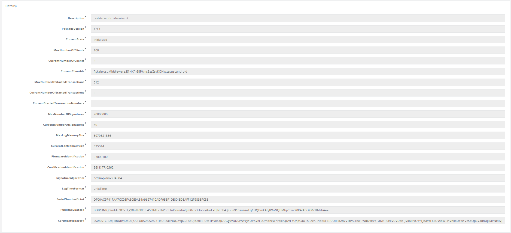

# fiskaltrust.Portal - Sprint 77
_July 6, 2020_

**Signature Creation Unit details and important stability improvements**

In sprint 77, development was mostly focused on syncing SCU details with the fiskaltrust cloud and displaying them in the Portal, and on improving the stability of recently added features.

## Features and stability improvements

### Signature Creation Unit details
We updated our backend services to properly process and store the information that Signature Creation Units query from TSEs in German middleware instances. This means that details like the TSE state, the maximum number of signatures, identification numbers, certificates and public keys can now be displayed directly in the fiskaltrust.Portal as soon as a SCU was initialized (by sending a initial-operation receipt to the connected Queue). The details page can be opened by clicking on the <i class="fa fa-search"></i> button in the SCU ist.

  

_The following information are displayed_: `Description`, `PackageVersion`, `CurrentState`, `MaxNumberOfClients`, `CurrentNumberOfClients`, `CurrentClientIds`, `MaxNumberOfStartedTransactions`, `CurrentNumberOfStartedTransactions`, `CurrentStartedTransactionNumbers`, `MaxNumberOfSignatures`, `CurrentNumberOfSignatures`, `MaxLogMemorySize`, `CurrentLogMemorySize`, `FirmwareIdentification`, `CertificationIdentification`, `SignatureAlgorithm`, `LogTimeFormat`, `SerialNumberOctet`, `PublicKeyBase64`, `CertificatesBase64`

In addition, we made it easier to detect if an SCU was already activated by displaying this information directly in the list, as shown on the screenshot below.

  

### User Management
Two issues in the new simplified invitation experience were fixed in this sprint:
- When inviting POS operators via the newly added button, the loading animation did not finish for some users, although the invitation was properly executed.
- Displaying the invitation history could led to a server error in some cases.

### Data exports
We extended the recently added FR-DEX export by a new file that shows all required totalizers to fullfil the legal requirements. These values are directly read from the queue database and now written to the file `FRDEX.{FILEHASH}-Type-QueueFRTotalizer.csv`.

Additionally, we fixed an issue that could lead to server errors when displaying the exports of an account.

## Next steps
In the upcoming sprints, the development team will continue to improve the onboarding experience, data exports, and introduce some updates to our shop.

## Feedback
We would love to hear what you think about these features. To get in touch, please reach out to [info@fiskaltrust.at](mailto:info@fiskaltrust.at).