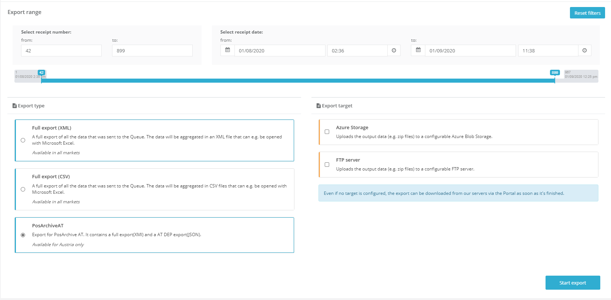
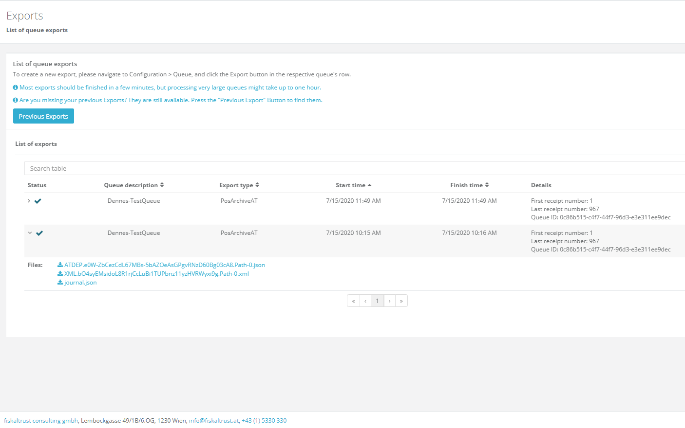
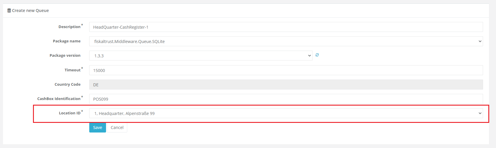
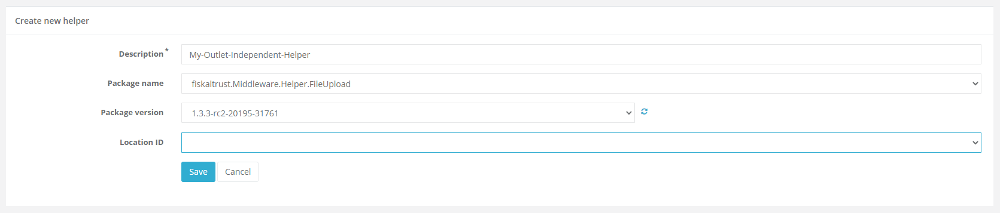
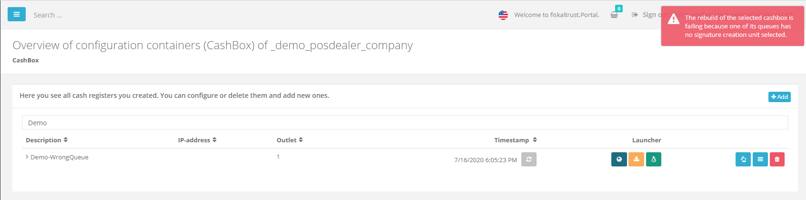
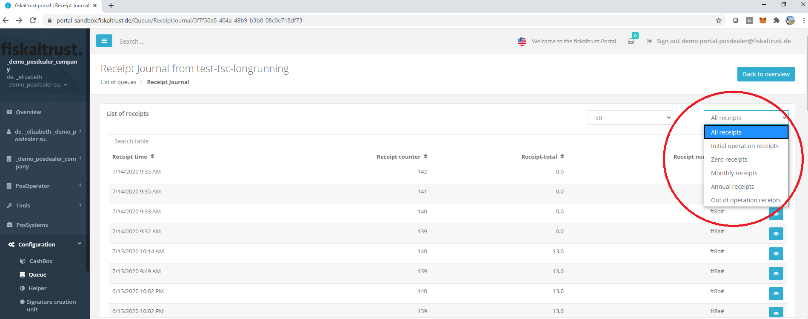
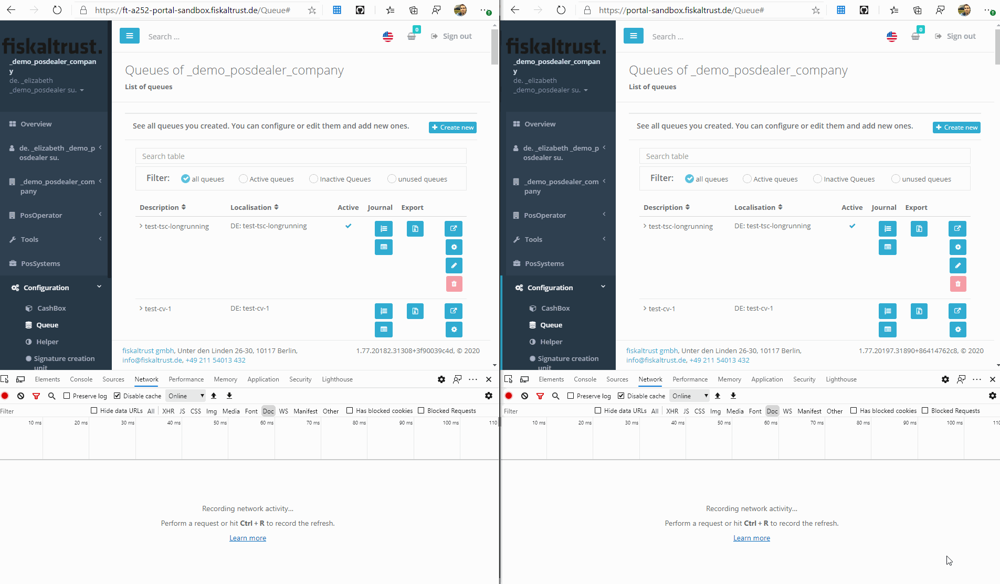
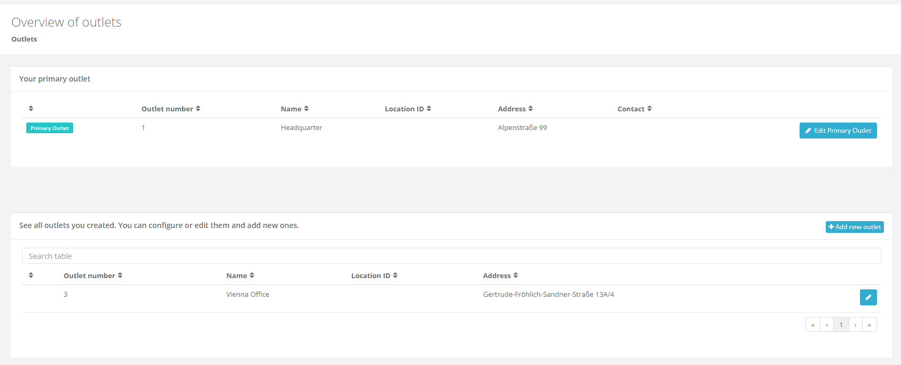
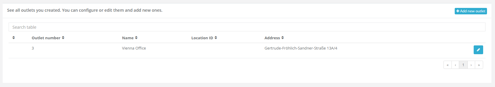

# fiskaltrust.Portal - Sprint 78
_July 20, 2020_

**Outlet Management for Middleware components, New Export experience for AT**

In sprint 78, development was mostly focused on preparing for the additional challenges that come along with operating Middleware components in the German market. Since most components in Germany are configured for just one outlet, we extended the portal's outlet management capabilities to fulfil this requirement.

## Features

### Data exports

#### Add the new Export view for AT

##### Export Creation
We added the new Export Creation View to the Austrian market. This should give our users a simplified and more reliable way to start exports.

The new Export Creation View uses our new _Exporting system_ which drastically decreases the times for creating an export from hours or even days to a few minutes, depending on the size of the queue.

We also added a new category of export to the page, called PosArchiveAT. This Export is a combination of the full export (XML) and the DEP 7 export, which is required for finance audits. 

  

#####  Export Retrieval
We also revamped the export page, which can be found in the _Tools_ section. The new page loads very quickly and displays all exports created with the new Export System. If a previously created (older) export is missing on that page, it can be accessed by clicking on the _"Previous Exports"_ button.

  

### E-Commerce

### Middleware Configuration

#### Configuring Outlets for Middleware components
Since we do have the requirement of binding Queues and SCUs to specific outlets in Germany, we added a setting for selecting the Outlet that the Queue/SCU should be created for. For Germany and France this setting is required. In Austria, selecting an Outlet is optional.

  

When configuring helpers you _can_ add an outlet, but it is not required. Especially for some specific helpers, it sometimes makes no sense to select an Outlet, hence it can be skipped for those.

  

When creating or configuring CashBoxes, users now have two options: it is both possible to configure the outlet, or to the field empty.
- If the field is empty during the creation, the next available outlet number is automatically selected to make sure that the queue is not placed into an invalid outlet. 
- Changing an outlet afterwards (e.g. because this setting was skipped during creation) is possible via the _Edit_ dialog.

We will continue to improve this feature, and will add additional functionalities to make it easier to see in which outlet the selected component is running.

#### Failed to load more than 1000 ReceiptJournals 
Our monitoring showed that displaying receipt journals failed for some customers when trying to access very large queues. The reason for this issue is a limitation in one of our backend systems. We for now resolved this by setting a cap of 1000 receipt journal entries that can be loaded.

####  FR - Fix for failing SCU creation if no proper outlet is configured
When trying to create a SignatureCreationUnit with an outlet that has no properly configured business number, the creation failed with a 500 error in the French portal. This was resolved, as users are now notified with an error message in case of no properly configured outlets:

  

_In case you are affected by this, please make sure that the company's configuration is valid that the selected outlet has a correct location ID._

#### DE - Hide non working Helpers in German market
Since 1.2 helpers are not compatible with the 1.3 Middleware, we removed all helpers that have a version number lower than 1.3 in the German market. This should make sure that it's impossible to create configurations that will fail at runtime.

#### DE - Display error message when CashBox contains QueueDE without an assigned SCU
Our monitoring showed that some of our customers were running into an issue when trying to start a CashBox with a Queue that has no SCU assigned. We extended this functionality with a check to make sure users are aware of this requirement. When the _"Rebuild configuration"_ button is clicked, an error message is now displayed in case this is configured incorrectly.

  

#### DE - Filter ReceiptJournals and ActionJournals by type
To simplify finding specific receipt journals or action journals in the Portal, we added a filter functionality to the respective pages. It is now possible to limit the display one of the following receipt types:

- All receipts
- Zero receipts
- Initial operation receipts
- Out of operation receipts
- Monthly receipts
- Annual receipts

  

#### Performance improvements for Queue list
While working on the outlet management feature, we noticed that the Queue page performance can be improved by optimizing how we query our backend systems. Changing this lead to 8x-10x faster page loading time (depending on how many queues are configured in the respective account). Especially accounts with many queues should see greatly improved page load times. The _gif_ bellow shows the difference quite clearly.

  

### User Management

#### Outlet Management
One of the main features we have tried to improve in this sprint is the management of _Outlets_ in the Portal. Hence, we made several changes that should make it easier to use, configure and add outlets. In the next sections we will go into the details of these new functionalities.

##### Distinction between primary and additional outlets
We received the feedback that even if the old outlet page contained all necessary information, it was sometimes hard to differentiate between the _primary outlet_ (main address of the company) and the other outlets that users can add for each of their additional company addresses. To simplify the distinction between these different categories of outlets, we reworked the UI to have two main sections - one for the primary outlet, and one for all the other outlets.

  

##### Searching / Pagination and exchanging fields that are shown in the table for outlets
In addition to the separation between the categories, we reordered some fields and added a search box that should simplify looking up specific outlets. The look and feel of the page was adjusted to the Middleware configuration pages as well. Finally, we added pagination to make sure we are not displaying too much information at once.

  

## Next steps
In the upcoming sprints, the development team will continue to improve the outlet management feature. One very frequently requested feature that will be implemented is the bulk import for many outlets. Additionally, we will improve the shopping experience so that users are able to buy outlet-based products.

## Feedback
We would love to hear what you think about these features. To get in touch, please reach out to [info@fiskaltrust.at](mailto:info@fiskaltrust.at).