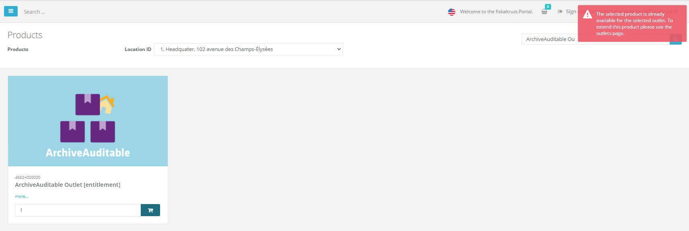
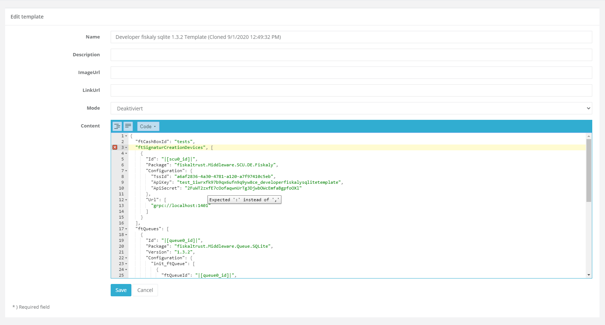
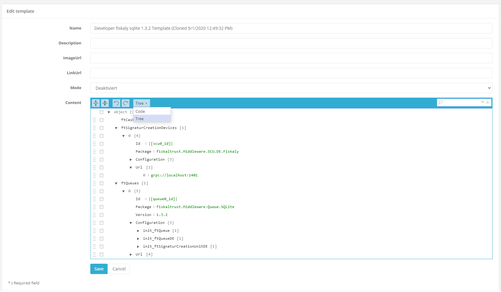
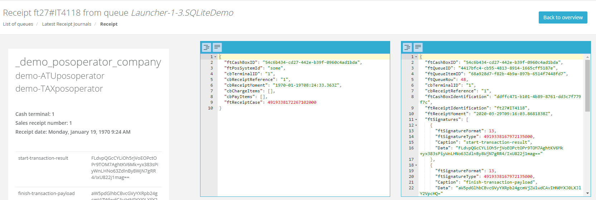

# fiskaltrust.Portal - Sprint 82
_September 14, 2020_

**MAIN FEATURE**

## Features

### E-Commerce

#### Enable Shop for FR (FR)

We are really happy to announce that we enabled the FR shop. Starting by now you are able to purchase products in FR. 

If you want to have more details on the products, or are interested to FR in general feel free to reach out to our FR sales team [sales@fiskaltrust.fr](mailto:sales@fiskaltrust.fr).

#### Improved visualization of products  (DE)

After enabling the digital products in the shop in sprint 81 we wanted to make sure that we are also improving the product visualization. For this purposes we added pictures and additional details to the product description to make it easier for the users to get details on the different products.

For more details or if you are interested in one of these products please reach out to our DE sales team [sales@fiskaltrust.de](mailto:sales@fiskaltrust.de).

#### Improve experience when purchasing outlet based products (DE, FR)

Since most of the outlet-based products can be bought only once, we wanted to make sure that users are not accidently buying twice for products that they don´t need. For this purpose we are showing an error message if the user puts a product into the cart that is already available for this location. Additionally we prevent buying more than 1 of these products per outlet. 

Some of our products require the selection of an outlet. Beside the outlet based products, a outlet must be selected for the FR ChaîneCloud. If one of these products is put into the cart without selecting an outlet beforehand an error message is shown.

### Middleware Configuration

#### New interface for editing CashBox templates (All markets)

We added a new functionality for editing cashbox templates content. With the newly integrated JSON editor it should be easier to create / edit and check cashbox templates. Additionally to these new editing capabilities the JSON editor highlights JSON errors to make it easier to spot potential issues.

We also added a tree view to the JSON editor to make it easier to go through very big CashBox templates.

Currently the JSON editor checks for basic json syntax errors only. Since the CashBox template has a fixed structure we will further improve the validation by adding a specific schema in one of the next sprints. 

#### Hiding packages that do not have versions (All markets)

In some cases it happend that even though a package was shown in the selection dialog, it was not possible to select a version. We added a check to make sure that we are only showing packages that have valid versions available.

#### Showing raw data of receipts (All markets)

We got the feedback that in some situations it would be very helpful if PosDealers and PosCreators are able to see the raw data that has been sent to the Middleware. We added a JSON viewer that shows the raw data for the request.json and the response.json

## Next steps

## Feedback