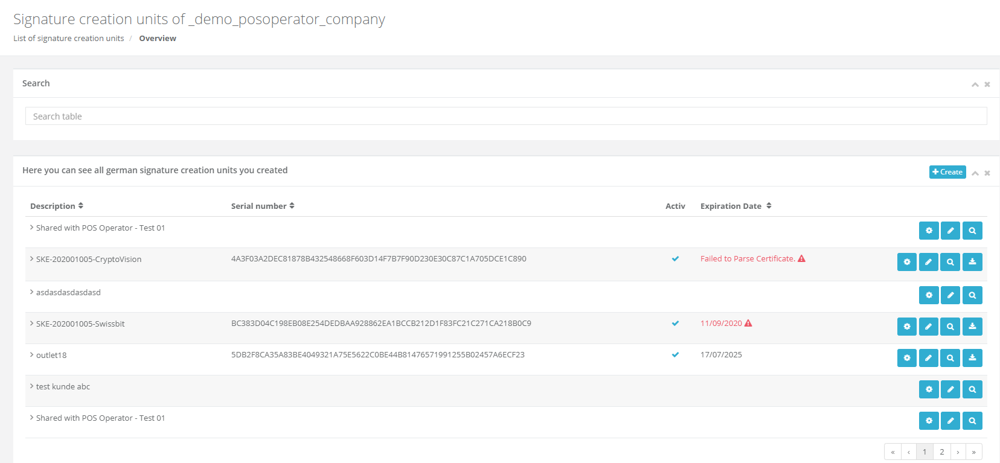

# fiskaltrust.Portal - Sprint 85
_October 26, 2020_

**TAR file export, simplified subscription management & TSE certificate details**

In this sprint, we worked in making the aggregated TAR export available in the Portal, which - together with the DSFinV-K export - enables our customers to get all audit-relevant data without requiring direct access to the POS System. Additionally, we greatly improved the subscription management, and are now displaying the expiration dates of TSEs.

## Features

### Data exports

#### PosArchive export for TAR files (DE)
In addition to the already existing DSFinV-K export, we added the possibility to download aggregated TSE tar files directly from the PosArchive storage. This means that a user-definable range of the TAR files that our Middleware automatically stores during each daily closing receipt (and later uploads to our cloud storage) is packed and served as a zip file.

_Please note that this feature requires Middleware version >= 1.3.9._

### E-Commerce

#### Simplify subscription extension (AT)
32252 Automated creation of sales quote from subscription extension csv
32254 Extend PosDealer subscription page to give user the choice between "Move by Entitlements" or "Dealer package"
32253 Extend PosDealer subscription page with selection of subscriptions to extend
32611 User is not able to cancel subscription

### Middleware Configuration

#### Display additional information for SCU certificates (DE))
We regularly got requests from users who wanted to easily download their TSE's certificates, or quickly see if the certificate has expired - with the latter being mostly relevant for developer TSEs, which expire after 6 months.

We hence added a _Download_ button to the German SCU page. When clicking this button, all certificates of an SCU can be downloaded in a zip file. If the certificates are available and can be parsed, we now also display the expiration date of the TSE. If a certificate is expired, a warning will be displayed.

## Next steps
In the next sprints, we will focus on further improving the user experience in our Portal, mostly focused on an enhanced rollout experience. This includes updates to the templating system, the invitation process, and other related workflows.

## Feedback
We would love to hear what you think about these improvements and fixes. To get in touch, please reach out to [info@fiskaltrust.at](mailto:info@fiskaltrust.at).