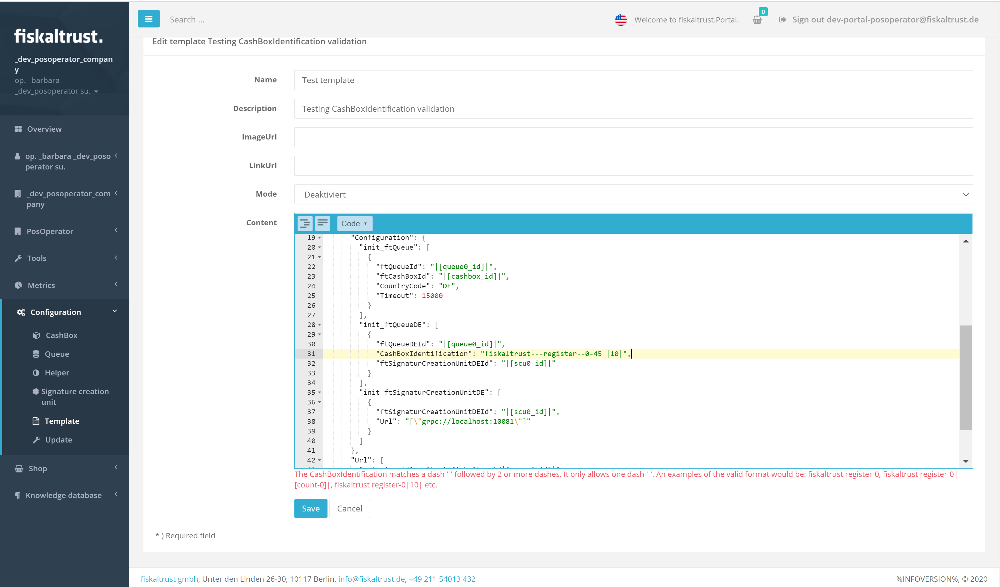

# fiskaltrust.Portal - Sprint 86
_November 9, 2020_

**Improved Android Launcher download experience and UX enhancements**

The main focus of this sprint was to further enhance the Portal's UI and UX, especially for large-scale rollout scenarios and general POS Dealer activities. In addition, we worked on improving the Android Launcher, which can now be downloaded more easily and will soon be rolled out to Google Play.

## Features

### Data exports

### Middleware Configuration

#### Android Launcher download
In a previous sprint, we announced the availability of the first preview version of our Android Middleware Launcher. In the last weeks, we increased our efforts in this area, and introduced several changes:
- While we initially only supported gRPC, we added an additional App that can be used with HTTP. We're offering separate Apps for gRPC and HTTP/REST to reduce the size of the respective apps - they behave the same and require only minimal changes in case POS Creators want to switch between them.
- We added a more convenient view to download the APK (also via QR code to simplify direct mobile downloads), and directly link to our sample projects now.

Finally, we are working hard on getting the Apps to the Play store as well, and are happy to announce that they currently are in **public preview**. The first production-ready version of the Android Launcher will be released in the next weeks.

#### Configuration pages for _ATrust_, _Epson_ and _Deutsche Fiskal_ SCUs (DE)
To simplify the creation of our newly added SCUs, we added configuration pages for _ATrust_, _Epson_ and _Deutsche Fiskal_. This means that while creating one of these respective components, users are now prompted to enter the required configuration parameters.

When ordering these items via the shop, SCUs with the appropriate configuration are automatically created.

#### Enforce _CashboxIdentification_ rules when creating templates (DE)
In a previous sprint, we introduced specific rules for the _CashboxIdentification_ field, as it's used as the TSE client ID and therefore has to fulfill certain requirements defined by the hardware producers. To avoid the creation of non-supported values, we now also enforce these validation rules when users create templates.

Additionally, we make use of our new editor's capabilities to ensure that the entered templates are valid JSON documents.

#### Fix filter in Cashbox configuration (All markets)
When selecting cashbox components in the _list_ view, the filter that can be entered by the user was applied to SCUs and Helpers, but not to Queues. This issue was now resolved.

### User Management

#### Make address fields required when creating outlets (All markets)
Previously, not all address fields were mandatory when creating outlets, which lead to hardware delivery issues because of incomplete addresses. This is now resolved, as all relevant parts of an outlet's address are marked as required fields now. 

Additionally, a warning is displayed in the checkout process in case a non-complete shipping address (which was created before this fix) is used.

#### Further improve the registration and password reset flow (All markets)
We added several new sub-pages to give our users more detailed information in case something went wrong during creating an account or resetting a password. Among others, this includes improved error messages in case users try to set a non-valid password.

In addition to this, we noticed that some special characters were not allowed in company names when inviting users (e.g. `&`), which is now not the case anymore.

## Next steps
In the next sprints, we will again focus on further improving the user experience in our Portal, mostly focused on an enhanced rollout experience.

## Feedback
We would love to hear what you think about these improvements and fixes. To get in touch, please reach out to [feedback+portal@fiskaltrust.cloud](mailto:feedback+portal@fiskaltrust.cloud).