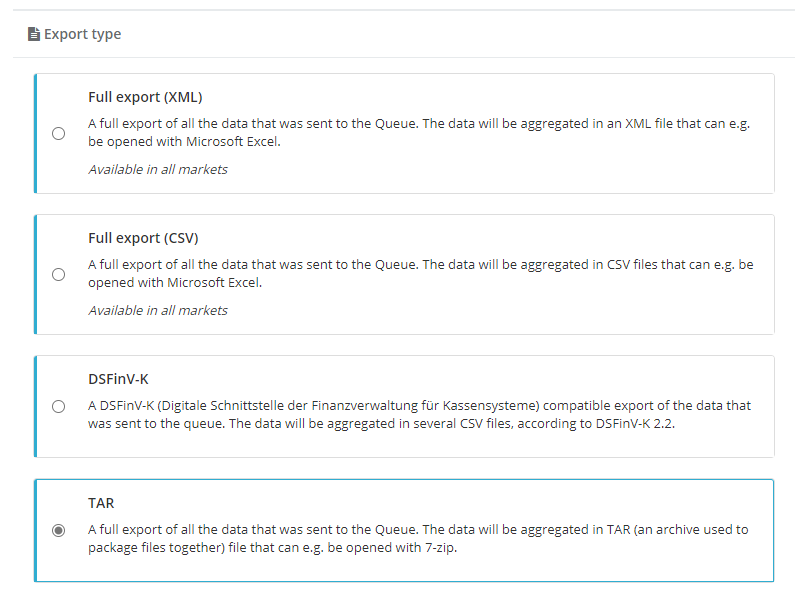
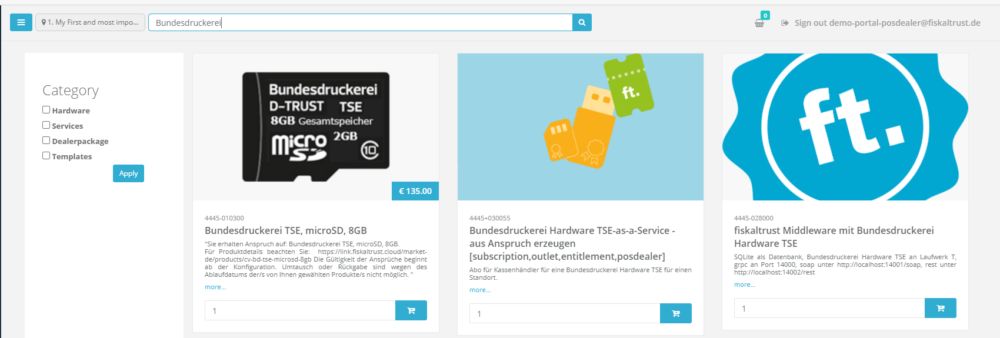

# fiskaltrust.Portal - Sprint 88
_December 7, 2020_

**Improve Shopping experience**

The main focus of this sprint was to further enhance the Portal's Shopping experience, especially the searching experience.

## Features

### Data exports

#### POSArchive powered TAR Export
In addition to the already existing DSFinV-K export, we added the possibility to download aggregated TSE tar files directly from the PosArchive storage. This means that a user-definable range of the TAR files that our Middleware automatically stores during each daily closing receipt (and later uploads to our cloud storage) is packed and served as a zip file.

### Middleware Configuration

#### Clarifed description of components outlet
When creating middleware components the user is prompted to select the related outlet. In the past this field was called Location ID, which lead to confusions. We renamed it to clarify the usage.

### E-Commerce

#### Improve search experience
After changing the outlet visualization in Sprint 87 we thought it might make sense to also put the search bar into the header to make the searchfield more prominent. This change should make it easier for users to search for specific items.

#### Order details are not sorted correctly
In the past details that have been sent as part of the order confirmation email weren't ordered by lineitemnumber. This lead to confusions in some cases. We fixed that behavior and items should be ordered correctly.

#### Invoice details are not sorted correctly
In the past details that have been printed onto the invoice weren't ordered by lineitemnumber. This lead to confusions in some cases. We fixed that behavior and items should be ordered correctly.

### User Management

#### Tax number should be mandatory for agencies instead of VAT ID
It's possible to set both the VAT and the Tax number when creating agencies. Currently, only the VAT number is mandatory. However, not all companies in Germany have a VAT number, but most companies have a tax number. We changed the page so that you are able to create agencies without VAT numbers and we made the Tax number a required field.

#### Extend country selection in agencies page
In the past it was not possible to select countries that where different than AT, DE or FR. We extended the selection in the agencies page and users should be able to choose any european country now.

#### Tax number should be configurable when inviting posoperators
Some of our customers reached out to us, because they haven't been able to configure the tax number when inviting PosOperators. We added another field which sould give PosDealers the chance to define taxnumbers while inviting PosOperators. Additionaly, this works for .csv based bulk invitations.

## Next steps
In the next sprints, we will again focus on further improving the user experience in our Portal, mostly focused on an enhanced rollout experience.

## Feedback
We would love to hear what you think about these improvements and fixes. To get in touch, please reach out to [info@fiskaltrust.at](mailto:info@fiskaltrust.at).