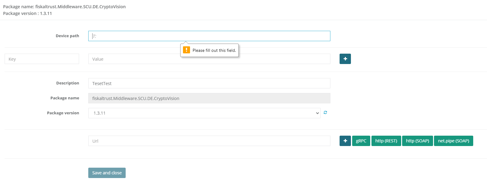

# fiskaltrust.Portal - Sprint 89
_December 20, 2020_

**Change the primary contact of an account**

One of the most requested feature across all markets was the possiblity to make a different employee of the company the primary contact. This is especially helpful if employees that had been the primary contact are not part of a company anymore. This feature has been rolled out as a preview feature and is not available for all customers. 

## Features

### Data exports

### E-Commerce

#### Wrong price showing up when user has selected multiple roles
Because of the fact that we are calculating the price of a product (and also if a product can be purchased) based on the role (and also other criterias) we have been showing up a price in the shop and a different one during the checkout. The main reason for this was the fact that the consultant and the posdealer role has been selected, and that prices for those roles are different. We changed the prioritization of the pricelists so that we are now showing the consultant price in the shop if the customer has the consultant role enabled.

### Middleware Configuration

#### Use different default REST-port for SCU
Some customers reached out to us, that they are frequently facing issues with blocked ports when using REST and gRPC. We have noticed that we are assigning the same default port for both endpoints when users had been using the button to assign these endpoints. To make sure that we are preventing such cases we have changed the default port for newly assigned REST endpoints to 1501.

#### Validate if DevicePath for CryptoVision has been set
Since many of our customers are using the portal to manually configure SCUs we have noticed that some of them are not setting the DevicePath and are facing issues while rolling out the middleware. To make sure that we make customers aware of configuration issues as soon as possible we added validation to the CryptoVision scu configuration.

### User Management

#### Change the primary contact of an account
As mentioned in the above section many customers have already requested this feature because until recently it was only possible to change the primary contact of an account by approaching our support. With this new feature users with the necessary permissions (manage) should be able to change the primary contact. You can perform this action by navigating to the Employee section of your account and open the permissions for an employee. We added a new button that changes the primary contact of the account to the chosen employee. The new primary contact will receive an email notifactiona bout that change.

#### PosDealers can not change Industries / Territories while they surrogate
During one of our security checkups we noticed that we are preventing PosDealers from changing Industries and Territories even though they had the necessary permissions. We fixed this behavior and PosDealers that do have the necessary permissions should be able to change these settings again.

#### Improve duplication check when inviting PosOperators
A customer of us reached out to us, that they are facing problems with adding companies because of the fact that our system detects them as already existing even though they have not yet existed. In the past we only checked for the companyname, which turned out to not being unique. To fix this behavior we are now checking the postalcode too, and if both fields are matching we are marking it as duplicate. If the companynames match and the postalcode is different we do not mark it as duplicate.

## Next steps
In the next sprints, we will continue to focus on further improving the user experience in our Portal, mostly focused on an enhanced rollout experience.

## Feedback
We would love to hear what you think about these improvements and fixes. To get in touch, please reach out to [info@fiskaltrust.at](mailto:info@fiskaltrust.at).