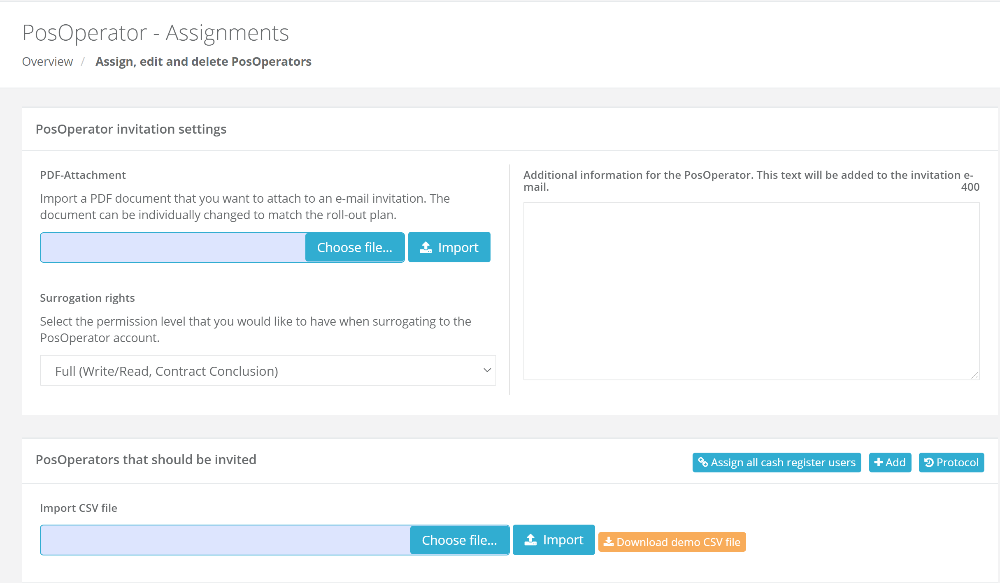

# fiskaltrust.Portal - Sprint 90
_December 28, 2020_

**Improve field descriptions in invitation view**
In this sprint we have focused on improving the labeling of the different functionalitiets in the invitation view. Additionally, we have removed some not needed features that have led to confusions in the past.

## Features

### User Management

#### Hide rights selection in invitation creation/edit view
When trying to manually create a posoperator invitation we do have a field called Default user rights. Currently this field will always be overriden be the field on the main page.
Since we do not use this field it has been removed from the Create and Edit page to prevent confusions.

#### Improving field descriptions in invitation view
After discussions with some of our users we noticed that many problems can be traced back to bad descriptions. Especially the invitation view is lacking good field descriptions and therefore often leads to confusions. We tried to improve the field descriptions to further clarify the usage and the functionalites that are visible.

## Next steps
In the next weeks we will focus on recovering and getting some quality time with our loved ones. Most of the engineering teams are on vacation and we will be back in 2021. 

## Feedback
We would love to hear what you think about these improvements and fixes. To get in touch, please reach out to [info@fiskaltrust.at](mailto:info@fiskaltrust.at).