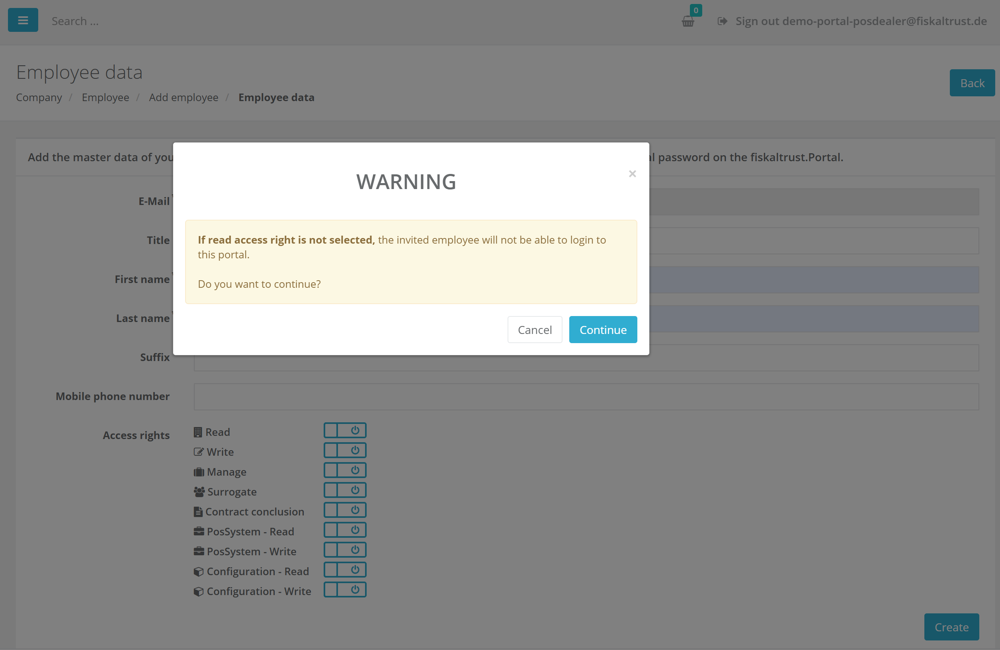
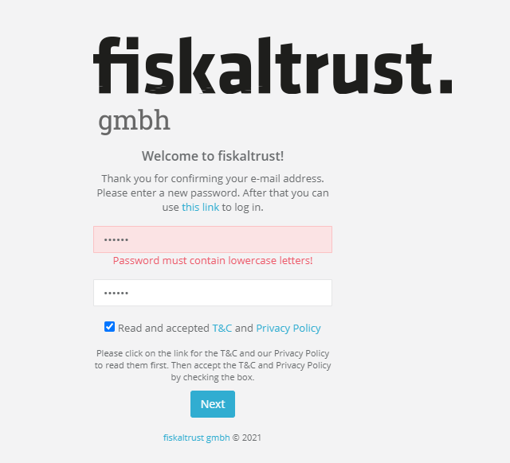
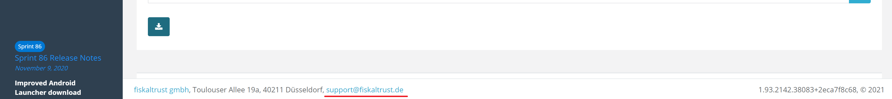

# fiskaltrust.Portal - Sprint 92
_February 12, 2021_

**Improving user experience in portal**

In this sprint, the Engineering team was mostly focusing on improving and fixing reported issues. several usability improvements and bug fixes were implemented that should resolve some common issues of our users.

## Features

### E-Commerce
#### Wrong Move Entitlements product is added to cart(DE market)
Previously, we were facing an issue while putting some products into the cart.
in some cases, when we put the Move Entitlements product into the cart,  the product was different from the one added to the shopping cart.
With this release, this should be fixed and products should be correctly added to the shopping cart.

### User Management

#### Enforce permission selection when employees are invited
lately, we were facing many issues with wrongly configured employees.
In most of these cases, the users forgot to assign default access rights during the invitation. To make sure that the user is aware of assigning the necessary rights, We added claim assignment during the process of invitations of the employee. All roles are shown at the bottom of the page and can be assigned to the employee during the invitation.
Selecting access rights is not mandatory, but if no rights are selected the user will be prompted with a warning that the invited employee will not be able to login as long as no read rights are assigned.

#### Front-end Validation missing in Password Check (All markets)
Not showing a-Z error in the front-end validation, giving the impression that the password is correct. Actually, after the "Next" button was clicked, in addition to the missing a-Z error, the button got disabled. Correcting the password no longer enabled the button. The page had to be reloaded or the Confirmation of the T&C had to be disabled and reenabled.\
The bug has been fixed and password client-side validation added to all forms that contain password.

 

#### ResetPassword for errorpage shows austrian mail address

When a failure during the ResetPassword was happening we were showing the AT mail address for all customers.
The bug have been fixed and now it's updated with the market specific email addresses.

#### Footer should contain correct support information

To navigate our users from diffrent markets to their specific support team, we replaced the general email in the portal footer to particular email based on the market.
 - support@fiskaltrust.at for AT market 
 - support@fiskaltrust.de for DE market 
 - support@fiskaltrust.fr for FR market 

And also the fiskaltrust telephone number is no longer displayed in the portal footer.

## Next steps
In the next sprints we will continue to improve the usability and user experience in the portal to make sure that it is easy to use. Additionally, we will Extend CashBoxes to have a status feature in order to inform user if the configuration has changed and needs to be rebuilt. 

## Feedback
We would love to hear what you think about these features. To get in touch, please reach out to info@fiskaltrust.at.
