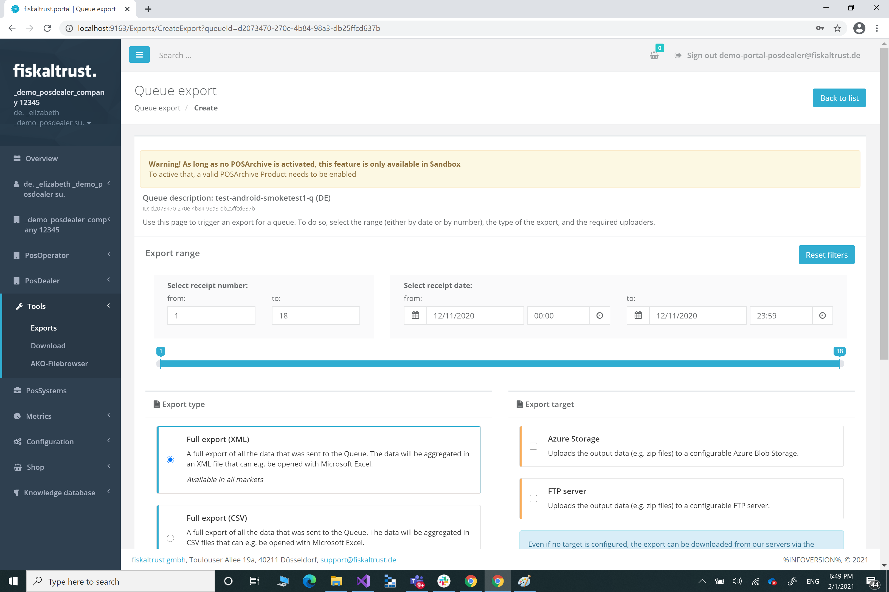
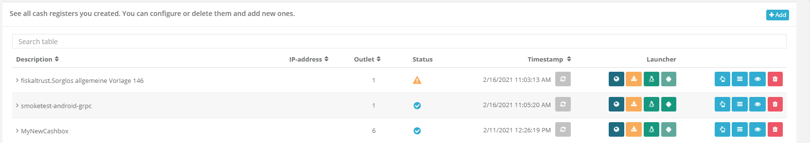
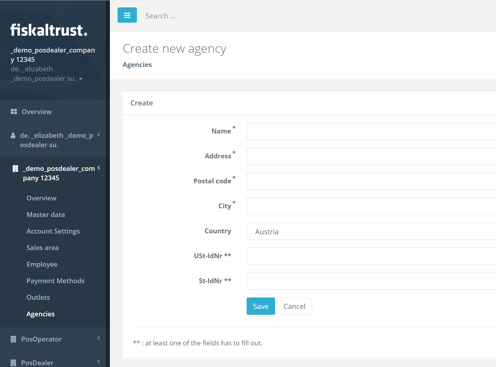

# fiskaltrust.Portal - Sprint 93
_February 15, 2021_

**Improving user experience in portal**

In this sprint we were focused on adding a new feature that should make it easier for users to detect changes in the CashBox configuration. This feature is currently in a preview state and only enabled for sandbox or specific production customers. If you want to give it a try too please feel free to reach out to us.

## Features

### Data exports

#### Inform users of Sandbox about limitations of PosArchive
While the export features are only available for customers that have purchased the PosARchive (e.g. as part of the Sorglos package), we wanted to give all users in the Sandbox environment the chance to test these functionalities without PosArchive. To prevent confusions why this is showing up in Sandbox and not in Production we have added a warning sign.

### Middleware Configuration

#### Visualize pending rebuilds in CashBox view
In the past we have noticed that it is very hard to now, wether a CashBox state is matching with the currently configured entity, or if a Rebuild is necessary. This is especially hard in a testing phase because changes are very frequent. To improve the usability of this and also to make users aware of changes in the CashBox we are previewing a new feature that indicates if a rebuild is pending. Basically there are three different states that a CashBox can have at the moment:

1) _Unkown_ - CashBox(es) which are in this state, means that we didn't applied any validation rules yet. Thus, they are remaining as unknown.

2. _Configuration has changed and a rebuild is needed to apply the new configuration_ - CashBoxes(es) which are in this state have changes in the configuration that haven't been applied yet. In this case the users would have to rebuild the CashBox to see the latest configuration.

3) _CashBox configuration is up to date_ - CashBox(es) which are in this state have no changes in the configuration so no Rebuild is required.

One thing worth mentioning is the fact that at the moment we are only considering the following configuration changes for this state:
- Changes to the CashBox itself (e.g. adding another Queue)
- Changes to a Queue that is connected to the CashBox
- Changes to the SignaturCreationUnits that are connected to the CashBox
- Changes to the Helpers that are connected to the CashBox

We do not yet consider changes to the following fields as state change:
- Account data (MasterData)
- Outlet data 
- PosSystem data

If any of these things is changed a rebuild is needed even though we will show that the state is correct.

### User Management

#### Agencies without Std.-Idnr cannot be created
Some of our customers reached out to us, that they wanted to create agencies, but haven't been able to do that because the have no valid Std.Idnr, however they have a VAT Id. To assure that we can support these cases too we are now requiring that either the STd.Idnr is set or the VAT Id.

## Next steps
In the next weeks we will focus on improving the rollout experience.

## Feedback
We would love to hear what you think about these improvements and fixes. To get in touch, please reach out to [info@fiskaltrust.at](mailto:info@fiskaltrust.at).