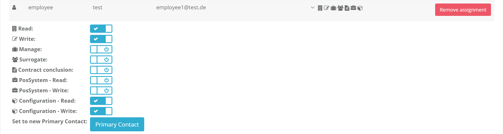
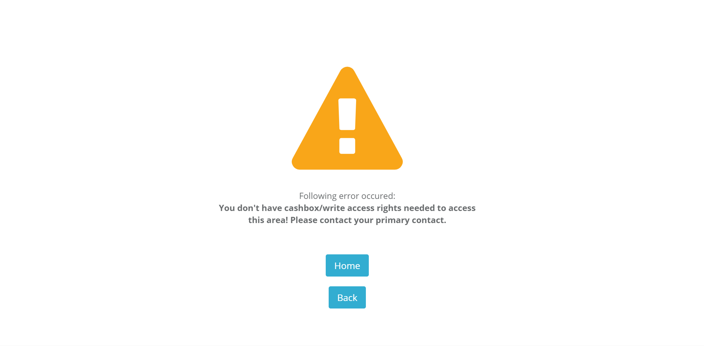
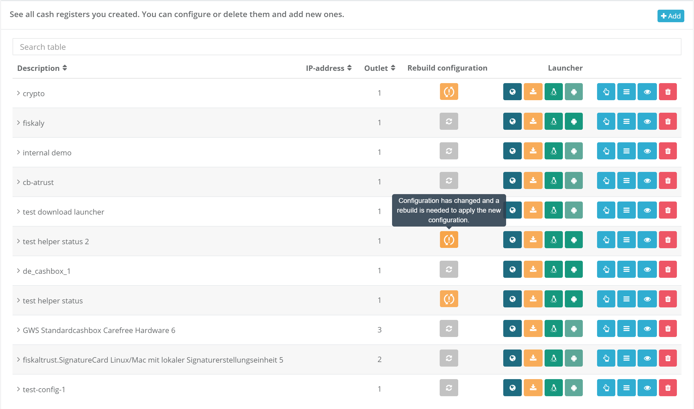

# fiskaltrust.Portal - Sprint 94
_February 26, 2021_

**Establish secure platform for configuring of Middleware components**

In this sprint we were focused to add authorization rules on configuration endpoints. Claim rules that are managed for employees are now applied to configuration management. To create any configuration component or edit configuration user needs to have assigned configuration write permission. For listing data in configuration pages user needs to have assigned configuration read permission.

## Features

### Configuration management

#### Secure endpoints for configuration

Employee permission management is available in portal for long time. User can assign different claims to his employees.

<i>Claims management</i>

Depending on the assigned claims he will be able to do different operations inside the configuration management. With given configuration read permission user will be able only to read listed data (i.e. cashboxes, queues, helpers...). To do write operations (i.e. create queue, edit cashbox, change configuration, rebuild configuration...) user will need to have configuration write permission. If user does not have permission for wanted action he will be redirected to warning page.

<i>Missing claims warning</i>

#### Cashbox configuration status

To have more clear view if running cashbox is using the latest configuration we are introducing cashbox configuration status. This feature will inform user if changes are made for specified cashbox and configuration is not rebuilt (i.e. queue configuration is changed, helper version is updated...). This will be shown as a warning button inside of the rebuild configuration column. Warning message is shown on button hover. If configuration is up to date button will be gray without warning indicator.

<i>Indicator of the cashbox rebuild status</i>

## Improvements

#### Open receipts without terminal id

Portal was not properly parsing the data for receipts without terminal id, so it was not possible to open those receipts. As this is possible scenario we fixed data parsing and now receipts without terminal id can be opened in portal.

## Next steps
TBD

## Feedback
We would love to hear what you think about these improvements and fixes. To get in touch, please reach out to [info@fiskaltrust.at](mailto:info@fiskaltrust.at).